---

# النظام الخبير لتحسين استعلامات SQL

## Expert System Query Optimizer

### نظام قائم على المعرفة لتحسين أداء استعلامات SQL باستخدام محرك الاستدلال Rete ومكتبة Experta

---

**إعداد الفريق:**

- [اسم الطالب 1]
- [اسم الطالب 2]
- [اسم الطالب 3]

**إشراف:**

- [اسم المشرف]

**الجامعة:**

- [اسم الجامعة]

**التاريخ:**

- يونيو 2026

---


---

# فهرس المحتويات

1. [مقدمة](#1-مقدمة)
2. [نظرة عامة على المشروع](#2-نظرة-عامة-على-المشروع)
3. [أهداف المشروع](#3-أهداف-المشروع)
4. [الخبير (Domain Expert)](#4-الخبير-domain-expert)
5. [مصادر المعرفة](#5-مصادر-المعرفة)
6. [نطاق المشروع](#6-نطاق-المشروع)
7. [أصحاب المصلحة](#7-أصحاب-المصلحة)
8. [المتطلبات الوظيفية](#8-المتطلبات-الوظيفية)
9. [المتطلبات غير الوظيفية](#9-المتطلبات-غير-الوظيفية)
10. [دراسة الجدوى](#10-دراسة-الجدوى)
11. [هندسة النظام](#11-هندسة-النظام)
12. [قاعدة المعرفة](#12-قاعدة-المعرفة)
13. [محرك الاستدلال](#13-محرك-الاستدلال)
14. [عامل اليقين (Certainty Factor)](#14-عامل-اليقين-certainty-factor)
15. [تدفق البيانات](#15-تدفق-البيانات)
16. [الخوارزميات](#16-الخوارزميات)
17. [هيكل المشروع](#17-هيكل-المشروع)
18. [الفئات الرئيسية](#18-الفئات-الرئيسية)
19. [التقنيات المستخدمة](#19-التقنيات-المستخدمة)
20. [أنماط التصميم](#20-أنماط-التصميم)
21. [الاختبار](#21-الاختبار)
22. [التحديات](#22-التحديات)
23. [العمل المستقبلي](#23-العمل-المستقبلي)
24. [الخاتمة](#24-الخاتمة)
25. [المراجع](#25-المراجع)

---

# 1. مقدمة

## 1.1 خلفية عامة

تُعد أنظمة إدارة قواعد البيانات (Database Management Systems) العمود الفقري لنظم المعلومات الحديثة، حيث تُستخدم لتخزين وإدارة كميات هائلة من البيانات في جميع القطاعات الصناعية. مع النمو المتسارع لحجم البيانات وازدياد تعقيد الاستعلامات، يصبح أداء استعلامات SQL عاملاً حاسماً في استجابة التطبيقات وكفاءة استخدام الموارد.

الـ Query Optimization أو تحسين الاستعلامات هي عملية اختيار خطة التنفيذ الأكثر كفاءة لاستعلام SQL معين من بين العديد من الخطط المكافئة دلالياً التي يمكن لنظام إدارة قواعد البيانات إنتاجها. تُعتبر هذه المشكلة صعبة بشكل خاص للأسباب التالية:

1. **مساحة البحث الهائلة:** عدد خطط التنفيذ الممكنة ينمو بشكل أُسي مع زيادة عدد عمليات JOIN
2. **تعدد العوامل المتداخلة:** الخطة المثلى تعتمد على خصائص البيانات (الحجم، التوزيع، التنظيم الفيزيائي) التي تتغير بمرور الوقت
3. **الحاجة إلى خبرة عميقة:** الاختيار بين مسارات الوصول (Full Scan vs Index Scan)، وخوارزميات JOIN (Nested Loop, Hash Join, Merge Join)، وترتيب JOIN يتطلب خبرة متخصصة
4. **الاعتماد على الإحصاءات:** نموذج تقدير الكلفة يعتمد على إحصاءات قد تكون قديمة أو غير دقيقة

## 1.2 دور الأنظمة الخبيرة (Expert Systems)

الأنظمة الخبيرة (Expert Systems) هي فرع من فروع الذكاء الاصطناعي يهدف إلى محاكاة قدرة الخبير البشري على اتخاذ القرارات في مجال معين. تتكون الأنظمة الخبيرة من ثلاثة مكونات رئيسية:

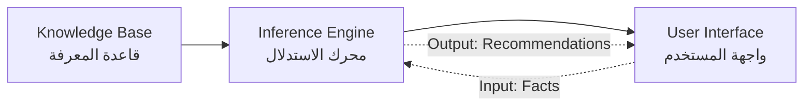

1. **Knowledge Base (قاعدة المعرفة):** مستودع منظم للحقائق (Facts) والقواعد (Rules) في مجال التخصص
2. **Inference Engine (محرك الاستدلال):** آلية تطبق القواعد على الحقائق لاستخلاص استنتاجات جديدة
3. **User Interface (واجهة المستخدم):)** الوسيلة التي يتفاعل من خلالها المستخدم مع النظام

على عكس البرمجة الإجرائية التقليدية (حيث يكون منطق القرار مضمنًا في جمل if/else وحلقات تكرارية)، تفصل الأنظمة الخبيرة المعرفة عن التحكم في التنفيذ. هذا الفصل يمنح الأنظمة الخصائص التالية:

- **الشفافية (Transparency):** كل توصية تكون مصحوبة بسلسلة الاستدلال التي أدت إليها
- **قابلية الصيانة (Maintainability):** يمكن إضافة القواعد أو تعديلها أو حذفها بشكل مستقل
- **قابلية التوسع (Extensibility):)** يمكن دمج معرفة جديدة دون إعادة هيكلة النظام
- **التفسير (Explainability):)** على عكس تقنيات التعلم الآلي (Black Box)، يقدم النظام تفسيرات واضحة لكل قرار

## 1.3 هذا المشروع

يقدم هذا المشروع نظاماً خبيراً (Expert System) لتحسين استعلامات SQL باستخدام لغة Python ومكتبة **Experta** (الإصدار 1.9.4)، التي تطبق خوارزمية Rete. النظام:

- **يحلل** خصائص الاستعلام (أنواع الشروط، JOIN، Subquery، التجميع)
- **يقيم** إحصاءات الجداول (الحجم، السعة، حداثة البيانات)
- **يقيّم** توفر الفهارس (النوع، الانتقائية، التجزؤ)
- **يأخذ في الاعتبار** أنماط العمل (قراءة مكثفة vs كتابة مكثفة، متطلبات وقت الاستجابة)
- **يطبق** 49 قاعدة (5 قواعد اشتقاق وسيطة + 44 قاعدة توصية) مستمدة من مصادر أكاديمية وصناعية موثوقة
- **ينتج** توصيات مرتبة ومفسرة مع تبرير علمي ومرجع مصدر

**توضيح هام:** على عكس ما ورد في المسودات السابقة من وجود 7 فئات منفصلة للحقائق (QueryFact, TableFact, IndexFact, إلخ)، فإن التطبيق الفعلي يستخدم `Fact()` العامة من Experta مع وسائط keyword. الفئة الوحيدة الملموسة هي `RecommendationFact` التي تمثل مخرجات التوصيات.

---

# 2. نظرة عامة على المشروع

## 2.1 وصف النظام

النظام الخبير لتحسين استعلامات SQL (Expert System Query Optimizer) هو تطبيق Python يطبق مبادئ الأنظمة الخبيرة في مجال تحسين أداء قواعد البيانات. يقوم النظام بتحليل الخصائص المختلفة لاستعلام SQL والبيئة المحيطة به، ثم يطبق مجموعة من القواعد الاستدلالية المستمدة من المراجع الأكاديمية ليقدم توصيات ذكية لتحسين أداء الاستعلام.

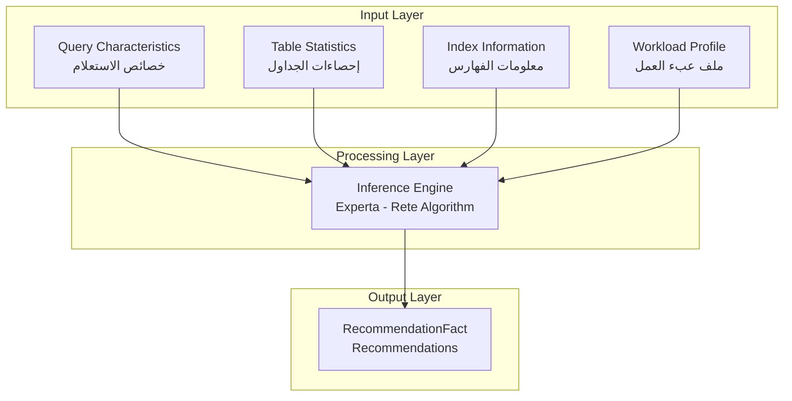

## 2.2 آلية العمل الأساسية

يعمل النظام وفق الخطوات التالية:

1. **تصريح الحقائق (Fact Declaration):** يقوم المستخدم (أو حالة الاختبار) بتغذية النظام بقائمة من كائنات `Fact()` التي تصف الاستعلام والجداول والفهارس وبيئة العمل
2. **المطابقة (Pattern Matching):** يقوم محرك Experta بمطابقة الحقائق مع شروط القواعد عبر شبكة Rete
3. **التفعيل (Activation):** تضاف القواعد المستوفاة الشروط إلى جدول الأعمال (Agenda)
4. **التنفيذ (Execution):)** تنفذ القواعد حسب الأولوية، وقد تنتج القواعد حقائق وسيطة أو توصيات
5. **المخرجات (Output):** تُجمع التوصيات وتُزال المكررات وتُرتب حسب الأولوية وتُعرض للمستخدم

## 2.3 إحصائيات المشروع

| العنصر | العدد |
|--------|-------|
| إجمالي القواعد (@Rule) | 49 قاعدة |
| قواعد الاشتقاق (Derivation Rules) | 5 قواعد |
| قواعد التوصية (Recommendation Rules) | 44 قاعدة |
| فئات التوصية (Categories) | 14 فئة |
| سمات الحقائق الفريدة | 78 سمة |
| حالات الاختبار | 4 حالات |
| مصادر المعرفة | 3 مصادر |
| إجمالي سطور الكود (Python) | 943 سطراً |

---

# 3. أهداف المشروع

## 3.1 الأهداف الرئيسية

1. **بناء نظام خبير متكامل** لتحسين استعلامات SQL باستخدام Python ومكتبة Experta، بحيث تكون جميع القرارات التحسينية ناتجة من تطبيق القواعد على الحقائق عبر محرك الاستدلال

2. **تصميم قاعدة معرفة شاملة** تغطي جميع جوانب تحسين الاستعلامات الرئيسية:
   - اختيار مسار الوصول (Access Path Selection)
   - اختيار خوارزمية JOIN
   - إعادة كتابة الاستعلام (Query Rewrite)
   - إدارة الفهارس (Index Management)
   - صيانة الإحصاءات (Statistics Maintenance)
   - استراتيجيات عبء العمل (Workload-based Strategies)

3. **تطبيق استدلال غير إجرائي (Non-Procedural Inference)** حيث تكون القرارات ناتجة من مطابقة الأنماط (Pattern Matching) وليس من شروط إجرائية (if/else)

4. **تقديم توصيات مفسرة (Explained Recommendations)** بحيث تكون كل توصية مصحوبة بـ:
   - نص التوصية
   - التبرير العلمي مع ذكر المصدر
   - مستوى الأولوية
   - التحسين المتوقع
   - مجال التطبيق

5. **التحقق من صحة النظام** من خلال 4 حالات اختبار متنوعة تغطي أنماط الاستعلام الشائعة

## 3.2 الأهداف التعليمية

1. توثيق المشروع بتقرير أكاديمي شامل باللغة العربية
2. إنشاء مخططات توضيحية (Mermaid Diagrams) تشرح كل قرار تحسيني
3. توفير نموذج عملي يمكن استخدامه في التدريس والبحث في مجال الأنظمة الخبيرة وتحسين قواعد البيانات

---

# 4. الخبير (Domain Expert)

## 4.1 تعريف الخبير في هذا النظام

في هذا النظام الخبير، **الخبير (Domain Expert)** ليس فرداً واحداً، بل هو خبير مركب (Synthesized Expert) تم بناؤه من ثلاثة مصادر موثوقة في مجال تحسين استعلامات قواعد البيانات. المعرفة المشفرة في قاعدة القواعد تمثل الخبرة الجماعية لهذه المصادر.

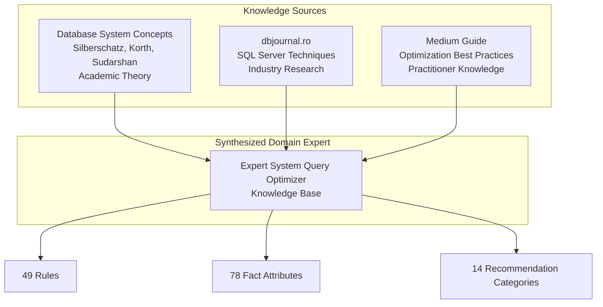

## 4.2 دور الخبير في النظام

| الوظيفة | الوصف |
|---------|-------|
| **تحديد القواعد** | تحديد شروط وظروف كل قاعدة تحسينية بناءً على المعرفة المتخصصة |
| **ترتيب الأولويات** | تحديد مستوى الأولوية (HIGH/MEDIUM/LOW) لكل توصية |
| **تقدير التحسين** | تقدير نسبة التحسين المتوقعة لكل توصية (مثل "تقليل I/O بنسبة 90%") |
| **التبرير العلمي** | كتابة التبرير العلمي لكل توصية مع ذكر المصدر |
| **تصنيف التوصيات** | تصنيف التوصيات إلى فئات (SCAN_SELECTION, JOIN_ALGORITHM, ...) |

## 4.3 منهجية استخراج المعرفة

تم استخراج المعرفة من المصادر الثلاثة من خلال عملية منهجية:

1. **التحديد (Identification):** تحديد قرارات التحسين الرئيسية التي يغطيها كل مصدر
2. **التصنيف (Classification):** تصنيف القرارات إلى فئات (مسار الوصول، خوارزمية JOIN، إلخ)
3. **الترميز (Formalization):** ترميز كل قرار كقاعدة Experta مع:
   - **الشروط (Conditions):** أنماط تطابق الحقائق في ذاكرة العمل
   - **الإجراء (Action):** توليد RecommendationFact بجميع الحقول المطلوبة
4. **التحقق (Validation):** اختبار القواعد ضد 4 حالات اختبار للتأكد من أنها تنفذ بشكل صحيح

---

# 5. مصادر المعرفة

## 5.1 المصادر المعتمدة

يعتمد هذا النظام على ثلاثة مصادر رئيسية للمعرفة، موثقة في ملف `knowledge_base/source_references.py`:

### 5.1.1 Database System Concepts — الفصل 16

| العنصر | التفاصيل |
|--------|----------|
| **المرجع** | Abraham Silberschatz, Henry F. Korth, S. Sudarshan |
| **الطبعة** | السابعة (7th Edition) |
| **الرابط** | https://www.db-book.com |
| **المفتاح البرمجي** | `DSC_Ch16` |

**المفاهيم المستخدمة في النظام:**

- نظرة عامة على تحسين الاستعلامات وخطط التنفيذ
- تحويل التعبيرات العلائقية باستخدام قواعد التكافؤ
- معلومات الكتالوج لتقدير الكلفة
- المعلومات الإحصائية لتقدير الكلفة
- استراتيجيات التحسين المعتمدة على الكلفة
- البرمجة الديناميكية لاختيار خطط التنفيذ
- التحسين التراتبي (Heuristic Optimization): دفع Selection للأسفل، دفع Projection للأسفل
- ترتيب JOIN واختيار خوارزمية JOIN
- خوارزميات Nested Loop Join, Hash Join, Merge Join

**القواعد المستمدة من هذا المصدر:**

```python
# مثال من engine/rules.py
reasoning="Source: Database System Concepts Ch16.3 - Push selection down reduces rows early, lowering JOIN cost"
```

### 5.1.2 Query Optimization Techniques in Microsoft SQL Server

| العنصر | التفاصيل |
|--------|----------|
| **المصدر** | Database Systems Journal, Volume 16, Issue 4 |
| **الرابط** | https://www.dbjournal.ro/archive/16/16_4.pdf |
| **المفتاح البرمجي** | `DBJournal_16_4` |

**المفاهيم المستخدمة في النظام:**

- تحسين الاستعلام المعتمد على الكلفة في SQL Server
- انتقائية الفهرس وأهمية الإحصاءات
- اختيار آلية الوصول إلى البيانات
- اختيار خوارزمية JOIN بناءً على خصائص البيانات
- تأثير تجزؤ الفهارس على الأداء
- حداثة الإحصاءات وجودة خطة التنفيذ
- مقارنة أداء EXISTS vs IN
- تحليل استخدام الفهارس ومراقبتها

**القواعد المستمدة من هذا المصدر:**

```python
# مثال من engine/rules.py
reasoning="Source: dbjournal.ro - Outdated statistics lead to suboptimal execution plans costing up to 10x more"
```

### 5.1.3 Optimizing SQL Query Performance: A Comprehensive Guide

| العنصر | التفاصيل |
|--------|----------|
| **المصدر** | Women in Technology — Medium |
| **الرابط** | https://medium.com/womenintechnology/... |
| **المفتاح البرمجي** | `Medium_Guide` |

**المفاهيم المستخدمة في النظام:**

- استخدام أسماء الأعمدة بدلاً من `SELECT *`
- تجنب DISTINCT غير الضروري
- استخدام WHERE بدلاً من HAVING للشروط غير التجميعية
- EXISTS vs IN
- UNION ALL vs UNION
- أفضل ممارسات صيانة الإحصاءات

**القواعد المستمدة من هذا المصدر:**

```python
# مثال من engine/rules.py
reasoning="Source: Medium Guide - LIMIT without ORDER BY yields inconsistent results across executions"
```

## 5.2 وحدة المراجع البرمجية

يحتوي المشروع على وحدة مخصصة لتوثيق المصادر في `knowledge_base/source_references.py`:

```python
SOURCE_REFERENCES = {
    "DSC_Ch16": {
        "title": "Database System Concepts, Chapter 16: Query Optimization",
        "authors": "Abraham Silberschatz, Henry F. Korth, S. Sudarshan",
        "url": "https://www.db-book.com",
        "key_concepts": [
            "Query optimization overview and evaluation plans",
            ...
        ]
    },
    "DBJournal_16_4": { ... },
    "Medium_Guide": { ... }
}

def get_source_summary():
    """ترجع نصاً منسقاً يلخص جميع المصادر"""
    ...
```

## 5.3 توزيع القواعد حسب المصادر

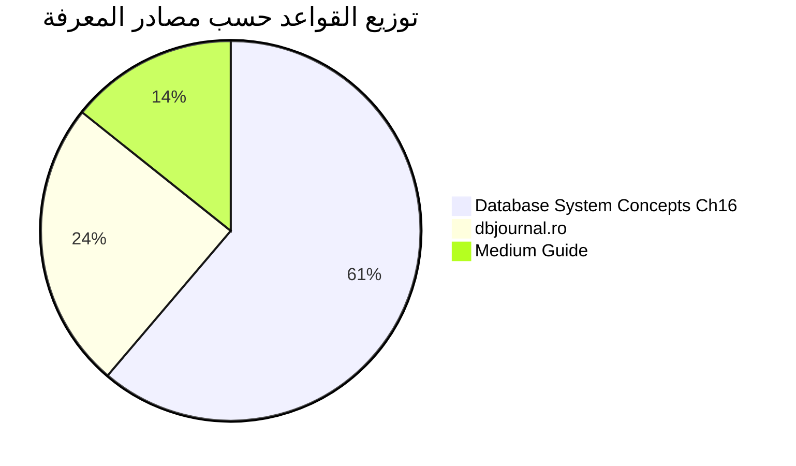

---

# 6. نطاق المشروع

## 6.1 الميزات المضمنة (Included Features)

| الميزة | الوصف |
|--------|-------|
| **اختيار مسار الوصول** | اختيار بين Full Table Scan, Index Scan, Covering Index Scan |
| **التحسين التراتبي (Heuristic Optimization)** | دفع شروط WHERE للأسفل، دفع Projection للأسفل |
| **اختيار خوارزمية JOIN** | Nested Loop, Hash Join, Merge Join, Semi-Join, Anti-Join, Adaptive Join |
| **ترتيب JOIN** | إعادة ترتيب JOINs بوضع الجداول الأصغر أولاً |
| **إعادة كتابة الاستعلام** | Subquery → JOIN, IN → EXISTS, NOT IN → NOT EXISTS, WHERE vs HAVING |
| **تحسين DISTINCT** | كشف DISTINCT غير الضروري عند وجود PRIMARY KEY |
| **تحسين UNION** | اقتراح UNION ALL بدلاً من UNION |
| **تحسين OR** | إعادة كتابة OR باستخدام UNION ALL |
| **فهارس** | اقتراح فهارس جديدة، فهارس مركبة، فهارس مجمعة |
| **صيانة الفهارس** | كشف الفهارس المجزأة وغير المستخدمة |
| **فهارس المفاتيح الخارجية** | اقتراح فهارس على أعمدة FK |
| **إدارة الإحصاءات** | كشف الإحصاءات القديمة، اقتراح Histogram |
| **تقليل النتائج الوسيطة** | تطبيق Selection و Projection قبل JOIN |
| **استراتيجيات عبء العمل** | نصائح حسب طبيعة الحمل (قراءة/كتابة) |
| **التنفيذ المتوازي** | اقتراح التنفيذ المتوازي للجداول الكبيرة |
| **تحسين التقسيم (Partition)** | قص الأقسام (Partition Pruning) |
| **تجسيد CTE** | تجسيد Common Table Expressions في جداول مؤقتة |
| **إزالة التكرار** | طبقة إزالة تكرار التوصيات بمفاتيح مركبة |
| **الترتيب حسب الأولوية** | HIGH > MEDIUM > LOW |
| **حالات اختبار** | 4 حالات تغطي أنماط الاستعلام الشائعة |

## 6.2 الميزات غير المضمنة (Excluded Features)

| الميزة | سبب الاستبعاد |
|--------|---------------|
| **تحليل SQL آلي** | النظام يستقبل حقائق مصنفة مسبقاً، وليس SQL خام |
| **الاتصال بقاعدة بيانات** | النظام لا يتصل بقواعد بيانات حية لجلب الإحصاءات |
| **تقدير الكلفة الكمي** | النظام يستخدم قواعد تراتبية، وليس حسابات كلفة رقمية |
| **واجهة مستخدم رسومية** | النظام يعمل كتطبيق CLI فقط |
| **التعلم الآلي** | لا توجد خوارزميات تعلم آلي |
| **إعادة كتابة تلقائية** | النظام يوصي بالتغييرات لكنه لا يطبقها |

## 6.3 القيود الحالية

1. **تصريح الحقائق يدوي:** يجب على المستخدم إنشاء كائنات `Fact()` يدوياً دون وجود parser لـ SQL
2. **لا يوجد نموذج كلفة كمي:** التوصيات مبنية على قواعد تراتبية وليس على حسابات كلفة رقمية
3. **لا يوجد عامل يقين:** كل قاعدة تنفذ بيقين مطلق (CF=1.0) عند استيفاء شروطها
4. **تحليل ثابت:** يحلل لقطة واحدة من الحقائق دون تعلم من نتائج التنفيذ
5. **مقتصر على SELECT:** جميع حالات الاختبار هي استعلامات SELECT

---

# 7. أصحاب المصلحة

## 7.1 تحديد أصحاب المصلحة

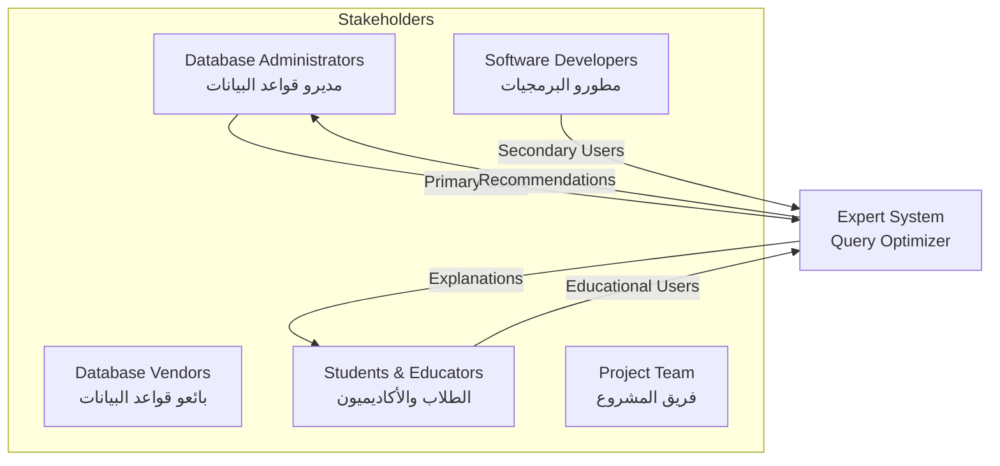

## 7.2 تحليل أصحاب المصلحة

### 7.2.1 مدراء قواعد البيانات (DBAs)

| الجانب | الوصف |
|--------|-------|
| **الدور** | المستخدم الرئيسي المستهدف؛ المسؤول عن أداء قاعدة البيانات |
| **المسؤوليات** | مراقبة أداء الاستعلامات، تحديد الاستعلامات البطيئة، تطبيق التحسينات |
| **الفوائد المتوقعة** | تحليل آلي لأنماط الاستعلامات، توصيات مفسرة بدعم أكاديمي، توفير وقت في مهام التحسين الروتينية |

### 7.2.2 مطورو البرمجيات

| الجانب | الوصف |
|--------|-------|
| **الدور** | مستخدمون ثانويون يكتبون استعلامات SQL في التطبيقات |
| **المسؤوليات** | كتابة استعلامات SQL صحيحة وفعالة تلبي متطلبات الأداء |
| **الفوائد المتوقعة** | تعلم أفضل ممارسات التحسين من خلال التوصيات المفسرة، تجنب مشاكل الأداء الشائعة |

### 7.2.3 الطلاب والأكاديميون

| الجانب | الوصف |
|--------|-------|
| **الدور** | مستخدمون أكاديميون يدرسون مفاهيم تحسين الاستعلامات |
| **الفوائد المتوقعة** | أمثلة عملية لقواعد التحسين، ربط بين النظرية (Database System Concepts) والتطبيق |

---

# 8. المتطلبات الوظيفية

## 8.1 FR-1: تصريح الحقائق

يجب أن يقبل النظام قائمة من كائنات `Fact()` التي تمثل خصائص الاستعلام والجداول والفهارس وبيئة العمل.

**التنفيذ في `engine/optimizer.py` الأسطر 15-16:**

```python
for f in facts or []:
    self.engine.declare(f)
```

## 8.2 FR-2: تعريف القواعد

يجب أن يعرّف النظام قواعد التحسين باستخدام المزين `@Rule` مع شروط مطابقة الأنماط.

**التنفيذ في `engine/rules.py`:** 49 قاعدة معرفة باستخدام `@Rule` و `MATCH` و `AND` و `NOT`.

## 8.3 FR-3: تنفيذ الاستدلال

يجب أن ينفذ النظام خوارزمية Rete للاستدلال لمطابقة الحقائق مع القواعد وتنفيذ القواعد المناسبة.

**التنفيذ في `engine/optimizer.py` السطر 17:**

```python
self.engine.run()
```

## 8.4 FR-4: توليد التوصيات

يجب أن تولد كل قاعدة مشغلة `RecommendationFact` بالحقول التالية:

| الحقل | النوع | الوصف |
|-------|------|-------|
| `recommendation_id` | int | معرف فريد |
| `category` | str | فئة التوصية |
| `recommendation_text` | str | نص التوصية |
| `reasoning` | str | التبرير العلمي |
| `priority` | str | مستوى الأولوية |
| `expected_improvement` | str | التحسين المتوقع |
| `applies_to` | str | مجال التطبيق |

## 8.5 FR-5: إزالة التكرار

يجب أن يزيل النظام التوصيات المكررة بناءً على مفتاح مركب من (category, recommendation_text, applies_to).

**التنفيذ في `engine/optimizer.py` الأسطر 29-37:**

```python
@staticmethod
def _deduplicate(recommendations):
    seen = set()
    result = []
    for rec in recommendations:
        key = (rec['category'], rec['recommendation_text'], rec['applies_to'])
        if key not in seen:
            seen.add(key)
            result.append(rec)
    return result
```

## 8.6 FR-6: الترتيب حسب الأولوية

يجب أن يرتب النظام التوصيات تنازلياً حسب الأولوية: HIGH (3) > MEDIUM (2) > LOW (1).

**التنفيذ في `engine/optimizer.py` الأسطر 4-7:**

```python
PRIORITY_ORDER = {"HIGH": 3, "MEDIUM": 2, "LOW": 1}

def sort_by_priority(recs: list) -> list:
    return sorted(recs, key=lambda r: PRIORITY_ORDER.get(r["priority"], 0), reverse=True)
```

## 8.7 FR-7: الاشتقاق الوسيط

يجب أن يستنتج النظام حقائق وسيطة (Intermediate Facts) من خلال قواعد الاشتقاق قبل تنفيذ قواعد التوصية.

**التنفيذ:** 5 قواعد اشتقاق في `engine/rules.py` الأسطر 21-39 تولد حقائق مثل `select_list_wide` و `push_selection_possible`.

## 8.8 FR-8: تنفيذ حالات الاختبار

يجب أن ينفذ النظام 4 حالات اختبار محددة مسبقاً.

**التنفيذ في `main.py`:**

```python
def run_all_cases():
    run_single_case("CASE 1: Simple SELECT with WHERE clause", case_simple_select)
    run_single_case("CASE 2: Multi-table JOIN query", case_join_query)
    run_single_case("CASE 3: Subquery with IN clause", case_subquery)
    run_single_case("CASE 4: Aggregation with GROUP BY and HAVING", case_aggregation)
```

---

# 9. المتطلبات غير الوظيفية

| المتطلب | الوصف | مؤشر النجاح |
|---------|-------|-------------|
| **الأداء** | يجب أن يكتمل الاستدلال خلال ثانيتين لجميع حالات الاختبار | < 1 ثانية (ملاحظ فعلياً) |
| **قابلية الصيانة** | يجب أن تكون القواعد مستقلة وقابلة للتعديل دون تأثير متبادل | كل قاعدة هي method مستقل |
| **قابلية التوسع** | إضافة أنواع حقائق جديدة لا يتطلب تعديل القواعد الموجودة | حقائق جديدة = وسائط keyword جديدة |
| **الشفافية** | كل توصية يجب أن تتضمن تبريرها ومصدرها | تحقق في جميع التوصيات |
| **قابلية النقل** | يجب أن يعمل النظام على أي منصة مع Python 3.8+ | اختبار على Windows, Python 3.12 |
| **عدم الإجرائية** | يجب أن يكون منطق القرار قائماً على القواعد وليس if/else | جميع القرارات عبر @Rule |

---

# 10. دراسة الجدوى

## 10.1 الجدوى التقنية

| المكون | التقييم |
|--------|---------|
| **لغة البرمجة (Python 3.8+)** | ناضجة، موثقة جيداً، الفريق ملم بها |
| **مكتبة Experta 1.9.4** | ناضجة، تطبق Rete، متوافقة مع Python |
| **تمثيل المعرفة** | سهل، واضح، مناسب للأنظمة القائمة على القواعد |
| **التوثيق (Markdown + Mermaid)** | أدوات قياسية مع دعم ممتاز |

**توافق Experta مع Python 3.10+:** تمت معالجة مشكلة التوافق من خلال monkeypatch في `engine/__init__.py`:

```python
import collections.abc
collections.Mapping = collections.abc.Mapping
collections.MutableMapping = collections.abc.MutableMapping
```

**النتيجة:** مجدية تقنياً ✅

## 10.2 الجدوى التشغيلية

- تنسيق المخرجات (توصيات مفسرة مع أولويات) يتوافق مع طريقة تواصل الخبراء البشريين
- يمكن دمج النظام في CI/CD pipeline أو منصات تعليمية

**النتيجة:** مجدية تشغيلاً ✅

## 10.3 الجدوى الاقتصادية

| المورد | التكلفة |
|--------|---------|
| Python | مجاني (مفتوح المصدر) |
| Experta | مجاني (MIT License) |
| أدوات التطوير | مجانية (VS Code, Git) |
| الموارد البشرية | أكاديمية (مشروع طلابي) |
| **الإجمالي** | **$0** |

**النتيجة:** مجدية اقتصادياً ✅

---

# 11. هندسة النظام

## 11.1 العمارة العامة

يتبع النظام عمارة طبقية (Layered Architecture) بأربع طبقات متميزة:

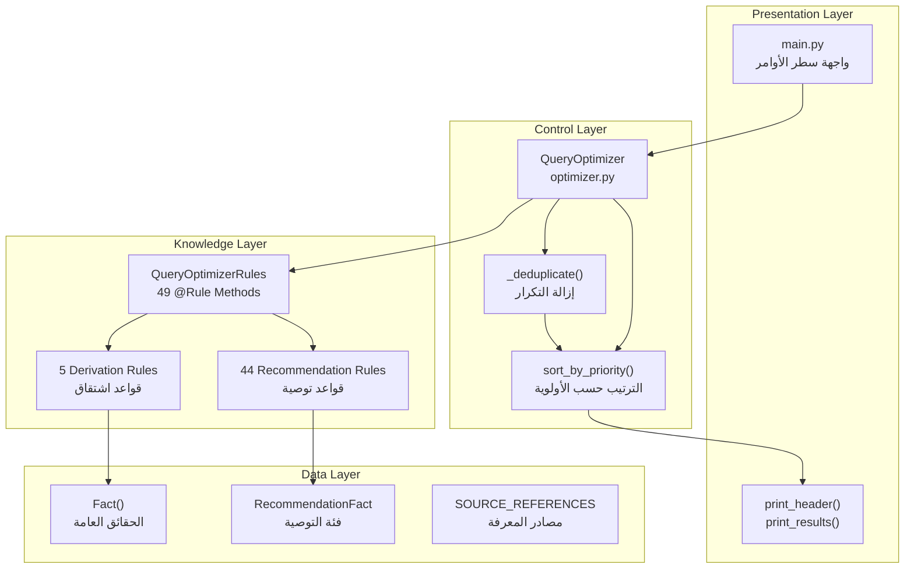

## 11.2 وصف الطبقات

### 11.2.1 طبقة العرض (Presentation Layer) — `main.py`

| الوظيفة | الغرض |
|---------|-------|
| `main()` | نقطة الدخول؛ تطبع العنوان الرئيسي وتنفذ جميع حالات الاختبار |
| `print_header()` | تنسيق عناوين الأقسام بخطوط فاصلة |
| `print_results()` | تنسيق تقرير التوصيات النهائي مع الترقيم والفئات والأولويات |
| `run_single_case()` | تنفيذ حالة اختبار واحدة: إنشاء الحقائق، تشغيل المحسن، عرض النتائج |
| `run_all_cases()` | تنسيق حالات الاختبار الأربع بالتسلسل |

### 11.2.2 طبقة التحكم (Control Layer) — `engine/optimizer.py`

| المكون | الغرض |
|--------|-------|
| `QueryOptimizer` | الفئة الرئيسية للتنسيق؛ تنشئ المحرك، تصرح الحقائق، تشغل الاستدلال، تعالج النتائج |
| `analyze()` | تقبل قائمة الحقائق، تعيد تعيين المحرك، تصرح الحقائق، تشغل القواعد، تزيل التكرار، ترتب، ترجع النتائج |
| `_deduplicate()` | تزيل التوصيات المكررة باستخدام مفتاح مركب |
| `sort_by_priority()` | ترتب التوصيات حسب الوزن: HIGH=3, MEDIUM=2, LOW=1 |

### 11.2.3 طبقة المعرفة (Knowledge Layer) — `engine/rules.py`

| المكون | الغرض |
|--------|-------|
| `QueryOptimizerRules(KnowledgeEngine)` | محرك القواعد الرئيسي يرث من Experta's KnowledgeEngine |
| `__init__()` | يهيئ المحرك بقوائم توصيات وسجلات استدلال فارغة |
| `record()` | يسجل RecommendationFact ويوثق الاستدلال |
| 5 قواعد اشتقاق | تولد حقائق وسيطة من الحقائق الأساسية |
| 44 قاعدة توصية | تولد توصيات التحسين عند استيفاء الشروط |

### 11.2.4 طبقة البيانات (Data Layer) — `engine/facts.py`

| المكون | الغرض |
|--------|-------|
| `RecommendationFact(Fact)` | فئة الحقائق الوحيدة الملموسة، تمثل توصية تحسين بسبعة حقول |
| `Fact()` | Experta's generic fact لجميع الحقائق الأخرى |

## 11.3 تبرير اختيار العمارة

### لماذا العمارة الطبقية (Layered Architecture)؟

1. **فصل الاهتمامات (Separation of Concerns):** كل طبقة لها مسؤولية واحدة، مما يسهل الفهم والاختبار والصيانة
2. **عزل المعرفة:** طبقة المعرفة (القواعد) معزولة تماماً عن منطق التحكم
3. **قابلية الاختبار:** يمكن اختبار كل طبقة بشكل مستقل
4. **المرونة:** يمكن استبدال طبقة العرض (بواجهة ويب مثلاً) دون التأثير على طبقات المعرفة أو التحكم

### لماذا العمارة القائمة على القواعد (Rule-Based Architecture)؟

1. **تصريحي وليس إجرائي:** القواعد تعلن عن الظروف والاستنتاجات، وليس كيفية التحقق منها خطوة بخطوة
2. **مطابقة الأنماط:** خوارزمية Rete تطابق الحقائق مع شروط القواعد بكفاءة
3. **الاستدلال التزايدي:** استنتاج حقائق وسيطة واستخدامها لتفعيل قواعد إضافية
4. **الاستدلال غير الرتيب:** عامل `NOT()` يسمح بتنفيذ القواعد بناءً على غياب الحقائق

---

# 12. قاعدة المعرفة

## 12.1 تمثيل المعرفة

تستخدم قاعدة المعرفة نظام قواعد الإنتاج (Production Rule System) بنوعين من المعرفة:

### 12.1.1 المعرفة التصريحية (Facts)

تمثل الحقائق ما هو معروف عن الاستعلام والجداول والفهارس والبيئة. تُعبر عنها باستخدام `Fact()` مع وسائط keyword:

```python
# خصائص الاستعلام
Fact(select_star=True)
Fact(where=True)
Fact(join=True)
Fact(subquery=True)

# خصائص الجدول
Fact(table="employees", large=True)
Fact(table="employees", tuples=1000000)

# خصائص الفهرس
Fact(table="employees", index=True)
Fact(table="employees", selective=True)

# خصائص JOIN
Fact(nested_loop_possible=True)
Fact(one_small=True)

# بيئة العمل
Fact(read_heavy=True)
Fact(temp_allowed=True)

# الإحصاءات
Fact(stats_outdated=True)
Fact(histogram_available=False)
```

**توزيع سمات الحقائق حسب الفئة:**

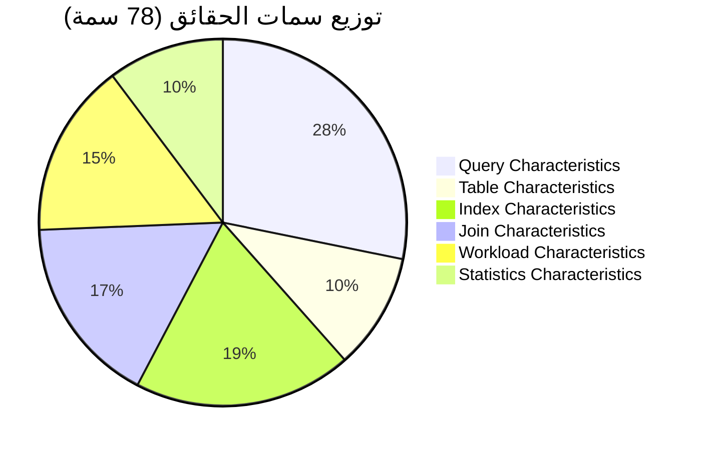

### 12.1.2 المعرفة الإجرائية (Rules)

تمثل القواعد ما يجب استنتاجه عند وجود أنماط معينة من الحقائق في ذاكرة العمل. تُعرف باستخدام مزين Experta's `@Rule`:

```python
@Rule(Fact(table=MATCH.t, large=True) & NOT(Fact(table=MATCH.t, index=True)))
def rule_full_scan(self):
    self.record(RecommendationFact(
        recommendation_id=next_id(),
        category="SCAN_SELECTION",
        recommendation_text="Use Full Table Scan - table is large with no suitable index",
        reasoning="Source: Database System Concepts Ch16 - Full Scan is the only option when no index exists",
        priority="HIGH",
        expected_improvement="Avoid using non-existent index",
        applies_to="access_path"
    ))
```

## 12.2 تصنيف الحقائق

على الرغم من أن النظام يستخدم فئة `Fact()` عامة مع وسائط keyword، إلا أن الحقائق تنقسم منطقياً إلى الفئات التالية:

### 12.2.1 خصائص الاستعلام (22 سمة)

| السمة | الوصف |
|-------|-------|
| `select_star` | يستخدم `SELECT *` |
| `select_minimal` | يختار أعمدة محددة |
| `where` | يحتوي على WHERE |
| `subquery` | يحتوي على Subquery |
| `correlated_subquery` | Subquery ترابطي |
| `join` | يحتوي على JOIN |
| `aggregation` | يستخدم دوال تجميعية |
| `group_by` | يحتوي على GROUP BY |
| `having` | يحتوي على HAVING |
| `distinct` | يستخدم DISTINCT |
| `order_by` | يحتوي على ORDER BY |
| `limit` | يحتوي على LIMIT/OFFSET |
| `in_operator` | يستخدم IN |
| `not_in` | يستخدم NOT IN |
| `union` | يستخدم UNION |
| `union_all` | يستخدم UNION ALL |
| `or_condition` | يحتوي على OR |
| `equality_predicate` | شرط WHERE مساواة |
| `range_predicate` | شرط WHERE نطاق (BETWEEN, >, <) |
| `multi_column_predicate` | WHERE بأعمدة متعددة |
| `view` | يستخدم VIEW |
| `cte` | يحتوي على CTE (WITH clause) |

### 12.2.2 خصائص الجداول (8 سمات)

| السمة | النوع | الوصف |
|-------|-------|-------|
| `table` | str | اسم الجدول (مفتاح الربط) |
| `large` | bool | جدول كبير |
| `small` | bool | جدول صغير |
| `tuples` | int | عدد الصفوف |
| `pk` | bool | يوجد PRIMARY KEY |
| `fk` | bool | يوجد FOREIGN KEY |
| `stats_fresh` | bool | الإحصاءات حديثة |
| `data_known` | bool | توزيع البيانات معروف |

### 12.2.3 خصائص الفهارس (15 سمة)

| السمة | الوصف |
|-------|-------|
| `index` | يوجد فهرس |
| `selective` | فهرس انتقائي |
| `clustered` | فهرس مجمع |
| `nonclustered` | فهرس غير مجمع |
| `covering` | فهرس غطاء (يغطي جميع الأعمدة) |
| `composite` | فهرس مركب |
| `on_predicate` | على عمود الشرط |
| `on_join` | على عمود JOIN |
| `supports_join` | يدعم JOIN |
| `supports_order` | يدعم ORDER BY |
| `fragmented` | فهرس مجزأ |
| `unused` | فهرس غير مستخدم |

### 12.2.4 خصائص JOIN (13 سمة)

| السمة | الوصف |
|-------|-------|
| `nested_loop_possible` | Nested Loop Join ممكن |
| `hash_join_possible` | Hash Join ممكن |
| `merge_join_possible` | Merge Join ممكن |
| `one_small` | إحدى العلاقات صغيرة |
| `both_large` | كلتا العلاقتين كبيرتان |
| `join_equality` | شرط JOIN مساواة |
| `semi_join_possible` | Semi-Join ممكن |
| `anti_join_possible` | Anti-Join ممكن |

### 12.2.5 خصائص بيئة العمل (12 سمة)

| السمة | الوصف |
|-------|-------|
| `read_heavy` | حمل قراءة مكثفة |
| `write_heavy` | حمل كتابة مكثفة |
| `fast_response` | استجابة سريعة مطلوبة |
| `temp_allowed` | جداول مؤقتة مسموحة |
| `memory_constrained` | ذاكرة محدودة |
| `parallel_available` | تنفيذ متوازي متاح |

### 12.2.6 خصائص الإحصاءات (8 سمات)

| السمة | الوصف |
|-------|-------|
| `stats_outdated` | الإحصاءات قديمة |
| `cardinality_accurate` | تقدير السعة دقيق |
| `histogram_available` | Histogram متاح |
| `intermediate_large` | نتائج وسيطة كبيرة |

## 12.3 تنظيم القواعد

### 12.3.1 نظرة عامة على القواعد الـ 49

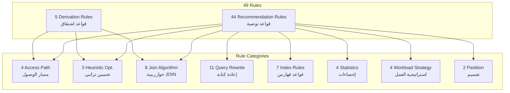

### 12.3.2 قواعد الاشتقاق (5 قواعد)

ترتيبها أولاً في `QueryOptimizerRules` يضمن تنفيذها قبل قواعد التوصية:

| القاعدة | السطر | الشرط | الحقيقة المشتقة |
|---------|-------|-------|-----------------|
| `derive_select_list_wide` | 22 | `select_star=True` | `select_list_wide=True` |
| `derive_select_list_narrow` | 26 | `select_minimal=True` | `select_list_minimal=True` |
| `derive_push_selection` | 30 | `where=True & subquery=True & join=True` | `push_selection_possible=True` |
| `derive_full_scan_scenario` | 34 | `table=t, large=True & NOT(index=True)` | `full_scan_scenario=True` |
| `derive_index_scan_scenario` | 38 | `table=t, index=True & selective=True & large=True` | `index_scan_possible=True` |

### 12.3.3 قواعد التوصية حسب الفئة

#### مسار الوصول (4 قواعد)

| القاعدة | الأولوية | الشرط |
|---------|----------|-------|
| `rule_full_scan` | HIGH | جدول كبير بدون فهرس |
| `rule_index_scan` | HIGH | جدول كبير + فهرس + انتقائي |
| `rule_small_table_scan` | MEDIUM | جدول صغير |
| `rule_covering_index_scan` | HIGH | SELECT محدد + فهرس غطاء |

#### التحسين التراتبي (3 قواعد)

| القاعدة | الأولوية | الشرط |
|---------|----------|-------|
| `rule_push_selection_down` | HIGH | WHERE + subquery + join |
| `rule_push_projection_down` | HIGH | قائمة SELECT واسعة |
| `rule_predicate_pushdown_view` | HIGH | VIEW + WHERE |

#### خوارزميات JOIN (8 قواعد)

| القاعدة | الأولوية | الشرط |
|---------|----------|-------|
| `rule_nested_loop_join` | HIGH | NLJ ممكن + علاقة صغيرة + فهرس |
| `rule_hash_join` | HIGH | جدولان كبيران + غير مقيد بالذاكرة |
| `rule_merge_join` | MEDIUM | Merge ممكن + ORDER BY |
| `rule_hash_join_no_index` | HIGH | Hash ممكن + مساواة + بدون فهرس |
| `rule_semi_join` | HIGH | Semi-join ممكن + subquery |
| `rule_anti_join` | HIGH | Anti-join ممكن + NOT IN |
| `rule_adaptive_join` | MEDIUM | Adaptive ممكن + غير دقيق السعة |
| `rule_join_order_optimization` | HIGH | إعادة ترتيب ممكنة + جدول صغير |

#### إعادة كتابة الاستعلام (11 قاعدة)

| القاعدة | الأولوية | الشرط |
|---------|----------|-------|
| `rule_subquery_to_join` | HIGH | Subquery ترابطي بدون تجميع |
| `rule_exists_vs_in` | MEDIUM | IN + subquery ترابطي |
| `rule_where_vs_having` | HIGH | HAVING بدون WHERE + تجميع |
| `rule_distinct_optimization` | MEDIUM | DISTINCT + PK موجود |
| `rule_union_all_instead_of_union` | MEDIUM | UNION بدون UNION ALL |
| `rule_or_condition_optimization` | MEDIUM | OR موجود |
| `rule_not_in_to_not_exists` | HIGH | NOT IN + subquery |
| `rule_cte_materialization` | MEDIUM | CTE غير مجسد + Temp مسموح |
| `rule_materialize_subquery` | MEDIUM | Subquery ترابطي + تجميع + Temp مسموح |
| `rule_order_by_with_limit` | LOW | LIMIT بدون ORDER BY |

#### الفهارس (7 قواعد)

| القاعدة | الأولوية | الشرط |
|---------|----------|-------|
| `rule_index_suggestion` | HIGH | جدول كبير بدون فهرس |
| `rule_composite_index_suggestion` | MEDIUM | شرط متعدد الأعمدة بدون فهرس مركب |
| `rule_clustered_index_for_range` | MEDIUM | شرط نطاق بدون Clustered Index |
| `rule_index_on_foreign_key` | HIGH | FK موجود بدون فهرس على JOIN |
| `rule_unused_index_detection` | LOW | فهرس غير مستخدم |
| `rule_fragmented_index` | MEDIUM | فهرس مجزأ |
| `rule_use_index_for_filter` | HIGH | WHERE + فهرس على عمود الشرط |

#### الإحصاءات (4 قواعد)

| القاعدة | الأولوية | الشرط |
|---------|----------|-------|
| `rule_statistics_freshness` | HIGH | إحصاءات قديمة |
| `rule_reduce_intermediate_results` | HIGH | نتائج وسيطة كبيرة |
| `rule_data_distribution_check` | MEDIUM | إحصاءات حديثة + توزيع بيانات غير معروف |
| `rule_create_histogram` | MEDIUM | لا يوجد Histogram |

#### استراتيجية العمل (4 قواعد)

| القاعدة | الأولوية | الشرط |
|---------|----------|-------|
| `rule_fast_response_strategy` | HIGH | استجابة سريعة + حرجة + ORDER BY |
| `rule_maintain_indexes_read_heavy` | MEDIUM | قراءة مكثفة |
| `rule_minimize_indexes_write_heavy` | MEDIUM | كتابة مكثفة |
| `rule_parallel_execution` | HIGH | توازي متاح + جدول كبير |

#### التقسيم (2 قاعدة)

| القاعدة | الأولوية | الشرط |
|---------|----------|-------|
| `rule_partition_pruning` | HIGH | جدول مقسم + استخدام مفتاح التقسيم |
| `rule_partition_key_missing` | MEDIUM | جدول مقسم + عدم استخدام مفتاح التقسيم |

## 12.4 نظام الأولويات

| الأولوية | الوزن | عدد القواعد | المعنى |
|----------|-------|-------------|--------|
| HIGH | 3 | 24 | تحسين حاسم، تأثير كبير (50-90%) |
| MEDIUM | 2 | 16 | تحسين مهم، تأثير متوسط |
| LOW | 1 | 4 | تحسين ثانوي أو تصحيح |
| (اشتقاق) | N/A | 5 | حقائق وسيطة، ليست توصيات |

## 12.5 مجالات التطبيق (applies_to)

يستخدم النظام **27 قيمة فريدة** في حقل `applies_to`:

`access_path`, `query_tree_transformation`, `view_optimization`, `select_optimization`, `join_execution`, `adaptive_join_execution`, `join_ordering`, `query_rewriting`, `subquery_optimization`, `filter_pushdown`, `duplicate_removal`, `set_operation_optimization`, `condition_rewriting`, `cte_optimization`, `query_correctness`, `index_creation`, `index_type_selection`, `index_maintenance`, `filter_optimization`, `limit_offset_optimization`, `statistics_maintenance`, `intermediate_result_optimization`, `statistics_enhancement`, `response_time_optimization`, `index_strategy`, `execution_parallelism`, `partition_access`

## 12.6 فئات التوصية (14 فئة)

`SCAN_SELECTION`, `INDEX_SCAN`, `HEURISTIC_OPTIMIZATION`, `QUERY_REWRITE`, `JOIN_ALGORITHM`, `JOIN_ORDER`, `INDEX_SUGGESTION`, `INDEX_MAINTENANCE`, `INDEX_USAGE`, `PERFORMANCE_TUNING`, `STATISTICS`, `WORKLOAD_STRATEGY`, `PARALLEL_EXECUTION`, `PARTITION_OPTIMIZATION`

---

# 13. محرك الاستدلال

## 13.1 خوارزمية Rete

يستخدم النظام **Experta** (الإصدار 1.9.4)، وهي مكتبة Python تطبق **خوارزمية Rete**. Rete هي خوارزمية سريعة لمطابقة الأنماط (Pattern Matching) صممها Charles Forgy عام 1982 خصيصاً لأنظمة إنتاج القواعد (Production Rule Systems).

### 13.1.1 هيكل شبكة Rete

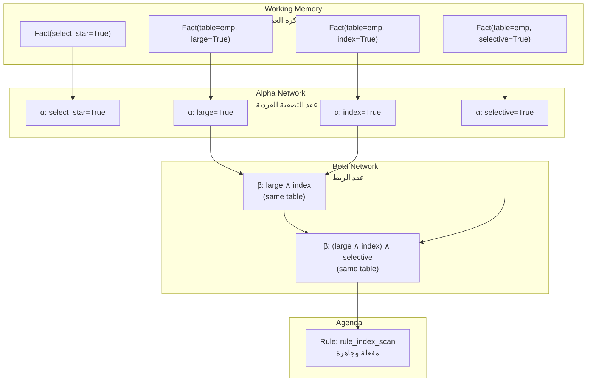

### 13.1.2 مكونات شبكة Rete

| المكون | الوظيفة |
|--------|---------|
| **Alpha Nodes** | ترشيح الحقائق الفردية بشرط بسيط (مثل `large=True`) |
| **Alpha Memory** | تخزين الحقائق التي تحقق شرط alpha node |
| **Beta Nodes** | ربط مجموعات من الحقائق من alpha memories مختلفة |
| **Beta Memory** | تخزين المطابقات الجزئية |
| **Production Nodes** | تمثل شروط القاعدة الكاملة |
| **Agenda** | قائمة القواعد المفعلة التي تنتظر التنفيذ |

### 13.1.3 مزايا Rete في هذا النظام

1. **حفظ الحالة (State-Saving):** النتائج الوسيطة مخزنة في alpha/beta memories؛ إضافة حقيقة جديدة لا يتطلب إعادة تقييم جميع الشروط
2. **مطابقة فعالة:** تعقيد زمني أقل من إعادة التقييم الكامل لكل قاعدة مع كل حقيقة جديدة
3. **تزايدي (Incremental):** يمكن إضافة حقائق جديدة تدريجياً دون إعادة تشغيل
4. **فعال مع القواعد الكثيرة:** الأداء يتدهور ببطء مع زيادة عدد القواعد

## 13.2 آلية الاستدلال

### 13.2.1 الاستدلال الأمامي (Forward Chaining)

يستخدم النظام **الاستدلال الأمامي (Forward Chaining)**: الاستدلال يتقدم من الحقائق المعروفة نحو الاستنتاجات (التوصيات).

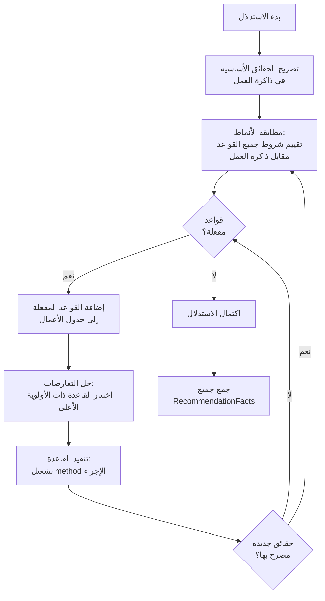

### 13.2.2 سلاسل الاستدلال (Inference Chaining)

توضح القواعد الخمس للاشتقاق كيف يعمل الاستدلال المتسلسل:

#### السلسلة 1: SELECT * → قائمة واسعة → دفع Projection
```
Fact(select_star=True)
  → derive_select_list_wide() -> Fact(select_list_wide=True)
    → rule_push_projection_down() [HEURISTIC_OPTIMIZATION, HIGH]
```

#### السلسلة 2: SELECT محدد → قائمة محدودة → Covering Index
```
Fact(select_minimal=True)
  → derive_select_list_narrow() -> Fact(select_list_minimal=True)
    → rule_covering_index_scan() [INDEX_SCAN, HIGH]
```

#### السلسلة 3: استعلام معقد → دفع Selection ممكن
```
Fact(where=True) & Fact(subquery=True) & Fact(join=True)
  → derive_push_selection() -> Fact(push_selection_possible=True)
    → rule_push_selection_down() [HEURISTIC_OPTIMIZATION, HIGH]
```

## 13.3 تنفيذ القاعدة

### 13.3.1 تشريح القاعدة

تتكون كل قاعدة من جزأين رئيسيين:

1. **الجزء الأيسر (LHS — Conditions):** الأنماط المحددة في مزين `@Rule`
2. **الجزء الأيمن (RHS — Action):)** نص الدالة الذي ينفذ عند مطابقة الشروط

```python
# LHS: الشروط
@Rule(
    Fact(table=MATCH.t, index=True),
    Fact(table=MATCH.t, selective=True),
    Fact(table=MATCH.t, large=True)
)
# RHS: الإجراء
def rule_index_scan(self):
    self.record(RecommendationFact(
        recommendation_id=next_id(),
        category="SCAN_SELECTION",
        recommendation_text="Use Index Scan instead of Full Scan...",
        reasoning="Source: dbjournal.ro - Index Scan significantly reduces...",
        priority="HIGH",
        expected_improvement="Reduce I/O by up to 90%",
        applies_to="access_path"
    ))
```

### 13.3.2 عوامل مطابقة الأنماط

| العامل | الغرض | مثال |
|--------|-------|------|
| `MATCH.t` | ربط متغير بقيمة من الحقيقة المطابقة | `Fact(table=MATCH.t, large=True)` |
| `&` (AND) | الربط المنطقي للشروط | `Fact(a=True) & Fact(b=True)` |
| `NOT()` | النفي — ينفذ عند غياب الحقيقة | `NOT(Fact(table=t, index=True))` |

### 13.3.3 رط المتغيرات بـ MATCH

يستخدم `MATCH` لربط الحقائق المتعلقة بنفس الكيان:

```python
# كل الحقائق يجب أن تشير إلى نفس الجدول (t)
@Rule(Fact(table=MATCH.t, index=True) & 
      Fact(table=MATCH.t, selective=True) & 
      Fact(table=MATCH.t, large=True))
def rule_index_scan(self):
    # t مربوط باسم الجدول
    ...
```

## 13.4 جدول الأعمال (Agenda)

جدول الأعمال هو قائمة ديناميكية بتنشيطات القواعد التي يحافظ عليها Rete:

```
محتوى جدول الأعمال (أثناء تشغيل Case 2):
  [1] rule_statistics_freshness        (stats_outdated=True)
  [2] rule_select_list_optimization    (select_star=True)
  [3] rule_reduce_intermediate_results (intermediate_large=True)
  [4] rule_join_order_optimization     (join_ordering_possible + has_small_table)
  ...
```

## 13.5 حل التعارضات (Conflict Resolution)

يستخدم Experta **حل التعارضات القائم على الأولوية الضمنية (salience)**:
- القواعد المعرفة أولاً في الكلاس لها أولوية ضمنية أعلى
- قواعد الاشتقاق (5) معرفة قبل قواعد التوصية (44)
- الترتيب في `QueryOptimizerRules`:
  - الأسطر 21-39: 5 قواعد اشتقاق (تَنفذ أولاً)
  - الأسطر 43-583: 44 قاعدة توصية (تَنفذ لاحقاً)

---

# 14. عامل اليقين (Certainty Factor)

## 14.1 الوضع الحالي

**النظام في إصداره الحالي لا يطبق عوامل اليقين (Certainty Factors).** كل قاعدة، عندما تستوفى شروطها، تنفذ بيقين مطلق (CF=1.0). لا توجد آلية لـ:

- تمثيل الحقائق غير المؤكدة (مثل "ربما الجدول كبير، CF=0.8")
- نشر عدم اليقين عبر سلاسل الاستدلال
- دمج اليقين من قواعد متعددة
- تفعيل القواعد بناءً على عتبة (threshold) من اليقين

## 14.2 أهمية عوامل اليقين في تحسين الاستعلامات

عدم اليقين متأصل في مجال تحسين الاستعلامات:

| مصدر عدم اليقين | مثال | التأثير |
|------------------|------|---------|
| **إحصاءات قديمة** | إحصاءات عمرها 6 أشهر؛ تقدير السعة قد يكون خاطئاً بعامل 10 | اختيار خوارزمية JOIN خاطئ |
| **خطأ المعاينة** | إحصاءات مبنية على عينة 1%؛ قد يفوت Histogram انحراف البيانات | تقديرات سعة غير دقيقة |
| **استعلامات معممة** | `WHERE salary > ?` القيمة الفعلية غير معروفة وقت التحسين | الانتقائية غير معروفة |
| **حمل متغير** | عبء العمل قد يتحول من قراءة مكثفة إلى كتابة مكثفة | استراتيجية الفهارس قد تصبح غير مثلى |
| **حمل النظام** | حمل النظام الحالي يؤثر على I/O و CPU | تقديرات الكلفة غير دقيقة |

## 14.3 النظام المقترح لعوامل اليقين

للتنفيذ المستقبلي، يُقترح نظام CF بناءً على **نموذج MYCIN**:

### 14.3.1 تمثيل CF

| قيمة CF | التفسير |
|----------|---------|
| 1.0 | صحيح بالتأكيد |
| 0.8 | محتمل جداً |
| 0.5 | محتمل متوسط |
| 0.2 | محتمل قليلاً |
| 0.0 | غير معروف |
| -0.2 | غير محتمل قليلاً |
| -0.5 | غير محتمل متوسط |
| -0.8 | غير محتمل جداً |
| -1.0 | خطأ بالتأكيد |

### 14.3.2 معادلات نشر CF

**الاقتران (AND):**

```
CF(A ∧ B) = min(CF(A), CF(B))
```

**الفصل (OR):**

```
CF(A ∨ B) = max(CF(A), CF(B))
```

**النفي (NOT):**

```
CF(¬A) = -CF(A)
```

**نشر القاعدة (Modus Ponens):**

عندما قاعدة R: "IF A THEN B" مع CF(R):

```
CF(B) = CF(A) × CF(R)
```

**دمج الأدلة المتوازية:**

عندما قاعدتان مستقلتان تنتجان نفس الاستنتاج B:

```
CF(B) = CF₁(B) + CF₂(B) − CF₁(B) × CF₂(B)    إذا كان كلاهما > 0
```

### 14.3.3 مثال: نشر CF في تحسين الاستعلام

اعتبر قاعدة مع CF(R) = 0.9:

```
IF  table is large (CF=0.8)
AND index is selective (CF=0.7)
AND index exists (CF=1.0)
THEN use Index Scan (CF(R)=0.9)
```

```
CF(conditions) = min(0.8, 0.7, 1.0) = 0.7
CF(conclusion) = 0.7 × 0.9 = 0.63
```

### 14.3.4 عتبات عرض التوصيات

| نطاق CF | العرض |
|---------|-------|
| 0.8 – 1.0 | عرض بارز (ثقة عالية) |
| 0.5 – 0.8 | عرض عادي (ثقة متوسطة) |
| 0.2 – 0.5 | عرض مع تحذير (ثقة منخفضة) |
| < 0.2 | لا يعرض (أدلة غير كافية) |

## 14.4 المعالجة الحالية لعدم اليقين

في غياب عوامل اليقين الرسمية، يعالج النظام عدم اليقين من خلال:

1. **مستويات الأولوية:** HIGH/MEDIUM/LOW كتقدير تقريبي للثقة
2. **قواعد متعددة:** سيناريوهات مختلفة تغطيها قواعد مختلفة
3. **تبرير صريح:** كل توصية تشرح الظروف التي أدت إليها
4. **الوعي بالإحصاءات:** قواعد تكتشف الإحصاءات القديمة وتحذر المستخدم

---

# 15. تدفق البيانات

## 15.1 مخطط تدفق البيانات الكامل

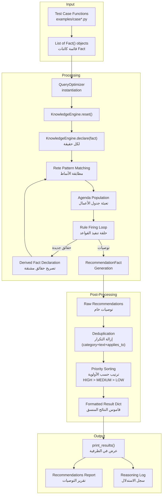

## 15.2 وصف خطوات تدفق البيانات

### الخطوة 1: توليد الإدخال

ترجع كل دالة حالة اختبار قائمة من كائنات `Fact()`:

```python
def case_simple_select():
    return [
        Fact(select_star=True),
        Fact(where=True),
        Fact(table="employees", large=True),
        Fact(table="employees", tuples=1000000),
        # ... 17 حقيقة أخرى
    ]
```

### الخطوة 2: تهيئة المحرك

```python
optimizer = QueryOptimizer()
results = optimizer.analyze(facts)
```

### الخطوة 3: مطابقة الأنماط وتنفيذ القواعد

تقوم شبكة Rete بتقييم جميع شروط القواعد في وقت واحد. لكل قاعدة مستوفاة:
- إذا كانت قاعدة اشتقاق → تُصرح حقيقة وسيطة جديدة
- إذا كانت قاعدة توصية → يُسجل `RecommendationFact`

### الخطوة 4: جمع التوصيات الخام

تُجمع جميع كائنات `RecommendationFact` في `self.engine.recommendations`

### الخطوة 5: إزالة التكرار

تُستخدم خريطة `set` مع مفتاح مركب (category, text, applies_to) لإزالة التكرارات.

**لماذا يحدث التكرار؟** القاعدة قد تنفذ مرات متعددة لكل مجموعة مطابقة من الحقائق. مثلاً، إذا كان هناك جدولان صغيران بفهارس، `rule_small_table_scan` تنفذ مرتين بنفس نص التوصية.

### الخطوة 6: الترتيب حسب الأولوية

تُرتب التوصيات تنازلياً: HIGH > MEDIUM > LOW

### الخطوة 7: تنسيق المخرجات

```python
{
    "recommendations": [...],   # مرتبة، بدون تكرار
    "reasoning_log": [...],     # نصوص منسقة للاستدلال
    "total_recommendations": N
}
```

### الخطوة 8: العرض

```python
def print_results(results: dict):
    for i, rec in enumerate(results['recommendations'], 1):
        print(f"  [{i}] {rec['category']}  [{rec['priority']}]")
        print(f"      Recommendation: {rec['recommendation_text']}")
        print(f"      Reasoning: {rec['reasoning']}")
        print(f"      Expected Improvement: {rec['expected_improvement']}")
        print(f"      Applies To: {rec['applies_to']}")
```

---

# 16. الخوارزميات

## 16.1 خوارزمية Rete

خوارزمية Rete هي خوارزمية مطابقة الأنماط الأساسية المستخدمة من Experta.

### 16.1.1 نظرة عامة

```
الإدخال:  ذاكرة العمل (مجموعة حقائق)
          ذاكرة الإنتاج (مجموعة قواعد مع شروط)
الإخراج: إجراءات القواعد المنفذة

الخوارزمية:
1. بناء شبكة Rete من شروط القواعد:
   - Alpha network: عقدة لكل شرط ذري
   - Beta network: عقد JOIN تربط المطابقات الجزئية
   - Production nodes: عقد طرفية للقواعد الكاملة

2. لكل حقيقة تضاف إلى ذاكرة العمل:
   a. نشر عبر alpha network (التصفية)
   b. تخزين في alpha memories المناسبة
   c. نشر إلى beta network (الربط)
   d. تحديث beta memories
   e. إذا تحققت شروط production node → إضافة إلى جدول الأعمال

3. بينما جدول الأعمال غير فارغ:
   a. اختيار القاعدة ذات الأولوية الأعلى
   b. تنفيذ القاعدة
   c. إذا صرحت القاعدة حقائق جديدة → العودة للخطوة 2
   d. إزالة القاعدة المنفذة من جدول الأعمال
```

### 16.1.2 تحليل التعقيد

| الخاصية | الأداء |
|---------|--------|
| إضافة حقيقة جديدة | O(|α| + |β|) حيث |α| = عدد alpha nodes, |β| = عدد beta nodes |
| تنفيذ قاعدة | O(1) |
| الذاكرة | O(|α-mem| + |β-mem|) لتخزين النتائج الوسيطة |

## 16.2 خوارزمية إزالة التكرار

```
Algorithm: _deduplicate(recommendations)
الإدخال:  قائمة dictionaries التوصيات
الإخراج: قائمة dictionaries فريدة

seen ← مجموعة فارغة
result ← قائمة فارغة

لكل rec في recommendations:
    key ← (rec['category'], rec['recommendation_text'], rec['applies_to'])
    إذا key ليس في seen:
        أضف key إلى seen
        أضف rec إلى result

أرجع result
```

**التعقيد الزمني:** O(n) حيث n = عدد التوصيات
**التعقيد المكاني:** O(n) لمجموعة `seen`

## 16.3 خوارزمية الترتيب حسب الأولوية

```
Algorithm: sort_by_priority(recommendations)
الإدخال:  قائمة dictionaries التوصيات
الإخراج: قائمة مرتبة تنازلياً حسب الأولوية

PRIORITY_ORDER ← {"HIGH": 3, "MEDIUM": 2, "LOW": 1}

أرجع sorted(recommendations,
       key=lambda r: PRIORITY_ORDER.get(r["priority"], 0),
       reverse=True)
```

**التعقيد الزمني:** O(n log n)
**التعقيد المكاني:** O(n)

## 16.4 خوارزمية الاستدلال الأمامي

```
Algorithm: ForwardChaining(engine, facts)
الإدخال:  KnowledgeEngine, قائمة حقائق
الإخراج: قائمة توصيات

1. engine.reset()
2. لكل fact في facts:
     engine.declare(fact)

3. كرر:
     matches ← ReteNetwork.match(engine.working_memory, engine.rules)
     agenda ← get_activated_rules(matches)

     إذا agenda فارغة:
         توقف

     rule ← select_highest_priority(agenda)
     action ← execute(rule)

     إذا action.type = declare:
         engine.declare(action.result)
     وإلا إذا action.type = record:
         recommendations.append(action.result)

4. أرجع recommendations
```

## 16.5 خوارزمية ربط المتغيرات بـ MATCH

```
Algorithm: MatchBinding(rules, facts)
الإدخال:  قواعد مع MATCH variables، مجموعة حقائق
الإخراج: ربطات متغيرات تحقق شروط القاعدة

لقاعدة بشرط:
    @Rule(Fact(table=MATCH.t, large=True) & Fact(table=MATCH.t, index=True))

الإجراء:
    جد كل الأزواج (f1, f2) من الحقائق حيث:
        - f1 لها attribute 'table' = قيمة v
        - f1 لها attribute 'large' = True
        - f2 لها attribute 'table' = v (نفس القيمة)
        - f2 لها attribute 'index' = True

    لكل زوج:
        اربط t ← v
        فعّل القاعدة مع الربط {t: v}
```

---

# 17. هيكل المشروع

## 17.1 شجرة الدليل الكاملة

```
E:\EXPERT-SYSTEM-QUERY-OPTIMIZER-Project\
│
├── main.py                          # نقطة الدخول - تطبيق CLI
├── README.md                        # توثيق المشروع
├── requirements.txt                 # متطلبات Python
├── Final_Report_Arabic.md           # هذا التقرير
├── Project_Diagrams.md              # مخططات المشروع
│
├── engine/                          # حزمة المحرك الأساسي
│   ├── __init__.py                  # تهيئة الحزمة، monkeypatch للمجموعات
│   ├── facts.py                     # فئة RecommendationFact
│   ├── rules.py                     # 49 قاعدة QueryOptimizerRules
│   └── optimizer.py                 # فئة QueryOptimizer للتنسيق
│
├── knowledge_base/                  # حزمة قاعدة المعرفة
│   ├── __init__.py                  # تهيئة فارغة
│   └── source_references.py         # قاموس SOURCE_REFERENCES
│
├── examples/                        # حزمة حالات الاختبار
│   ├── __init__.py                  # تهيئة فارغة
│   ├── case1_simple_select.py       # حالة اختبار 1
│   ├── case2_join_query.py          # حالة اختبار 2
│   ├── case3_subquery.py            # حالة اختبار 3
│   └── case4_aggregation.py         # حالة اختبار 4
│
├── docs/                            # التوثيق
│   ├── report.md                    # تقرير أكاديمي أولي (عربي)
│   ├── diagrams.md                  # مخططات معمارية سابقة
│   └── kbsReportProject (4) - Khalid Al-Nashi.pdf  # مرجع
│
└── venv/                            # بيئة Python الافتراضية
```

## 17.2 وصف الملفات

### الملفات الجذرية

| الملف | السطور | الوصف |
|-------|--------|-------|
| `main.py` | 57 | نقطة الدخول؛ تنفذ 4 حالات اختبار وتعرض النتائج |
| `README.md` | 92 | توثيق المشروع مع الهيكل والمتطلبات والاستخدام |
| `requirements.txt` | 4 | التبعيات: experta, frozendict, schema, sqlparse |

### حزمة engine/

| الملف | السطور | الوصف |
|-------|--------|-------|
| `__init__.py` | 4 | monkeypatch لـ `collections.Mapping` لتوافق Experta مع Python 3.10+ |
| `facts.py` | 10 | تعريف `RecommendationFact` مع 7 حقول |
| `rules.py` | 583 | تعريف `QueryOptimizerRules` مع 49 قاعدة (5 اشتقاق + 44 توصية) |
| `optimizer.py` | 38 | تعريف `QueryOptimizer` مع `analyze()`، `_deduplicate()`، `sort_by_priority()` |

### حزمة knowledge_base/

| الملف | السطور | الوصف |
|-------|--------|-------|
| `__init__.py` | 0 | تهيئة فارغة |
| `source_references.py` | 62 | قاموس `SOURCE_REFERENCES` يوثق مصادر المعرفة الثلاثة |

### حزمة examples/

| الملف | السطور | الحقائق | الوصف |
|-------|--------|---------|-------|
| `case1_simple_select.py` | 30 | 21 حقيقة | SELECT بسيط مع WHERE على جدول مفهرس |
| `case2_join_query.py` | 62 | 49 حقيقة | JOIN متعدد الجداول (3 جداول) |
| `case3_subquery.py` | 52 | 40 حقيقة | Subquery ترابطي مع IN |
| `case4_aggregation.py` | 45 | 35 حقيقة | تجميع مع GROUP BY و HAVING و DISTINCT |

## 17.3 monkeypatch في `engine/__init__.py`

يعالج هذا الملف مشكلة توافق بين Experta 1.9.4 و Python 3.10+:

```python
import collections.abc
collections.Mapping = collections.abc.Mapping
collections.MutableMapping = collections.abc.MutableMapping
```

في Python 3.10+، تم نقل `collections.Mapping` و `collections.MutableMapping` إلى `collections.abc`. Experta لا يزال يشير إلى `collections.Mapping`، لذا هذا monkeypatch يعيد التوجيه.

---

# 18. الفئات الرئيسية

## 18.1 `RecommendationFact` — `engine/facts.py`

```python
class RecommendationFact(Fact):
    recommendation_id: int
    category: str
    recommendation_text: str
    reasoning: str
    priority: str
    expected_improvement: str
    applies_to: str
```

**الغرض:** تمثل توصية تحسين واحدة يولدها النظام.

| الحقل | النوع | الوصف | مثال |
|-------|-------|-------|------|
| `recommendation_id` | int | معرف فريد متزايد | 1 |
| `category` | str | تصنيف التوصية | "SCAN_SELECTION" |
| `recommendation_text` | str | نص التوصية | "Use Index Scan..." |
| `reasoning` | str | تبرير علمي مع مصدر | "Source: dbjournal.ro..." |
| `priority` | str | مستوى الأولوية | "HIGH" |
| `expected_improvement` | str | التحسين المتوقع | "Reduce I/O by up to 90%" |
| `applies_to` | str | مجال التطبيق | "access_path" |

**العلاقات:**
- ترث من `experta.Fact`
- تستخدمها `QueryOptimizerRules.record()` لتخزين التوصيات
- تصل إليها `QueryOptimizer._deduplicate()` و `sort_by_priority()`

## 18.2 `QueryOptimizerRules` — `engine/rules.py`

```python
class QueryOptimizerRules(KnowledgeEngine):
    def __init__(self):
        super().__init__()
        self.recommendations = []
        self.reasoning_log = []

    def record(self, rec: RecommendationFact):
        self.recommendations.append(rec)
        self.reasoning_log.append(...)
```

**الغرض:** محرك القواعد الأساسي الذي يحتوي على جميع قواعـد التحسين الـ 49.

| نوع الدوال | العدد | الوصف |
|-----------|-------|-------|
| المُنشئ (`__init__`) | 1 | تهيئة قوائم التوصيات وسجلات الاستدلال فارغة |
| `record()` | 1 | تسجيل توصية وتوثيق الاستدلال |
| قواعد الاشتقاق | 5 | توليد حقائق وسيطة من الحقائق الأساسية |
| قواعد التوصية | 44 | توليد توصيات التحسين |

**اصطلاح تسمية الدوال:**
- قواعد الاشتقاق: `derive_*` (مثل `derive_select_list_wide`)
- قواعد التوصية: `rule_*` (مثل `rule_index_scan`)

**البيانات:**
- `self.recommendations`: `List[RecommendationFact]` — يجمع جميع التوصيات المولدة
- `self.reasoning_log`: `List[str]` — يجمع نصوص الاستدلال المنسقة

**العلاقات:**
- ترث من `experta.KnowledgeEngine`
- تستخدم `RecommendationFact` للمخرجات
- تستخدم `Fact()` العام للمدخلات والحقائق الوسيطة
- تصل إليها `QueryOptimizer` للتنسيق

## 18.3 `QueryOptimizer` — `engine/optimizer.py`

```python
class QueryOptimizer:
    def __init__(self):
        self.engine = QueryOptimizerRules()

    def analyze(self, facts: list = None) -> dict:
        self.engine.reset()
        for f in facts or []:
            self.engine.declare(f)
        self.engine.run()

        unique_recs = self._deduplicate(self.engine.recommendations)
        sorted_recs = sort_by_priority(unique_recs)

        return {
            "recommendations": sorted_recs,
            "reasoning_log": reasoning_log,
            "total_recommendations": len(sorted_recs)
        }
```

**الغرض:** ينسق عملية الاستدلال ويعالج النتائج بعد المعالجة.

| الدالة | الرؤية | الغرض |
|--------|--------|-------|
| `__init__()` | عامة | إنشاء محرك `QueryOptimizerRules` جديد |
| `analyze(facts)` | عامة | إعادة تعيين المحرك، تصريح الحقائق، تشغيل الاستدلال، إزالة التكرار، الترتيب، إرجاع النتائج |
| `_deduplicate()` | خاصة ثابتة | إزالة التوصيات المكررة بالمفتاح المركب |

**قيمة الإرجاع من `analyze()`:**

```python
{
    "recommendations": [{...}, ...],  # مرتبة، بدون تكرار
    "reasoning_log": ["...", ...],    # نصوص الاستدلال
    "total_recommendations": 5
}
```

**العلاقات:**
- تمتلك كائن `QueryOptimizerRules`
- تستخدم `sort_by_priority()` من نفس الوحدة
- تستدعى من دوال `main.py`

## 18.4 دوال الوحدة (`engine/optimizer.py`)

### `sort_by_priority()`

```python
PRIORITY_ORDER = {"HIGH": 3, "MEDIUM": 2, "LOW": 1}

def sort_by_priority(recs: list) -> list:
    return sorted(recs, key=lambda r: PRIORITY_ORDER.get(r["priority"], 0), reverse=True)
```

### `next_id()` — `engine/rules.py`

```python
recommendation_counter = iter(range(1, 1000))

def next_id():
    return next(recommendation_counter)
```

تستخدم لتوليد معرفات فريدة متسلسلة للتوصيات.

## 18.5 دوال حالات الاختبار (`examples/case*.py`)

| الدالة | الملف | الحقائق | الجداول |
|--------|-------|---------|---------|
| `case_simple_select()` | `case1_simple_select.py` | 21 | employees (1M) |
| `case_join_query()` | `case2_join_query.py` | 49 | orders (500K), customers (50K), products (10K) |
| `case_subquery()` | `case3_subquery.py` | 40 | employees (100K), departments (500) |
| `case_aggregation()` | `case4_aggregation.py` | 35 | sales (10M) |

---

# 19. التقنيات المستخدمة

## 19.1 مجموعة التقنيات

| التقنية | الإصدار | الغرض |
|----------|---------|-------|
| **Python** | 3.8+ (3.12.6) | لغة البرمجة الرئيسية |
| **Experta** | 1.9.4 | محرك استدلال قائم على القواعد (خوارزمية Rete) |
| **frozendict** | 2.4.7 | قاموس غير قابل للتغيير (تابعية Experta) |
| **schema** | 0.6.7 | التحقق من صحة المخططات (تابعية Experta) |
| **sqlparse** | 0.5.0+ | محلل SQL (مدرج في المتطلبات، غير مستخدم حالياً) |

## 19.2 Python

**لماذا Python:**
- **تطوير سريع:** صياغة Python النظيفة تمكن من النمذجة السريعة للأنظمة القائمة على القواعد
- **مجموعة مكتبات غنية:** Experta بالإضافة إلى هياكل البيانات القياسية
- **قابلية القراءة:** صياغة `@Rule` التصريحية تقرأ بشكل طبيعي
- **قابلية النقل:** تعمل على Windows, Linux, macOS

**ميزات Python المستخدمة:**

| الميزة | الاستخدام |
|--------|-----------|
| Type hints | تعريفات حقول `RecommendationFact` |
| Decorators | `@Rule()` لتعريف القواعد |
| Iterators | نمط `next_id()` لتوليد المعرفات |
| Static methods | `QueryOptimizer._deduplicate()` |
| Higher-order functions | `sorted()` مع دالة key مخصصة |

## 19.3 Experta

**لماذا Experta:**
- **Python أصلي:** لا حاجة لمحرك قواعد خارجي (Drools, CLIPS)
- **خوارزمية Rete:** مطابقة أنماط فعالة لأنظمة إنتاج القواعد
- **صياغة @Rule تصريحية:** تعريفات قواعد نظيفة وقابلة للقراءة
- **عوامل مطابقة الأنماط:** MATCH, AND, OR, NOT

**مكونات Experta المستخدمة:**

| المكون | الغرض |
|--------|-------|
| `Fact` | الفئة الأساسية لجميع الحقائق |
| `KnowledgeEngine` | الفئة الأساسية لمحرك القواعد |
| `@Rule` decorator | تعريف شروط القاعدة |
| `MATCH()` | ربط المتغيرات في الأنماط |
| `AND()`, `OR()`, `NOT()` | العوامل المنطقية |
| `declare()` | إضافة حقائق إلى ذاكرة العمل |
| `reset()` | مسح ذاكرة العمل وجدول الأعمال |
| `run()` | بدء الاستدلال |

## 19.4 sqlparse

مدرج في `requirements.txt` كـ `sqlparse>=0.5.0` ولكن **غير مستخدم** في أي ملف مصدر. هو عنصر نائب للتكامل المستقبلي لتحليل SQL تلقائياً.

---

# 20. أنماط التصميم

## 20.1 أنماط التصميم المحددة

| النمط | الموقع | الغرض |
|-------|--------|-------|
| **Rule Pattern** | `engine/rules.py` | تشفير المعرفة كأزواج شرط-إجراء |
| **Facade** | `engine/optimizer.py` | `QueryOptimizer` يوفر واجهة مبسطة للمحرك |
| **Strategy** | `engine/optimizer.py` | `sort_by_priority()` تغلف استراتيجية الترتيب |
| **Template Method** | `experta.KnowledgeEngine` | `run()` يحدد هيكل الاستدلال |
| **Iterator** | `engine/rules.py` | `next_id()` توفر معرفات متسلسلة |
| **Monkeypatch** | `engine/__init__.py` | تصحيح توافق Experta مع Python 3.10+ |

## 20.2 Rule Pattern

**الغرض:** تشفير المعرفة كأزواج شرط-إجراء يمكن تعريفها ودمجها بشكل مستقل.

**التنفيذ:** كل قاعدة هي method مزينة بـ `@Rule(...)`:

```python
@Rule(Fact(table=MATCH.t, large=True) & NOT(Fact(table=MATCH.t, index=True)))
def rule_full_scan(self):
    self.record(RecommendationFact(...))
```

**الفوائد:**
- **فصل:** كل قاعدة مستقلة؛ إضافة قاعدة لا تؤثر على الأخرى
- **إعادة استخدام:** نفس هيكل القاعدة ينطبق على جميع قرارات التحسين
- **قابلية الصيانة:** القواعد تضاف وتزال وتعدل بمعزل عن بعضها

## 20.3 Facade Pattern

**الغرض:** توفير واجهة مبسطة لنظام معقد.

**التنفيذ:** `QueryOptimizer` يلف التفاعل المعقد مع `KnowledgeEngine`:

```python
# بدون Facade (معقد):
engine = QueryOptimizerRules()
engine.reset()
for f in facts: engine.declare(f)
engine.run()
# ... كود إزالة التكرار ...
# ... كود الترتيب ...

# مع Facade (بسيط):
optimizer = QueryOptimizer()
results = optimizer.analyze(facts)
```

**الفوائد:**
- يخفي دورة حياة المحرك (reset, declare, run)
- يغلف المعالجة اللاحقة (إزالة التكرار، الترتيب)
- يوفر API نظيف لـ `main.py`

## 20.4 Strategy Pattern

**الغرض:** تعريف عائلة من الخوارزميات، وتغليف كل منها، وجعلها قابلة للتبادل.

**التنفيذ:** `sort_by_priority` هي دالة مستقلة تنفذ استراتيجية ترتيب محددة:

```python
def sort_by_priority(recs: list) -> list:
    return sorted(recs, key=lambda r: PRIORITY_ORDER.get(r["priority"], 0), reverse=True)
```

يمكن تبديل الاستراتيجية (مثلاً للترتيب حسب category) دون تغيير باقي النظام.

## 20.5 عمارة النظم (Layered Architecture)

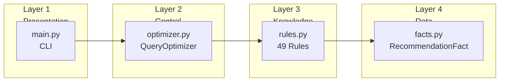

---

# 21. الاختبار

## 21.1 استراتيجية الاختبار

يستخدم المشروع **الاختبار القائم على السيناريوهات (Scenario-based Testing)** مع 4 حالات اختبار محددة مسبقاً تغطي سيناريوهات تحسين الاستعلام الشائعة.

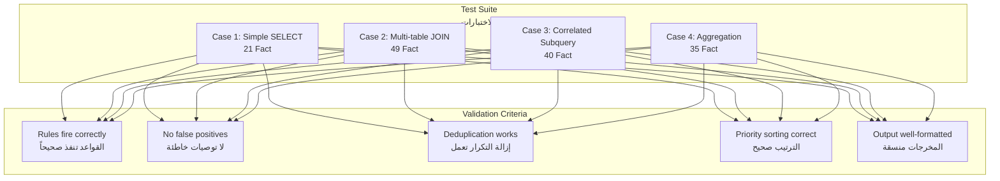

## 21.2 حالات الاختبار

### Case 1: SELECT بسيط مع WHERE

| الخاصية | القيمة |
|---------|--------|
| **الملف** | `examples/case1_simple_select.py` |
| **عدد الحقائق** | 21 |
| **الجدول** | employees (1,000,000 صف) |
| **الميزات** | SELECT *, WHERE, LIMIT, فهرس انتقائي |

**التوصيات المتوقعة (5):**

| # | الفئة | الأولوية | التوصية |
|---|-------|----------|---------|
| 1 | INDEX_USAGE | HIGH | استخدام الفهرس الموجود |
| 2 | SCAN_SELECTION | HIGH | Index Scan |
| 3 | HEURISTIC_OPTIMIZATION | HIGH | دفع Projection للأسفل |
| 4 | QUERY_REWRITE | HIGH | استخدام أسماء أعمدة بدلاً من SELECT * |
| 5 | QUERY_REWRITE | LOW | إضافة ORDER BY مع LIMIT |

### Case 2: JOIN متعدد الجداول

| الخاصية | القيمة |
|---------|--------|
| **الملف** | `examples/case2_join_query.py` |
| **عدد الحقائق** | 49 |
| **الجداول** | orders (500K), customers (50K), products (10K) |
| **الميزات** | SELECT *, JOIN, إحصاءات قديمة |

**التوصيات المتوقعة (10):** تشمل تحديث الإحصاءات، إعادة ترتيب JOIN، اختيار Nested Loop Join، إنشاء فهرس FK.

### Case 3: Subquery ترابطي مع IN

| الخاصية | القيمة |
|---------|--------|
| **الملف** | `examples/case3_subquery.py` |
| **عدد الحقائق** | 40 |
| **الجداول** | employees (100K), departments (500) |
| **الميزات** | SELECT محدد, WHERE, Subquery ترابطي, IN |

**التوصيات المتوقعة (6):** تشمل إعادة كتابة Subquery كـ JOIN، استخدام EXISTS بدلاً من IN، Semi-Join.

### Case 4: تجميع مع GROUP BY و HAVING

| الخاصية | القيمة |
|---------|--------|
| **الملف** | `examples/case4_aggregation.py` |
| **عدد الحقائق** | 35 |
| **الجدول** | sales (10,000,000 صف) |
| **الميزات** | GROUP BY, HAVING, DISTINCT, ORDER BY, إحصاءات قديمة |

**التوصيات المتوقعة (5):** تشمل نقل الشروط من HAVING إلى WHERE، فحص DISTINCT، تحديث الإحصاءات.

## 21.3 التنفيذ

```bash
python main.py
```

**النتائج الملاحظة:**
- جميع حالات الاختبار الأربع تنفذ بنجاح
- إجمالي التوصيات: Case 1: 5, Case 2: 10, Case 3: 6, Case 4: 5
- لا توجد توصيات مكررة في المخرجات
- التوصيات مرتبة حسب الأولوية (HIGH أولاً)
- التبرير يتضمن الاستشهاد بالمصادر
- اكتمال التنفيذ في أقل من ثانية واحدة

## 21.4 معايير التحقق

| المعيار | طريقة الاختبار | النتيجة |
|---------|----------------|---------|
| تنفيذ القواعد الصحيح | مقارنة التوصيات المتوقعة مع الملاحظة | ✅ |
| عدم وجود توصيات خاطئة | التحقق من ملاءمة كل توصية للخصائص | ✅ |
| إزالة التكرار | عدم وجود نصوص توصيات مكررة | ✅ |
| الترتيب حسب الأولوية | HIGH قبل MEDIUM قبل LOW | ✅ |
| تنسيق المخرجات | فواصل وترقيم وتسمية حقول متسقة | ✅ |

---

# 22. التحديات

## 22.1 توافق Experta مع Python 3.10+

**المشكلة:** Experta 1.9.4 صُمم لـ Python 3.8/3.9 ويشير إلى `collections.Mapping` و `collections.MutableMapping`، والتي أزيلت من وحدة `collections` في Python 3.10.

**الحل:** إضافة monkeypatch في `engine/__init__.py`:

```python
import collections.abc
collections.Mapping = collections.abc.Mapping
collections.MutableMapping = collections.abc.MutableMapping
```

## 22.2 التوصيات المكررة

**المشكلة:** عندما تشترك جداول متعددة في نفس الخصائص، تنفذ القاعدة مرة لكل زوج مطابق، منتجة توصيات مكررة.

**مثال:** إذا كان هناك جدولان صغيران بفهارس، `rule_small_table_scan` تنفذ مرتين بنفس النص.

**الحل:** إضافة طبقة إزالة تكرار في `engine/optimizer.py`:

```python
@staticmethod
def _deduplicate(recommendations):
    seen = set()
    result = []
    for rec in recommendations:
        key = (rec['category'], rec['recommendation_text'], rec['applies_to'])
        if key not in seen:
            seen.add(key)
            result.append(rec)
    return result
```

**البديل المدروس:** استخدام salience أو rule-refraction في Experta — لكن إزالة التكرار في طبقة المخرجات كانت أبسط وأكثر شفافية.

## 22.3 ترتيب القواعد لسلسلة الاستدلال

**المشكلة:** يجب أن تنفذ قواعد الاشتقاق قبل قواعد التوصية التي تعتمد على حقائقها المشتقة.

**الحل:** ترتيب قواعد الاشتقاق أولاً في `QueryOptimizerRules`:

```python
class QueryOptimizerRules(KnowledgeEngine):
    # الأسطر 21-39: 5 قواعد اشتقاق (أولوية أعلى ضمنياً)
    def derive_select_list_wide(self): ...
    def derive_select_list_narrow(self): ...
    def derive_push_selection(self): ...
    def derive_full_scan_scenario(self): ...
    def derive_index_scan_scenario(self): ...

    # الأسطر 43-583: 44 قاعدة توصية (أولوية أقل ضمنياً)
    def rule_full_scan(self): ...
    def rule_index_scan(self): ...
    # ...
```

## 22.4 عدم وجود عامل يقين

**المشكلة:** نطاق المشروع تضمن عوامل اليقين (Certainty Factors) لكن التنفيذ لا يحتوي على حساب CF.

**الحل:** توثيق هذا القيد صراحة في التقرير ووصف نظام CF المقترح كعمل مستقبلي. يستخدم النظام حالياً مستويات الأولوية (HIGH/MEDIUM/LOW) كتقدير تقريبي للثقة.

## 22.5 تصريح الحقائق اليدوي

**المشكلة:** يجب على المستخدم إنشاء كائنات `Fact()` يدوياً بوسائط keyword. هذا عرضة للخطأ ويتطلب معرفة بنمط الحقائق الداخلي.

**الحل الحالي:** توثيق واضح لأنماط الحقائق وحالات اختبار تعمل كقوالب.

**الحل المستقبلي:** دمج sqlparse لتحويل SQL تلقائياً إلى حقائق.

---

# 23. العمل المستقبلي

## 23.1 المدى القصير (3-6 أشهر)

| التحسين | الجهد | التأثير |
|---------|-------|---------|
| **دمج محلل SQL** | متوسط | أتمتة استخراج الحقائق من SQL الخام |
| **موصل قاعدة بيانات** | عالي | جلب إحصاءات حقيقية من PostgreSQL/MySQL |
| **اختبارات وحدة آلية** | منخفض | ضمان التطوير دون أخطاء انحدارية |

## 23.2 المدى المتوسط (6-12 شهراً)

| التحسين | الجهد | التأثير |
|---------|-------|---------|
| **عوامل اليقين** | عالي | توصيات واعية بعدم اليقين |
| **واجهة ويب** | متوسط | تحسين سهولة الوصول |
| **نموذج تقدير كلفة** | عالي | مقارنة كمية للخطط |

## 23.3 المدى الطويل (12+ شهراً)

| التحسين | الجهد | التأثير |
|---------|-------|---------|
| **تعلم آلي للأولويات** | عالي جداً | تعلم ترتيب التوصيات الأمثل من التغذية الراجعة |
| **دعم استعلامات DML** | متوسط | توسيع التغطية لـ INSERT/UPDATE/DELETE |
| **مراقبة لحظية** | عالي جداً | تحليل مستمر للاستعلامات في الإنتاج |

---

# 24. الخاتمة

## 24.1 ملخص المشروع

تم بنجاح بناء **نظام خبير لتحسين استعلامات SQL (Expert System Query Optimizer)** — وهو نظام قائم على المعرفة لتحسين استعلامات SQL باستخدام Python ومحرك الاستدلال Experta Rete. يوضح المشروع كيف يمكن للأساليب التصريحية القائمة على القواعد أن تلتقط وتطبق المعرفة المعقدة في المجال الصعب لتحسين استعلامات قواعد البيانات.

**الإنجازات الرئيسية:**

| الإنجاز | التفاصيل |
|---------|----------|
| **49 قاعدة** | 5 قواعد اشتقاق وسيطة + 44 قاعدة توصية تغطي 9 فئات تحسين |
| **4 حالات اختبار** | SELECT بسيط، JOIN متعدد، Subquery ترابطي، تجميع مع GROUP BY |
| **3 مصادر معرفة** | Database System Concepts (Ch16), dbjournal.ro, Medium Guide |
| **14 فئة توصية** | من SCAN_SELECTION إلى PARTITION_OPTIMIZATION |
| **78 سمة حقيقة** | تغطي الاستعلام، الجداول، الفهارس، JOIN، العمل، الإحصاءات |
| **943 سطر كود** | Python نقي، بدون اعتماد على منصة محددة |

## 24.2 الإسهامات التقنية

1. **منطق تحسين غير إجرائي:** أظهر المشروع أن قرارات تحسين الاستعلامات يمكن ترميزها كقواعد تصريحية بدلاً من شروط if/else إجرائية. فصل المعرفة (القواعد) عن التحكم (محرك الاستدلال) ينتج نظاماً أكثر قابلية للصيانة والتوسع والشفافية.

2. **الاستدلال الأمامي بالحقائق الوسيطة:** استخدام 5 قواعد اشتقاق يوضح الاستدلال متعدد الخطوات. الحقائق الأساسية تطلق قواعد الاشتقاق، التي تنتج حقائق وسيطة تطلق قواعد التوصية.

3. **مطابقة أنماط فعالة:** خوارزمية Rete تعالج بكفاءة نظام الـ 49 قاعدة مع ما يصل إلى 49 حقيقة، مكتملة في أقل من ثانية. خاصية حفظ الحالة في Rete تضمن أن إضافة حقائق جديدة لا يتطلب إعادة تقييم جميع الشروط.

4. **الشفافية:** كل توصية مصحوبة بتبرير علمي واستشهاد بالمصدر، مما يعطي المستخدمين ثقة في قرارات النظام.

## 24.3 الدروس المستفادة

| الدرس | الخلاصة |
|-------|---------|
| **ترتيب القواعد مهم** | قواعد الاشتقاق يجب أن تعرف قبل القواعد التي تعتمد على مخرجاتها |
| **إزالة التكرار ضروري** | بدونها، القواعد التي تنفذ لمجموعات حقائق متعددة تنتج مخرجات مكررة |
| **قد تكون هناك حاجة لـ monkeypatch** | حتى المكتبات الناضجة (Experta) قد تحتاج لتعديلات توافق |
| **الشفافية ميزة رئيسية** | التوصيات المفسرة تعطي المستخدمين ثقة في قرارات النظام |
| **الأولويات تقارب الثقة** | في غياب عوامل اليقين، مستويات الأولوية توفر تقديراً تقريبياً مفيداً |

## 24.4 الكلمة الختامية

يمثل هذا المشروع تطبيقاً عملياً لمفاهيم الأنظمة الخبيرة في مجال تحسين استعلامات قواعد البيانات. يجمع المشروع بين المعرفة الأكاديمية (من المصادر المعتمدة) والتقنيات البرمجية الحديثة (Python + Experta) لتقديم نظام متكامل يمكن استخدامه في التعليم والبحث.

يُظهر هذا المشروع أن الأنظمة الخبيرة تبقى نهجاً قوياً وذا صلة في عصر التعلم الآلي. في مجالات مثل تحسين الاستعلامات — حيث المعرفة محددة جيداً، والقواعد واضحة، وإمكانية التفسير حاسمة — تقدم الأنظمة القائمة على القواعد مزايا لا تستطيع أساليب التعلم الآلي (Black Box) مضاهاتها: الشفافية، وقابلية الصيانة، والاستدلال القابل للتحقق.

---

# 25. المراجع

1. **Database System Concepts, 7th Edition**
   Abraham Silberschatz, Henry F. Korth, S. Sudarshan
   Chapter 16: Query Optimization
   McGraw-Hill Education, 2019
   https://www.db-book.com

2. **Query Optimization Techniques in Microsoft SQL Server**
   Database Systems Journal, Volume 16, Issue 4
   https://www.dbjournal.ro/archive/16/16_4.pdf

3. **Optimizing SQL Query Performance: A Comprehensive Guide**
   Women in Technology — Medium
   https://medium.com/womenintechnology/optimizing-sql-query-performance-a-comprehensive-guide-6cb72b9f52ef

4. **Experta: Expert Systems for Python**
   GitHub Repository
   https://github.com/nilp0inter/experta
   Version 1.9.4

5. **Rete: A Fast Algorithm for the Many Pattern/Many Object Pattern Match Problem**
   Charles Forgy
   Artificial Intelligence, Volume 19, Issue 1, pages 17-37, 1982

6. **FrozenDict: Immutable Dictionaries for Python**
   https://pypi.org/project/frozendict/
   Version 2.4.7

7. **Schema: Schema Validation for Python**
   https://pypi.org/project/schema/
   Version 0.6.7

8. **sqlparse: Non-validating SQL Parser**
   https://pypi.org/project/sqlparse/
   Version 0.5.0

---

*تم الإنشاء في: 29 يونيو 2026*
*Expert System Query Optimizer — تقرير أكاديمي نهائي*
