# Architecture Diagrams - Expert System Query Optimizer

---

## Diagram 1: General System Architecture

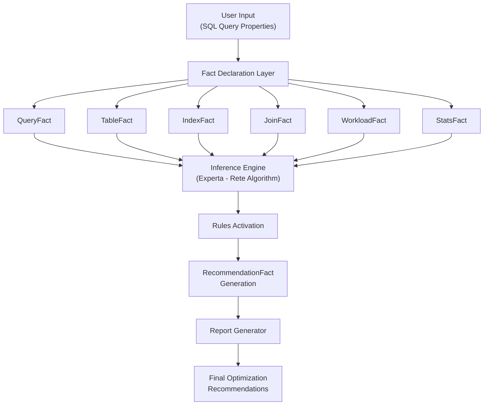
```mermaid
flowchart TB
    A["User Input<br/>(SQL Query Properties)"] --> B["Fact Declaration Layer"]
    B --> C["QueryFact"]
    B --> D["TableFact"]
    B --> E["IndexFact"]
    B --> F["JoinFact"]
    B --> G["WorkloadFact"]
    B --> H["StatsFact"]

    C --> I["Inference Engine<br/>(Experta - Rete Algorithm)"]
    D --> I
    E --> I
    F --> I
    G --> I
    H --> I

    I --> J["Rules Activation"]
    J --> K["RecommendationFact<br/>Generation"]

    K --> L["Report Generator"]
    L --> M["Final Optimization<br/>Recommendations"]
```

**شرح المخطط:** يوضح هذا المخطط البنية العامة للنظام الخبير. تبدأ العملية بإدخال خصائص الاستعلام (نوع الاستعلام، خصائص الجدول، الفهارس، إلخ)، ثم تحويل هذه الخصائص إلى حقائق (Facts) منظمة. تمر هذه الحقائق إلى محرك الاستدلال Experta الذي يطبق خوارزمية Rete لتفعيل القواعد المناسبة. تنتج القواعد توصيات تحسين يتم تجميعها في تقرير نهائي.

---

## Diagram 2: Query Classification and Fact Extraction

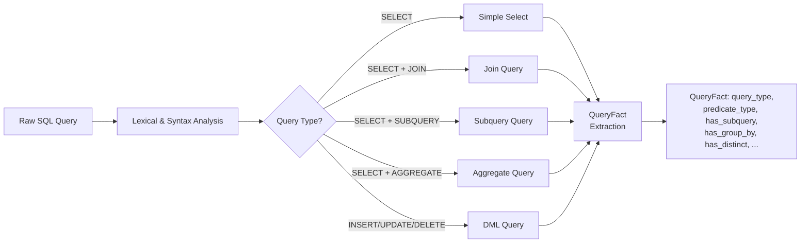
```mermaid
flowchart LR
    A["Raw SQL Query"] --> B["Lexical & Syntax Analysis"]
    B --> C{"Query Type?"}
    C -->|"SELECT"| D["Simple Select"]
    C -->|"SELECT + JOIN"| E["Join Query"]
    C -->|"SELECT + SUBQUERY"| F["Subquery Query"]
    C -->|"SELECT + AGGREGATE"| G["Aggregate Query"]
    C -->|"INSERT/UPDATE/DELETE"| H["DML Query"]

    D --> I["QueryFact<br/>Extraction"]
    E --> I
    F --> I
    G --> I
    H --> I

    I --> J["QueryFact: query_type,<br/>predicate_type, has_subquery,<br/>has_group_by, has_distinct, ..."]
```

**شرح المخطط:** يقوم النظام أولاً بتصنيف نوع الاستعلام (SELECT بسيط، JOIN، Subquery، تجميعي، DML). بناءً على التصنيف، يتم استخراج خصائص الاستعلام المختلفة وتحويلها إلى QueryFact. هذا التصنيف المبكر يوجه القواعد التي سيتم تطبيقها لاحقاً.

---

## Diagram 3: Full Scan vs Index Scan Decision

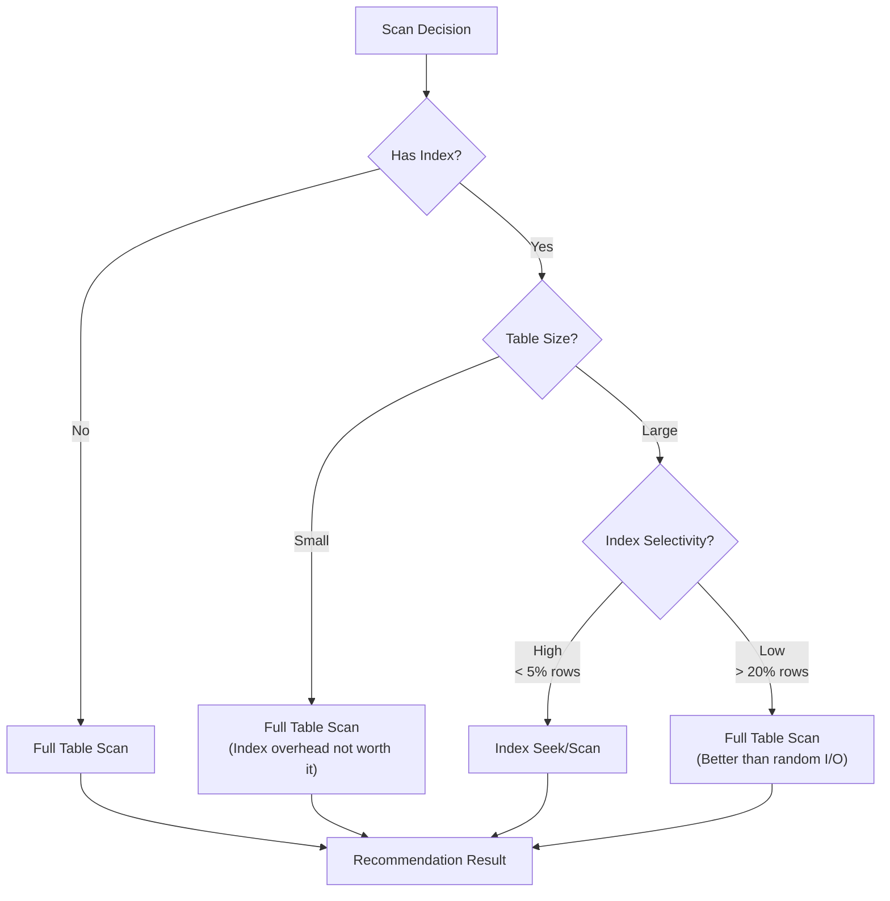
```mermaid
flowchart TD
    A["Scan Decision"] --> B{"Has Index?"}
    B -->|"No"| C["Full Table Scan"]
    B -->|"Yes"| D{"Table Size?"}
    
    D -->|"Small"| E["Full Table Scan<br/>(Index overhead not worth it)"]
    D -->|"Large"| F{"Index Selectivity?"}
    
    F -->|"High<br/>< 5% rows"| G["Index Seek/Scan"]
    F -->|"Low<br/>> 20% rows"| H["Full Table Scan<br/>(Better than random I/O)"]
    
    C --> I["Recommendation Result"]
    E --> I
    G --> I
    H --> I
```

**شرح المخطط:** أحد أهم القرارات في تحسين الاستعلامات هو كيفية الوصول إلى البيانات. يقرر النظام ما إذا كان سيستخدم Full Table Scan أو Index Scan بناءً على:
1. وجود فهرس من عدمه
2. حجم الجدول (صغير أم كبير)
3. درجة انتقائية الفهرس (Selectivity)
يتبع هذا القرار المبادئ المذكورة في Database System Concepts Chapter 16 حول تقدير كلفة الوصول.

---

## Diagram 4: Push Selection Down

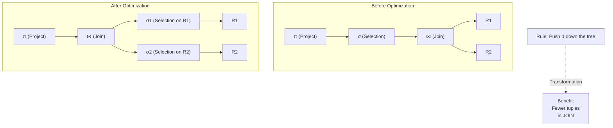
```mermaid
flowchart TB
    subgraph "Before Optimization"
        A["π (Project)"] --> B["σ (Selection)"]
        B --> C["⋈ (Join)"]
        C --> D["R1"]
        C --> E["R2"]
    end

    subgraph "After Optimization"
        F["π (Project)"] --> G["⋈ (Join)"]
        G --> H["σ1 (Selection on R1)"]
        G --> I["σ2 (Selection on R2)"]
        H --> J["R1"]
        I --> K["R2"]
    end

    L["Rule: Push σ down the tree"] -.->|"Transformation"| M["Benefit:<br/>Fewer tuples<br/>in JOIN"]
```

**شرح المخطط:** تعتبر قاعدة Push Selection Down من أهم قواعد التحسين الترابطي (Heuristic Optimization). بدلاً من تطبيق شروط الاختيار (WHERE) بعد JOIN، يتم دفعها لأسفل لتُطبق مباشرة على كل جدول قبل JOIN. هذا يقلل عدد الصفوف المشاركة في JOIN بشكل كبير، مما يحسن الأداء. المصدر: Database System Concepts Ch16.3.

---

## Diagram 5: Push Projection Down

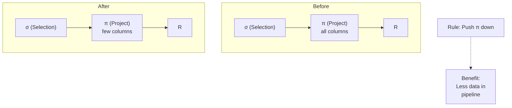
```mermaid
flowchart TB
    subgraph "Before"
        A["σ (Selection)"] --> B["π (Project)<br/>all columns"]
        B --> C["R"]
    end

    subgraph "After"
        D["σ (Selection)"] --> E["π (Project)<br/>few columns"]
        E --> F["R"]
    end

    G["Rule: Push π down"] -.-> H["Benefit:<br/>Less data in<br/>pipeline"]
```

**شرح المخطط:** دفع الإسقاط (Projection) للأسفل يقلل عدد الأعمدة التي يتم نقلها بين مراحل تنفيذ الاستعلام. بتطبيق SELECT بأسماء الأعمدة المحددة بدلاً من SELECT * في أقرب وقت ممكن، نقلل عرض الصفوف المنقولة ونحسن استخدام الذاكرة و I/O.

---

## Diagram 6: Join Algorithm Selection

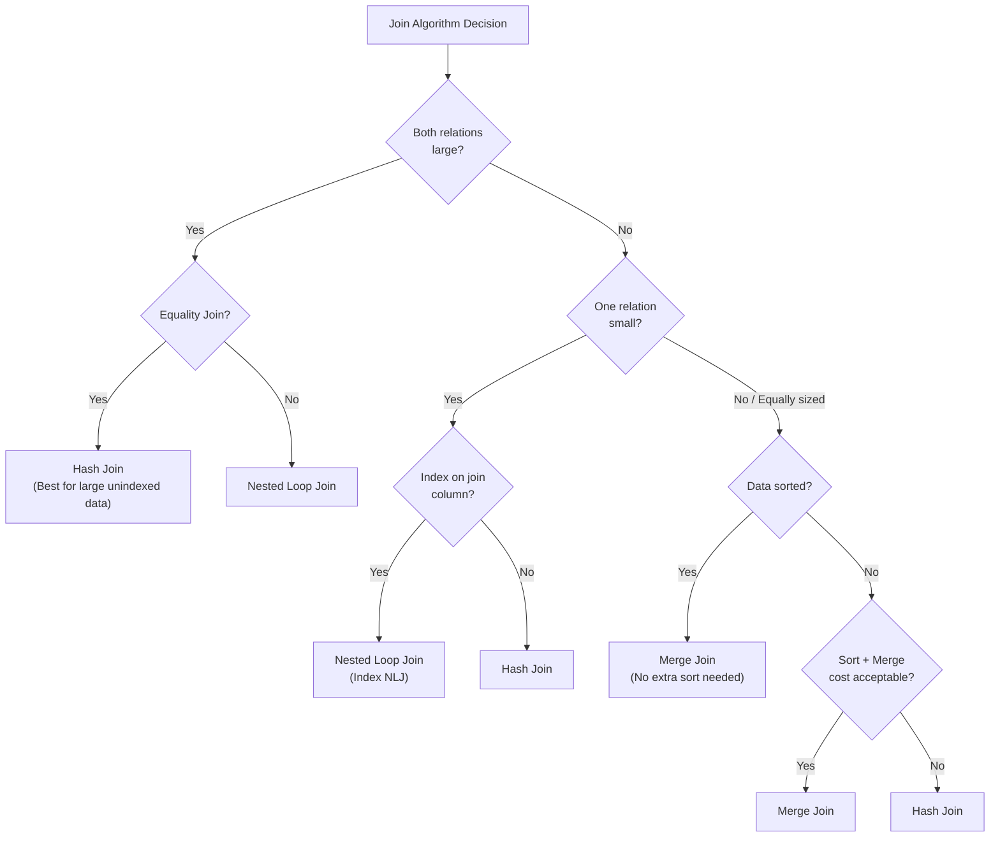
```mermaid
flowchart TD
    A["Join Algorithm Decision"] --> B{"Both relations<br/>large?"}
    
    B -->|"Yes"| C{"Equality Join?"}
    C -->|"Yes"| D["Hash Join<br/>(Best for large unindexed data)"]
    C -->|"No"| E["Nested Loop Join"]
    
    B -->|"No"| F{"One relation<br/>small?"}
    F -->|"Yes"| G{"Index on join<br/>column?"}
    G -->|"Yes"| H["Nested Loop Join<br/>(Index NLJ)"]
    G -->|"No"| I["Hash Join"]
    
    F -->|"No / Equally sized"| J{"Data sorted?"}
    J -->|"Yes"| K["Merge Join<br/>(No extra sort needed)"]
    J -->|"No"| L{"Sort + Merge<br/>cost acceptable?"}
    L -->|"Yes"| M["Merge Join"]
    L -->|"No"| N["Hash Join"]
```

**شرح المخطط:** اختيار خوارزمية JOIN المناسبة يعتمد على:
- **Nested Loop Join:** مثالي عندما تكون إحدى العلاقات صغيرة والأخرى مفهرسة
- **Hash Join:** الأفضل للعلاقات الكبيرة بدون فهارس (شروط المساواة)
- **Merge Join:** مناسب عندما تكون البيانات مرتبة مسبقاً أو مطلوب ترتيب النتائج
المصدر: Database System Concepts Ch16.5 والمقال في dbjournal.ro.

---

## Diagram 7: Join Order Optimization

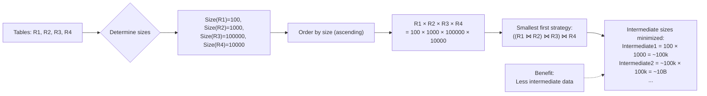
```mermaid
flowchart LR
    A["Tables: R1, R2, R3, R4"] --> B{"Determine sizes"}
    
    B --> C["Size(R1)=100, Size(R2)=1000,<br/>Size(R3)=100000, Size(R4)=10000"]
    
    C --> D["Order by size (ascending)"]
    
    D --> E["R1 × R2 × R3 × R4<br/>= 100 × 1000 × 100000 × 10000"]
    
    E --> F["Smallest first strategy:<br/>((R1 ⋈ R2) ⋈ R3) ⋈ R4"]
    
    F --> G["Intermediate sizes minimized:<br/>Intermediate1 = 100 × 1000 = ~100k<br/>Intermediate2 = ~100k × 100k = ~10B<br/>..."]
    
    H["Benefit:<br/>Less intermediate data"] -.-> G
```

**شرح المخطط:** ترتيب JOINs يؤثر بشكل كبير على كلفة الاستعلام. القاعدة الأساسية هي وضع العلاقات الأصغر أولاً في ترتيب JOIN لتقليل حجم النتائج الوسيطة. Database System Concepts Ch16.5.5 يشرح كيف يمكن استخدام البرمجة الديناميكية لإيجاد أفضل ترتيب JOIN.

---

## Diagram 8: Subquery Rewriting

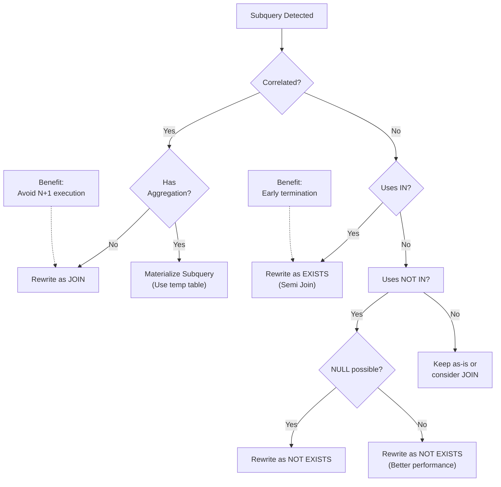
```mermaid
flowchart TD
    A["Subquery Detected"] --> B{"Correlated?"}
    
    B -->|"Yes"| C{"Has<br/>Aggregation?"}
    C -->|"No"| D["Rewrite as JOIN"]
    C -->|"Yes"| E["Materialize Subquery<br/>(Use temp table)"]
    
    B -->|"No"| F{"Uses IN?"}
    F -->|"Yes"| G["Rewrite as EXISTS<br/>(Semi Join)"]
    F -->|"No"| H["Uses NOT IN?"]
    H -->|"Yes"| I{"NULL possible?"}
    I -->|"Yes"| J["Rewrite as NOT EXISTS"]
    I -->|"No"| K["Rewrite as NOT EXISTS<br/>(Better performance)"]
    H -->|"No"| L["Keep as-is or<br/>consider JOIN"]
    
    M["Benefit:<br/>Avoid N+1 execution"] -.-> D
    N["Benefit:<br/>Early termination"] -.-> G
```

**شرح المخطط:** إعادة كتابة الـ Subquery يمكن أن تحسن الأداء بشكل جذري. القاعدة:
- الـ Subquery الترابطي (Correlated) يتحول إلى JOIN (إذا لم يكن فيه تجميع)
- الـ IN يتحول إلى EXISTS (توقف عند أول تطابق)
- الـ NOT IN يتحول إلى NOT EXISTS (تجنب مشاكل NULL + أداء أفضل)
المصدر: Database System Concepts Ch16.3.2 و dbjournal.ro.

---

## Diagram 9: WHERE vs HAVING Decision

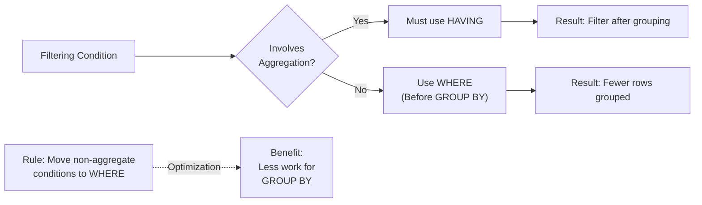
```mermaid
flowchart LR
    A["Filtering Condition"] --> B{"Involves<br/>Aggregation?"}
    
    B -->|"Yes"| C["Must use HAVING"]
    B -->|"No"| D["Use WHERE<br/>(Before GROUP BY)"]
    
    D --> E["Result: Fewer rows grouped"]
    C --> F["Result: Filter after grouping"]
    
    G["Rule: Move non-aggregate<br/>conditions to WHERE"] -.->|"Optimization"| H["Benefit:<br/>Less work for<br/>GROUP BY"]
```

**شرح المخطط:** HAVING يُطبق بعد GROUP BY بينما WHERE يُطبق قبله. لذلك، يجب وضع شروط التصفية غير التجميعية في WHERE لتقليل عدد الصفوف التي تدخل في عملية التجميع. المصدر: Database System Concepts Ch16 و Medium Guide.

---

## Diagram 10: DISTINCT Optimization

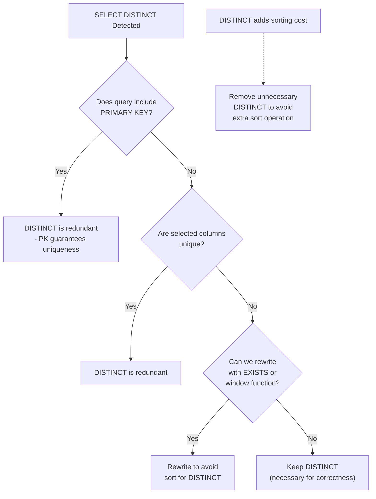
```mermaid
flowchart TD
    A["SELECT DISTINCT Detected"] --> B{"Does query include<br/>PRIMARY KEY?"}
    
    B -->|"Yes"| C["DISTINCT is redundant<br/>- PK guarantees uniqueness"]
    B -->|"No"| D{"Are selected columns<br/>unique?"}
    D -->|"Yes"| E["DISTINCT is redundant"]
    D -->|"No"| F{"Can we rewrite<br/>with EXISTS or<br/>window function?"}
    F -->|"Yes"| G["Rewrite to avoid<br/>sort for DISTINCT"]
    F -->|"No"| H["Keep DISTINCT<br/>(necessary for correctness)"]
    
    I["DISTINCT adds sorting cost"] -.-> J["Remove unnecessary<br/>DISTINCT to avoid<br/>extra sort operation"]
```

**شرح المخطط:** DISTINCT يضيف كلفة فرز إضافية. إذا كان الاستعلام يحتوي على PRIMARY KEY أو كان الحقل فريداً، فإن DISTINCT يصبح غير ضروري ويمكن حذفه. المصدر: Database System Concepts Ch16 و Medium Guide.

---

## Diagram 11: EXISTS vs IN

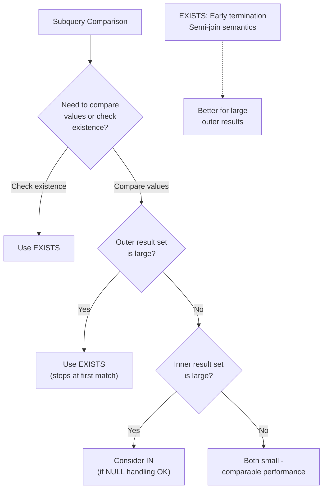
```mermaid
flowchart TD
    A["Subquery Comparison"] --> B{"Need to compare<br/>values or check<br/>existence?"}
    
    B -->|"Check existence"| C["Use EXISTS"]
    B -->|"Compare values"| D{"Outer result set<br/>is large?"}
    
    D -->|"Yes"| E["Use EXISTS<br/>(stops at first match)"]
    D -->|"No"| F{"Inner result set<br/>is large?"}
    F -->|"Yes"| G["Consider IN<br/>(if NULL handling OK)"]
    F -->|"No"| H["Both small -<br/>comparable performance"]
    
    I["EXISTS: Early termination<br/>Semi-join semantics"] -.-> J["Better for large<br/>outer results"]
```

**شرح المخطط:** EXISTS يوقف التنفيذ عند أول تطابق (Early Termination) بينما IN يفحص جميع القيم. لذلك، EXISTS أفضل عندما يكون الهدف هو التحقق من الوجود فقط. مع ذلك، يجب مراعاة معالجة NULL ومقارنة الأداء حسب حجم البيانات. المصدر: dbjournal.ro و Medium Guide.

---

## Diagram 12: Index Suggestion Decision

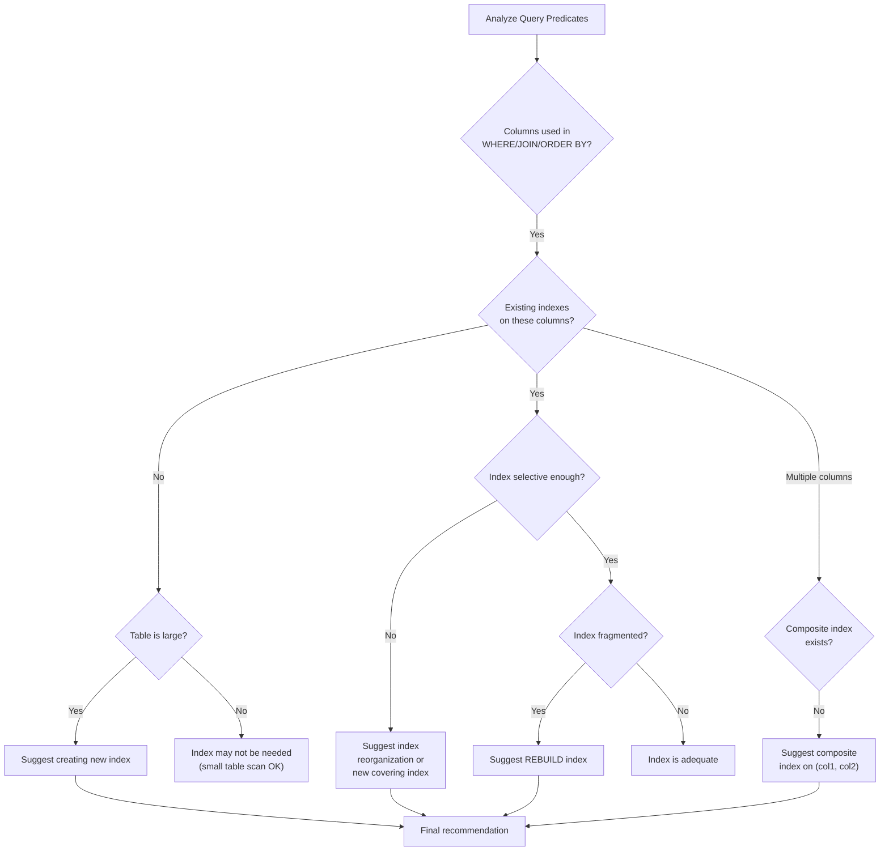
```mermaid
flowchart TD
    A["Analyze Query Predicates"] --> B{"Columns used in<br/>WHERE/JOIN/ORDER BY?"}
    
    B -->|"Yes"| C{"Existing indexes<br/>on these columns?"}
    C -->|"No"| D{"Table is large?"}
    D -->|"Yes"| E["Suggest creating new index"]
    D -->|"No"| F["Index may not be needed<br/>(small table scan OK)"]
    
    C -->|"Yes"| G{"Index selective enough?"}
    G -->|"No"| H["Suggest index<br/>reorganization or<br/>new covering index"]
    G -->|"Yes"| I{"Index fragmented?"}
    I -->|"Yes"| J["Suggest REBUILD index"]
    I -->|"No"| K["Index is adequate"]
    
    C -->|"Multiple columns"| L{"Composite index<br/>exists?"}
    L -->|"No"| M["Suggest composite<br/>index on (col1, col2)"]
    
    E --> N["Final recommendation"]
    H --> N
    J --> N
    M --> N
```

**شرح المخطط:** قرار الفهرسة معقد ويعتمد على تحليل دقيق للأعمدة المستخدمة في WHERE و JOIN و ORDER BY. يشمل القرار:
1. إنشاء فهرس جديد للأعمدة غير المفهرسة
2. إنشاء فهرس مركب للأعمدة المتعددة
3. إعادة بناء الفهرس المجزأ
المصدر: Database System Concepts Ch16.4 و dbjournal.ro.

---

## Diagram 13: Statistics Freshness Check

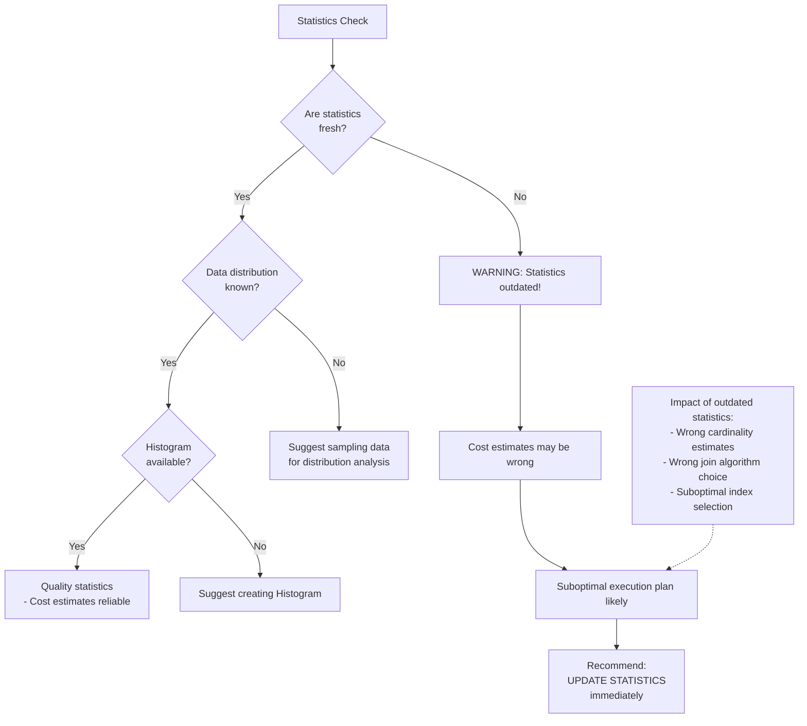
```mermaid
flowchart TD
    A["Statistics Check"] --> B{"Are statistics<br/>fresh?"}
    
    B -->|"Yes"| C{"Data distribution<br/>known?"}
    C -->|"Yes"| D{"Histogram<br/>available?"}
    D -->|"Yes"| E["Quality statistics<br/>- Cost estimates reliable"]
    D -->|"No"| F["Suggest creating Histogram"]
    
    C -->|"No"| G["Suggest sampling data<br/>for distribution analysis"]
    
    B -->|"No"| H["WARNING: Statistics outdated!"]
    H --> I["Cost estimates may be wrong"]
    I --> J["Suboptimal execution plan likely"]
    J --> K["Recommend:<br/>UPDATE STATISTICS<br/>immediately"]
    
    L["Impact of outdated statistics:<br/>- Wrong cardinality estimates<br/>- Wrong join algorithm choice<br/>- Suboptimal index selection"] -.-> J
```

**شرح المخطط:** الإحصاءات القديمة تؤدي إلى خطط تنفيذ غير مثلى. عندما تكون الإحصاءات قديمة، يصبح تقدير الكلفة غير دقيق مما قد يؤدي لاختيار خوارزميات JOIN غير مناسبة أو فهارس غير صحيحة. المصدر: dbjournal.ro - الإحصاءات القديمة تزيد كلفة الاستعلام حتى 10 أضعاف.

---

## Diagram 14: Intermediate Result Reduction

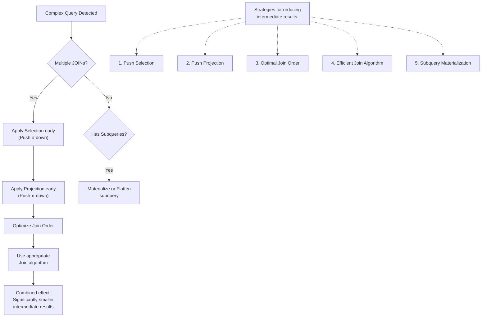
```mermaid
flowchart TD
    A["Complex Query Detected"] --> B{"Multiple JOINs?"}
    B -->|"Yes"| C["Apply Selection early<br/>(Push σ down)"]
    B -->|"No"| D{"Has Subqueries?"}
    
    C --> E["Apply Projection early<br/>(Push π down)"]
    D -->|"Yes"| F["Materialize or Flatten<br/>subquery"]
    
    E --> G["Optimize Join Order"]
    G --> H["Use appropriate<br/>Join algorithm"]
    
    H --> I["Combined effect:<br/>Significantly smaller<br/>intermediate results"]
    
    J["Strategies for reducing<br/>intermediate results:"] -.-> K["1. Push Selection"]
    J -.-> L["2. Push Projection"]
    J -.-> M["3. Optimal Join Order"]
    J -.-> N["4. Efficient Join Algorithm"]
    J -.-> O["5. Subquery Materialization"]
```

**شرح المخطط:** تقليل النتائج الوسيطة هو الهدف الرئيسي لتحسين الاستعلامات المعقدة. يتم تطبيق مجموعة من القواعد الترابطية:
- دفع Selection للأسفل (تقليل عدد الصفوف)
- دفع Projection للأسفل (تقليل عدد الأعمدة)
- ترتيب JOIN الأمثل (تقليل حجم كل خطوة)
- اختيار خوارزمية JOIN مناسبة
المصدر: Database System Concepts Ch16.

---

## Diagram 15: Final Decision Assembly

```mermaid
flowchart TB
    subgraph "Input Layer"
        A1["Query Properties"]
        A2["Table Statistics"]
        A3["Index Information"]
    end

    subgraph "Rule Engine (Experta)"
        B1["Rule: Scan Selection"]
        B2["Rule: Push Selection"]
        B3["Rule: Push Projection"]
        B4["Rule: Join Algorithm"]
        B5["Rule: Join Order"]
        B6["Rule: Subquery Rewrite"]
        B7["Rule: WHERE vs HAVING"]
        B8["Rule: DISTINCT Check"]
        B9["Rule: EXISTS vs IN"]
        B10["Rule: Index Suggestion"]
        B11["Rule: Index Maintenance"]
        B12["Rule: Statistics Check"]
        B13["Rule: Cost Analysis"]
        B14["Rule: Intermediate Result"]
        B15["Rule: UNION Optimization"]
    end

    subgraph "Output Layer"
        C1["Access Path<br/>Recommendation"]
        C2["Query Rewrite<br/>Recommendations"]
        C3["Index<br/>Recommendations"]
        C4["Statistics<br/>Recommendations"]
        C5["Cost-based<br/>Plan Selection"]
    end

    A1 --> B1
    A1 --> B2
    A1 --> B3
    A1 --> B4
    A1 --> B5
    A1 --> B6
    A1 --> B7
    A1 --> B8
    A1 --> B9
    A1 --> B10
    A1 --> B11
    A1 --> B12
    A2 --> B12
    A2 --> B13
    A3 --> B1
    A3 --> B10
    A3 --> B11

    B1 --> C1
    B2 --> C2
    B3 --> C2
    B4 --> C1
    B5 --> C1
    B6 --> C2
    B7 --> C2
    B8 --> C2
    B9 --> C2
    B10 --> C3
    B11 --> C3
    B12 --> C4
    B13 --> C5
    B14 --> C2
    B15 --> C2
```

**شرح المخطط:** هذا هو المخطط النهائي الذي يوضح كيف تتكامل جميع القرارات. تبدأ العملية من طبقة الإدخال (خصائص الاستعلام، إحصاءات الجدول، معلومات الفهارس)، تمر عبر 15+ قاعدة في محرك Experta، وتنتج توصيات في 5 فئات رئيسية: مسار الوصول، إعادة كتابة الاستعلام، الفهارس، الإحصاءات، واختيار الخطة بناءً على الكلفة.

---

## Diagram 16: Rete Network (Experta Inference)

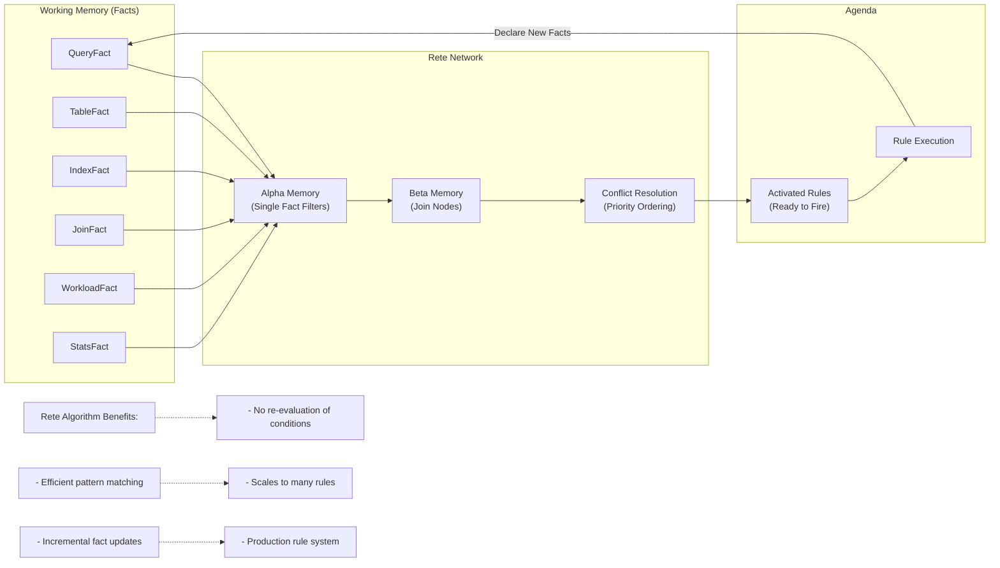
```mermaid
flowchart LR
    subgraph "Working Memory (Facts)"
        A["QueryFact"]
        B["TableFact"]
        C["IndexFact"]
        D["JoinFact"]
        E["WorkloadFact"]
        F["StatsFact"]
    end

    subgraph "Rete Network"
        G["Alpha Memory<br/>(Single Fact Filters)"]
        H["Beta Memory<br/>(Join Nodes)"]
        I["Conflict Resolution<br/>(Priority Ordering)"]
    end

    subgraph "Agenda"
        J["Activated Rules<br/>(Ready to Fire)"]
        K["Rule Execution"]
    end

    A --> G
    B --> G
    C --> G
    D --> G
    E --> G
    F --> G
    
    G --> H
    H --> I
    I --> J
    J --> K
    
    K -->|"Declare New Facts"| A
    
    L["Rete Algorithm Benefits:"] -.-> M["- No re-evaluation of conditions"]
    N["- Efficient pattern matching"] -.-> O["- Scales to many rules"]
    P["- Incremental fact updates"] -.-> Q["- Production rule system"]
```

**شرح المخطط:** يوضح هذا المخطط كيف يعمل محرك Experta داخلياً باستخدام خوارزمية Rete. يتم تخزين الحقائق في الذاكرة العاملة (Working Memory)، ثم تمر عبر شبكة Rete التي تحتوي على Alpha Memory (لتصفية الحقائق الفردية) و Beta Memory (لربط الحقائق المتعددة). عندما تتحقق شروط قاعدة معينة، يتم تفعيلها ووضعها في جدول الأعمال (Agenda) لتنفيذها. الميزة الرئيسية هي أن Rete لا يعيد تقييم الشروط عند إضافة حقائق جديدة، بل يحتفظ بنتائج التقييم السابقة.

---

## Diagram 17: Cost-Based Plan Selection

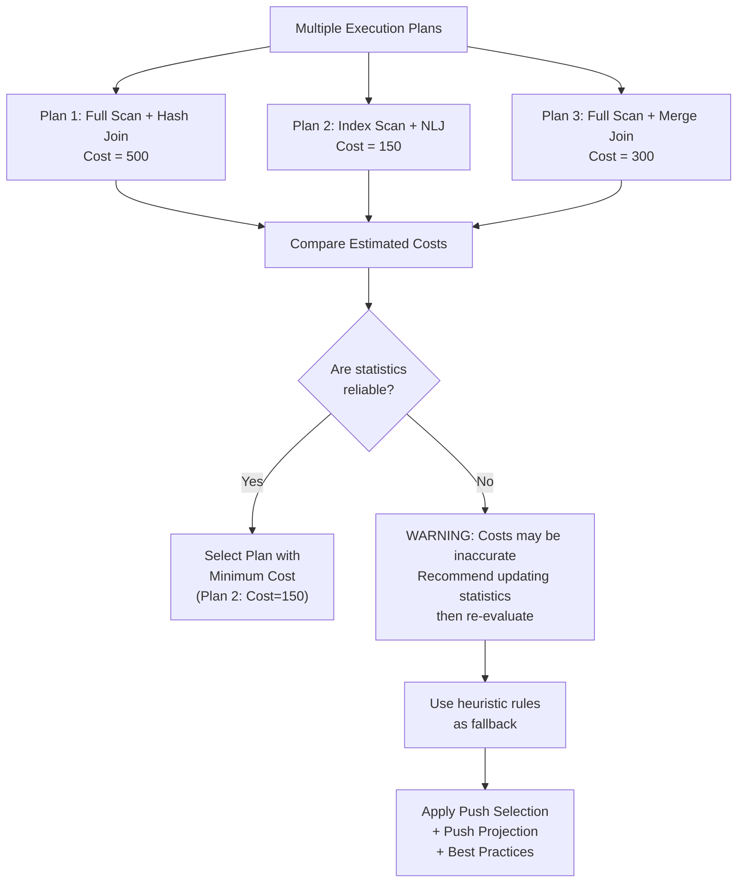
```mermaid
flowchart TD
    A["Multiple Execution Plans"] --> B["Plan 1: Full Scan + Hash Join<br/>Cost = 500"]
    A --> C["Plan 2: Index Scan + NLJ<br/>Cost = 150"]
    A --> D["Plan 3: Full Scan + Merge Join<br/>Cost = 300"]
    
    B --> E["Compare Estimated Costs"]
    C --> E
    D --> E
    
    E --> F{"Are statistics<br/>reliable?"}
    
    F -->|"Yes"| G["Select Plan with<br/>Minimum Cost<br/>(Plan 2: Cost=150)"]
    
    F -->|"No"| H["WARNING: Costs may be inaccurate<br/>Recommend updating statistics<br/>then re-evaluate"]
    H --> I["Use heuristic rules<br/>as fallback"]
    I --> J["Apply Push Selection<br/>+ Push Projection<br/>+ Best Practices"]
```

**شرح المخطط:** اختيار خطة التنفيذ يعتمد على تقدير الكلفة. ومع ذلك، إذا كانت الإحصاءات قديمة، فإن تقدير الكلفة قد يكون غير دقيق. في هذه الحالة، يوصي النظام أولاً بتحديث الإحصاءات قبل اختيار الخطة النهائية. المصدر: Database System Concepts Ch16.6.

---

## Diagram 18: Explain Output Flow

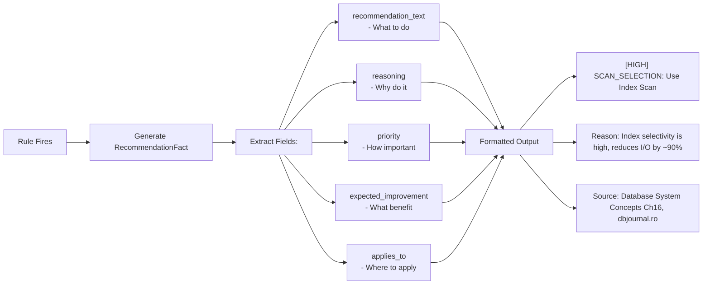
```mermaid
flowchart LR
    A["Rule Fires"] --> B["Generate RecommendationFact"]
    B --> C["Extract Fields:"]
    C --> D["recommendation_text<br/>- What to do"]
    C --> E["reasoning<br/>- Why do it"]
    C --> F["priority<br/>- How important"]
    C --> G["expected_improvement<br/>- What benefit"]
    C --> H["applies_to<br/>- Where to apply"]
    
    D --> I["Formatted Output"]
    E --> I
    F --> I
    G --> I
    H --> I
    
    I --> J["[HIGH] SCAN_SELECTION: Use Index Scan"]
    I --> K["Reason: Index selectivity is high, reduces I/O by ~90%"]
    I --> L["Source: Database System Concepts Ch16, dbjournal.ro"]
```

**شرح المخطط:** كل قاعدة تنتج RecommendationFact يحوي 6 حقول أساسية توفر تفسيراً كاملاً للتوصية. هذا يضمن أن النظام ليس مجرد "صندوق أسود" بل يقدم تفسيرات واضحة لكل قرار تحسيني.

---

## Diagram 19: Write-Heavy vs Read-Heavy Workload

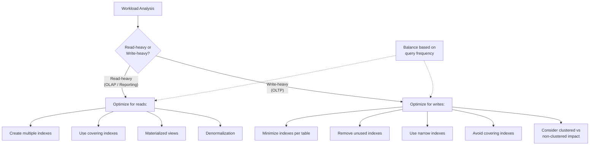
```mermaid
flowchart TD
    A["Workload Analysis"] --> B{"Read-heavy or<br/>Write-heavy?"}
    
    B -->|"Read-heavy<br/>(OLAP / Reporting)"| C["Optimize for reads:"]
    C --> C1["Create multiple indexes"]
    C --> C2["Use covering indexes"]
    C --> C3["Materialized views"]
    C --> C4["Denormalization"]
    
    B -->|"Write-heavy<br/>(OLTP)"| D["Optimize for writes:"]
    D --> D1["Minimize indexes per table"]
    D --> D2["Remove unused indexes"]
    D --> D3["Use narrow indexes"]
    D --> D4["Avoid covering indexes"]
    D --> D5["Consider clustered vs<br/>non-clustered impact"]
    
    E["Balance based on<br/>query frequency"] -.-> C
    E -.-> D
```

**شرح المخطط:** طبيعة الحمل (Read-heavy vs Write-heavy) تؤثر على قرارات الفهرسة. في أنظمة OLAP يُفضل إنشاء فهارس متعددة لتسريع القراءة. في أنظمة OLTP يُفضل تقليل الفهارس لتجنب كلفة التحديث. المصدر: Medium Guide.

---

## Diagram 20: Complete Decision Tree Summary

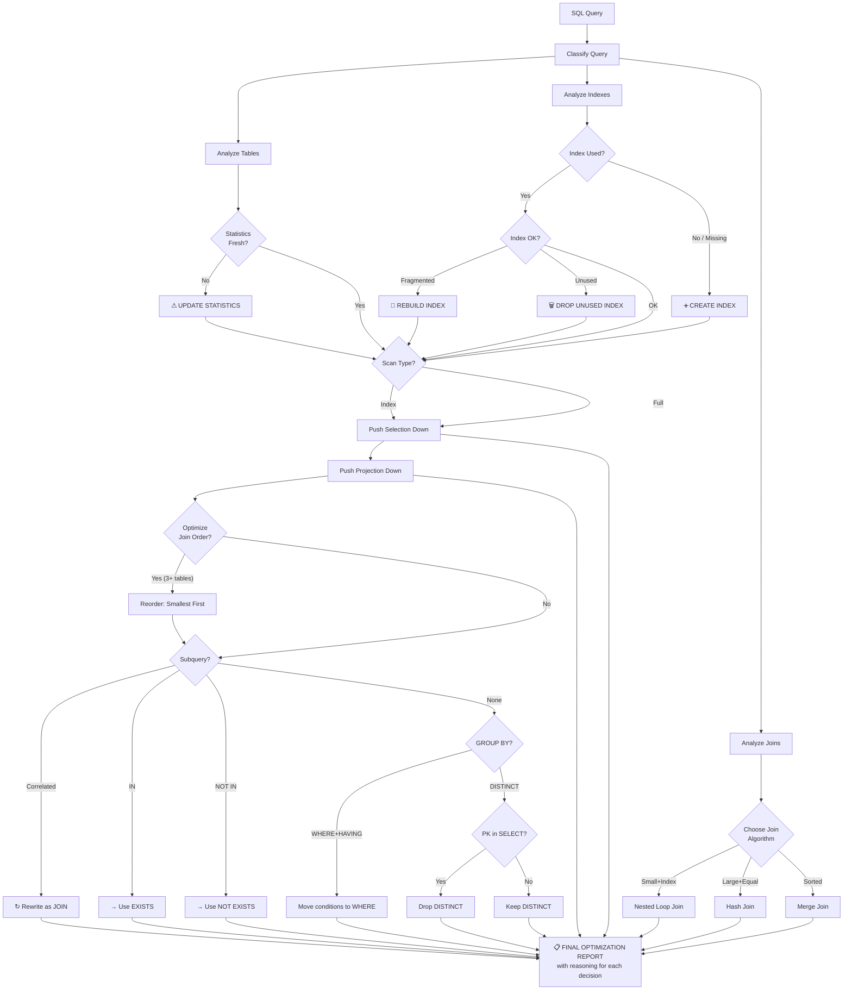
```mermaid
flowchart TB
    START["SQL Query"] --> QCLASS["Classify Query"]
    QCLASS --> TABLES["Analyze Tables"]
    QCLASS --> INDEXES["Analyze Indexes"]
    QCLASS --> JOINS["Analyze Joins"]

    TABLES --> STATS{"Statistics<br/>Fresh?"}
    STATS -->|"No"| REC1["⚠ UPDATE STATISTICS"]
    STATS -->|"Yes"| SCAN{"Scan Type?"}
    
    INDEXES --> IDX_USE{"Index Used?"}
    IDX_USE -->|"Yes"| IDX_OK{"Index OK?"}
    IDX_OK -->|"Fragmented"| REC2["🔧 REBUILD INDEX"]
    IDX_OK -->|"Unused"| REC3["🗑 DROP UNUSED INDEX"]
    IDX_OK -->|"OK"| SCAN
    
    IDX_USE -->|"No / Missing"| REC4["➕ CREATE INDEX"]
    REC4 --> SCAN

    SCAN -->|"Index"| PUSH_SEL["Push Selection Down"]
    SCAN -->|"Full"| PUSH_SEL
    
    JOINS --> JOIN_ALG{"Choose Join<br/>Algorithm"}
    JOIN_ALG -->|"Small+Index"| NLJ["Nested Loop Join"]
    JOIN_ALG -->|"Large+Equal"| HJ["Hash Join"]
    JOIN_ALG -->|"Sorted"| MJ["Merge Join"]
    
    PUSH_SEL --> PUSH_PROJ["Push Projection Down"]
    PUSH_PROJ --> JOIN_ORDER{"Optimize<br/>Join Order?"}
    JOIN_ORDER -->|"Yes (3+ tables)"| REORDER["Reorder: Smallest First"]
    JOIN_ORDER -->|"No"| SUB{"Subquery?"}
    
    REORDER --> SUB
    SUB -->|"Correlated"| REWRITE1["↻ Rewrite as JOIN"]
    SUB -->|"IN"| REWRITE2["→ Use EXISTS"]
    SUB -->|"NOT IN"| REWRITE3["→ Use NOT EXISTS"]
    SUB -->|"None"| GROUP{"GROUP BY?"}
    
    GROUP -->|"WHERE+HAVING"| WH_REWRITE["Move conditions to WHERE"]
    GROUP -->|"DISTINCT"| DIST_REWRITE{"PK in SELECT?"}
    DIST_REWRITE -->|"Yes"| DROP_DIST["Drop DISTINCT"]
    DIST_REWRITE -->|"No"| KEEP_DIST["Keep DISTINCT"]
    
    FINAL["📋 FINAL OPTIMIZATION REPORT<br/>with reasoning for each decision"]
    
    REC1 --> SCAN
    REC2 --> SCAN
    REC3 --> SCAN
    WH_REWRITE --> FINAL
    REWRITE1 --> FINAL
    REWRITE2 --> FINAL
    REWRITE3 --> FINAL
    NLJ --> FINAL
    HJ --> FINAL
    MJ --> FINAL
    KEEP_DIST --> FINAL
    DROP_DIST --> FINAL
    PUSH_SEL --> FINAL
    PUSH_PROJ --> FINAL
```

**شرح المخطط:** هذا هو المخطط الشامل الذي يلخص جميع قرارات النظام الخبير من البداية إلى النهاية. يبدأ بتصنيف الاستعلام، ثم تحليل الجداول والفهارس و JOINs، ثم تطبيق سلسلة من قواعد التحسين، وينتهي بتقرير تحسيني شامل مع تبرير لكل قرار.

---

## Diagram 21: Deduplication Output Layer

```mermaid
flowchart TD
    A["Engine fires all matching rules"] --> B["Raw Recommendation list<br/>(may contain duplicates)"]
    
    B --> C["Deduplication Phase"]
    
    C --> D["For each recommendation, compute key:<br/>(category + recommendation_text + applies_to)"]
    D --> E{"Key already seen?"}
    E -->|"Yes"| F["Skip duplicate"]
    E -->|"No"| G["Add to final list"]
    
    F --> H["Deduplicated Recommendation List"]
    G --> H
    
    H --> I["Sorted by priority<br/>(HIGH, MEDIUM, LOW)"]
    I --> J["Final Report"]
    
    K["Why duplicates occur:"] -.-> L["Rules fire per matching fact pair<br/>e.g. 2 small tables × 2 indexes = 4 firings"]
    K -.-> M["Same recommendation text<br/>with different fact bindings"]
    K -.-> N["Dedup keeps first occurrence only"]
```

**شرح المخطط:** تمت إضافة طبقة إزالة التكرار في مرحلة تجميع النتائج النهائية بعد إطلاق جميع القواعد. لكل توصية، يتم حساب مفتاح فريد (فئة التوصية + النص + مجال التطبيق). إذا تكرر نفس المفتاح، يتم الاحتفاظ بالتوصية الأولى فقط وتجاهل الباقي. هذا يمنع التكرار دون تغيير قواعد Experta نفسها. تم تطبيق هذا التحسين بناءً على تحليل المخرجات التي أظهرت تكرار بعض التوصيات حتى 4 مرات في الحالات التي تحتوي على عدة جداول وفهارس.

---

## Diagram 22: NOT IN to NOT EXISTS Transformation

```mermaid
flowchart TD
    A["Query with NOT IN subquery"] --> B{"Subquery result<br/>contains NULL?"}
    
    B -->|"Yes/Unknown"| C["NOT IN returns EMPTY result<br/>(NULL semantics break it)"]
    C --> D["⚠ Correctness issue!"]
    D --> E["Rewrite as NOT EXISTS"]
    
    B -->|"No NULLs"| F["NOT IN works correctly<br/>but may be slow"]
    F --> G["NOT IN scans ALL values<br/>in subquery result"]
    G --> H["Rewrite as NOT EXISTS<br/>for better performance"]
    
    E --> I["NOT EXISTS benefits:"]
    H --> I
    
    I --> J["Early termination<br/>(stops at first match)"]
    I --> K["Correct NULL handling"]
    I --> L["Semi-join optimization"]
    I --> M["Better index usage"]
    
    N["Source: Database System Concepts Ch16"] -.-> O["NOT EXISTS is always preferred<br/>over NOT IN for subqueries"]
```

**شرح المخطط:** NOT IN يعاني من مشكلة معروفة: إذا كانت نتيجة Subquery تحتوي على NULL، فإن NOT IN يرجع مجموعة فارغة (لأن NULL = ANY (subquery) يُقيّم إلى UNKNOWN). NOT EXISTS يتعامل مع NULL بشكل صحيح ويوفر أداء أفضل بفضل التوقف عند أول تطابق (Early Termination). المصدر: Database System Concepts Ch16 و dbjournal.ro.

---

## Diagram 23: Clustered Index for Range Queries

```mermaid
flowchart TD
    A["Range Query Detected<br/>(BETWEEN, >, <, >=, <=)"] --> B{"Existing index<br/>on column?"}
    
    B -->|"Yes"| C{"Index type?"}
    C -->|"Clustered"| D["✓ Optimal performance"]
    C -->|"Non-Clustered"| E["⚠ Suboptimal for range"]
    
    E --> F["Non-Clustered Index on range:<br/>- Random I/O per matching row<br/>- Key lookup for each row<br/>- May be worse than Full Scan"]
    F --> G["Suggest converting to<br/>Clustered Index"]
    
    B -->|"No"| H{"Table is large?"}
    H -->|"Yes"| I["Suggest creating<br/>Clustered Index"]
    H -->|"No"| J["Full Scan is cheaper<br/>for small tables"]
    
    G --> K["Clustered Index benefits:"]
    I --> K
    
    K --> L["Physical ordering of data"]
    K --> M["Sequential I/O for ranges"]
    K --> N["No key lookup needed"]
    K --> O["Covers ORDER BY on key"]
    
    P["Performance gain:<br/>50-80% for range queries"] -.-> K
```

**شرح المخطط:** Clustered Index يرتب البيانات فيزيائياً على القرص وفقاً لترتيب مفتاح الفهرس. هذا يجعله مثالياً لاستعلامات النطاق (BETWEEN, >, <) لأن البيانات المتجاوبة ستكون مخزنة بشكل متتالٍ، مما يسمح بقراءة متسلسلة (Sequential I/O) بدلاً من قراءة عشوائية. الفرق في الأداء يمكن أن يصل إلى 80% لاستعلامات النطاق. المصدر: Database System Concepts Ch16.

---

## Diagram 24: Composite Index Decision

```mermaid
flowchart TD
    A["Multiple WHERE conditions detected"] --> B{"Which columns are<br/>most selective?"}
    
    B --> C["Order columns by selectivity<br/>(most selective first)"]
    C --> D["Candidate index:<br/>(col1, col2, col3)"]
    
    D --> E{"Column order<br/>in queries?"}
    E -->|"col1, col2 always together"| F["Good: Single composite index"]
    E -->|"col1 alone, col2 alone"| G["Consider separate indexes"]
    E -->|"col2 without col1"| H["⚠ col2 won't use composite<br/>if col1 is leading column"]
    
    F --> I["Composite index benefits:"]
    G --> I
    
    I --> J["Index covering more queries"]
    I --> K["Reduced index maintenance"]
    I --> L["Better than multiple single indexes"]
    
    M["Rules of thumb:"] -.-> N["Leading column should be<br/>most selective or most used"]
    M -.-> O["Max 3-5 columns per composite"]
    M -.-> P["Consider all queries, not just one"]
    
    Q["Source: Database System Concepts Ch16"] -.-> R["Composite index design is critical<br/>for multi-condition queries"]
```

**شرح المخطط:** الفهرس المركب (Composite Index) هو فهرس على عدة أعمدة معاً. ترتيب الأعمدة في الفهرس المركب مهم جداً: يجب وضع العمود الأكثر انتقائية أولاً. كما أن الفهرس المركب لا يمكن استخدامه إذا لم يكن العمود الأول (Leading Column) موجوداً في الشرط. المصدر: Database System Concepts Ch16 و dbjournal.ro.

---

## Diagram 25: Covering Index Scan

```mermaid
flowchart TD
    A["Query with SELECT column1, column2"] --> B{"Index contains<br/>all SELECT columns?"}
    
    B -->|"Yes"| C["Covering Index possible!"]
    B -->|"No"| D["Need key lookup to<br/>fetch missing columns"]
    
    C --> E["Using Covering Index:"]
    E --> F["✓ Only index pages read"]
    E --> G["✓ No base table access"]
    E --> H["✓ Index is already sorted"]
    E --> I["✓ Much less I/O"]
    
    D --> J["Non-covering access:"]
    J --> K["✗ Index pages read (narrow)"]
    J --> L["✗ Key lookup per row"]
    J --> M["✗ Random I/O for lookups"]
    J --> N["✗ More I/O + CPU"]
    
    O["Comparison:"] -.-> P["Covering Scan = 5-15 I/Os<br/>Non-covering = 1000s of I/Os"]
    
    Q["Source: Database System Concepts Ch16.4"] -.-> R["Covering indexes eliminate table access,<br/>providing the fastest read path"]
```

**شرح المخطط:** Covering Index (فهرس غطاء) هو فهرس يحتوي على جميع الأعمدة المطلوبة في استعلام SELECT، مما يلغي الحاجة إلى الوصول إلى الجدول الأصلي. هذا يوفر وقتاً كبيراً في I/O لأنه يكتفي بقراءة صفحات الفهرس فقط. هو أسرع طريقة لقراءة البيانات لأن BASE TABLE لا يُلمس البتة. المصدر: Database System Concepts Ch16.4.

---

## Diagram 26: Materialized Subquery Optimization

```mermaid
flowchart TD
    A["Correlated Subquery detected"] --> B{"Allows temp table?"}
    
    B -->|"Yes"| C{"Has aggregation<br/>in subquery?"}
    B -->|"No"| D["Cannot materialize"]
    
    C -->|"Yes"| E["Good candidate<br/>for materialization"]
    C -->|"No"| F["Consider JOIN rewrite first"]
    
    E --> G["Materialization process:"]
    G --> H["1. Execute subquery once"]
    G --> I["2. Store result in temp table"]
    G --> J["3. Add index on join column"]
    G --> K["4. Join outer query with temp table"]
    
    H --> L["Before: N+1 executions"]
    I --> L
    K --> L
    
    L --> M["After: 1 execution + efficient join"]
    
    N["Performance impact:"] -.-> O["For N=1000 outer rows<br/>Before: 1000 subquery executions<br/>After: 1 subquery + 1 indexed join"]
    
    P["Source: Database System Concepts Ch16"] -.-> Q["Materialization converts correlated<br/>subquery into efficient join"]
```

**شرح المخطط:** تجسيد Subquery (Materialization) هو أسلوب تحسيني للـ Subqueries الترابطية (Correlated Subqueries). بدلاً من تنفيذ Subquery لكل صف من الاستعلام الخارجي (N+1 مرة)، يتم تنفيذ Subquery مرة واحدة وتخزين النتيجة في جدول مؤقت مع فهرس على عمود JOIN. هذا يحول المشكلة من N+1 تنفيذ إلى تنفيذ واحد + JOIN فعال. المصدر: Database System Concepts Ch16.

---

## Diagram 27: LIMIT/OFFSET Pagination Optimization

```mermaid
flowchart TD
    A["Query with LIMIT/OFFSET"] --> B{"Has ORDER BY?"}
    
    B -->|"No"| C["⚠ Inconsistent results!"]
    C --> D["Same query may return<br/>different rows each execution"]
    D --> E["Recommend: Always add ORDER BY<br/>with LIMIT/OFFSET"]
    
    B -->|"Yes"| F{"Index supports<br/>ORDER BY?"}
    
    F -->|"Yes"| G["Use ordered index scan"]
    G --> H["Index provides sorted order<br/>without extra sort"]
    H --> I["Scan skips first OFFSET rows<br/>Stops after LIMIT rows"]
    I --> J["Highly efficient"]
    
    F -->|"No"| K["DB must sort all rows first"]
    K --> L["Full sort of table"]
    L --> M["Then apply LIMIT/OFFSET"]
    M --> N["Potentially expensive for large tables"]
    
    O["Performance comparison:"] -.-> P["Index-based: O(log N + LIMIT) I/Os<br/>Full sort: O(N log N) I/Os"]
    
    Q["Source: Database System Concepts Ch16"] -.-> R["Index on ORDER BY column is critical<br/>for efficient pagination"]
```

**شرح المخطط:** تحسين استعلامات LIMIT/OFFSET (التقسيم إلى صفحات) يعتمد بشكل كبير على وجود فهرس يدعم ORDER BY. مع الفهرس المناسب، يمكن للقاعدة تخطي الصفوف بسرعة (OFFSET) وإرجاع العدد المطلوب فقط (LIMIT) دون فرز جميع البيانات. بدون فهرس مناسب، تضطر قاعدة البيانات لفرز الجدول كاملاً. المصدر: Database System Concepts Ch16 و Medium Guide.

---

## Diagram 28: OR Condition Rewriting with UNION ALL

```mermaid
flowchart TD
    A["Query with OR condition"] --> B{"Columns in OR<br/>have separate indexes?"}
    
    B -->|"Yes"| C["Rewrite as UNION ALL"]
    B -->|"No"| D{"Single index covers<br/>both columns?"}
    
    C --> E["Original: WHERE col1='x' OR col2='y'"]
    E --> F["Rewrite:"]
    F --> G["SELECT ... WHERE col1='x'<br/>UNION ALL<br/>SELECT ... WHERE col2='y'"]
    
    G --> H["Each part uses its own index"]
    H --> I["Much more efficient"]
    
    D -->|"Yes"| J["Use composite index scan"]
    D -->|"No"| K["⚠ May result in Full Table Scan"]
    K --> L["OR often prevents index usage"]
    L --> M["Consider creating indexes or<br/>rewriting with UNION ALL"]
    
    N["Why OR is problematic:"] -.-> O["Index can only seek one range<br/>OR requires scanning both sets"]
    N -.-> P["UNION ALL allows separate index<br/>seeks per condition"]
    
    Q["Source: dbjournal.ro"] -.-> R["OR conditions can degrade performance<br/>by 40-60% without proper optimization"]
```

**شرح المخطط:** شروط OR تمنع استخدام الفهارس في معظم الحالات لأن محرك قاعدة البيانات لا يستطيع تنفيذ Index Seek واحد لشرط OR (يحتاج إلى مسح ضوئي). الحل هو إعادة كتابة OR باستخدام UNION ALL حيث يمكن لكل جزء استخدام الفهرس الخاص به. هذا يحسن أداء الاستعلامات التي تحتوي على OR بنسبة 40-60%. المصدر: dbjournal.ro.

---

## Diagram 29: UNION ALL vs UNION Decision

```mermaid
flowchart TD
    A["Query with UNION"] --> B{"Need deduplication?"}
    
    B -->|"Yes"| C["UNION is correct"]
    B -->|"No"| D["Use UNION ALL instead"]
    
    C --> E["UNION process:"]
    E --> F["Execute both queries"]
    F --> G["Merge results"]
    G --> H["Sort to detect duplicates"]
    H --> I["Remove duplicates"]
    I --> J["Return unique results"]
    
    D --> K["UNION ALL process:"]
    K --> L["Execute both queries"]
    L --> M["Append results directly"]
    M --> N["Return all results"]
    
    O["Performance comparison:"] -.-> P["UNION: O(N log N) for sorting<br/>UNION ALL: O(N) direct merge"]
    O -.-> Q["UNION ALL is always faster<br/>when dedup not needed"]
    
    R["Source: Database System Concepts Ch16"] -.-> S["UNION adds sort for dedup,<br/>UNION ALL concatenates directly"]
```

**شرح المخطط:** UNION يقوم بإزالة التكرارات (Deduplication) بينما UNION ALL لا يفعل ذلك. عملية إزالة التكرار تتطلب فرز النتائج (Sort) مما يزيد من كلفة الاستعلام. إذا كنت متأكداً من عدم وجود تكرارات أو لا تمانع وجودها، استخدم UNION ALL للحصول على أداء أفضل. المصدر: Database System Concepts Ch16.

---

## Diagram 30: Data Distribution and Histogram Statistics

```mermaid
flowchart TD
    A["Query with WHERE condition"] --> B{"Data distribution<br/>known?"}
    
    B -->|"Yes"| C{"Histogram<br/>available?"}
    B -->|"No"| D["⚠ Need data sampling"]
    D --> E["Collect data distribution stats"]
    E --> F["Create histogram"]
    
    C -->|"Yes"| G["Quality cardinality estimation"]
    C -->|"No"| H["Using basic statistics<br/>(min, max, avg)"]
    
    H --> I["Basic assumption: uniform distribution"]
    I --> J["Often inaccurate for real data"]
    J --> K["Example: 'status = ERROR'<br/>with 1% rows → actual 0.01%"]
    K --> L["Cost estimation error: 100x!"]
    
    G --> M["Histogram provides:"]
    M --> N["Frequency distribution per bucket"]
    M --> O["Accurate selectivity for each value"]
    M --> P["Better join cardinality estimates"]
    M --> Q["More reliable cost-based decisions"]
    
    R["Impact:"] -.-> S["Without histogram: 50-100% cost error<br/>With histogram: <10% cost error"]
    
    T["Source: Database System Concepts Ch16.4"] -.-> U["Histograms are essential for accurate<br/>cardinality estimation in real-world data"]
```

**شرح المخطط:** الـ Histogram (الرسم البياني للتوزيع) هو أداة إحصائية مهمة لتقدير انتقائية الشروط في الاستعلامات. بدون Histogram، يفترض محرك قاعدة البيانات توزيعاً منتظماً للبيانات (Uniform Distribution) وهو افتراض غير دقيق في معظم الحالات الواقعية. مع Histogram، يمكن تقدير عدد الصفوف المطابقة لشرط معين بدقة أكبر، مما يؤدي إلى خطط تنفيذ أفضل. المصدر: Database System Concepts Ch16.4 و Medium Guide.

---

## Diagram 31: Workload Strategy Decision

```mermaid
flowchart TD
    A["Workload Type Analysis"] --> B{"Query execution<br/>frequency?"}
    
    B -->|"HIGH<br/>(Hot queries)"| C["Prioritize optimization<br/>for this query"]
    B -->|"MEDIUM"| D["Standard optimization"]
    B -->|"LOW"| E["Minimal optimization<br/>(batch OK)"]
    
    C --> F{"Workload<br/>balance?"}
    D --> F
    E --> F
    
    F -->|"Read-Heavy<br/>(OLAP/Reporting)"| G["Strategy: Maximize read speed"]
    G --> G1["✓ Create multiple indexes"]
    G --> G2["✓ Use covering indexes"]
    G --> G3["✓ Consider materialized views"]
    G --> G4["✓ Denormalize if needed"]
    
    F -->|"Write-Heavy<br/>(OLTP)"| H["Strategy: Minimize write overhead"]
    H --> H1["✓ Minimize indexes per table"]
    H --> H2["✓ Drop unused indexes"]
    H --> H3["✓ Use narrow indexes"]
    H --> H4["✓ Avoid covering indexes"]
    
    F -->|"Mixed"| I["Strategy: Balance"]
    I --> I1["✓ Index selective columns only"]
    I --> I2["✓ Monitor index usage regularly"]
    I --> I3["✓ Consider filtered indexes"]
    I --> I4["✓ Partition large tables"]
    
    J["Response time critical?"] -.-> G
    J -.-> H
    J -.-> I
    
    K["Source: Medium Guide"] -.-> L["Workload strategy determines<br/>the entire optimization approach"]
```

**شرح المخطط:** استراتيجية تحسين الاستعلامات تعتمد على طبيعة الحمل (Workload). أنظمة OLAP (قراءة مكثفة) تستفيد من الفهارس المتعددة لتسريع القراءة. أنظمة OLTP (كتابة مكثفة) تحتاج إلى تقليل الفهارس لتجنب كلفة التحديث. الأنظمة المختلطة تحتاج إلى موازنة دقيقة بناءً على تحليل استخدام الفهارس وتكرار الاستعلامات. المصدر: Medium Guide.

---

## Diagram 32: Index Suggestion vs Maintenance Decision

```mermaid
flowchart TD
    A["Index Analysis"] --> B{"Index exists?"}
    
    B -->|"No"| C["INDEX_SUGGESTION"]
    C --> C1["Large table?"]
    C1 -->|"Yes"| C2["Suggest CREATE INDEX<br/>on WHERE/JOIN columns"]
    C1 -->|"No"| C3["Small table - index<br/>may not be needed"]
    
    B -->|"Yes"| D{"Index status?"}
    
    D -->|"Unused<br/>(usage_count = 0)"| E["INDEX_MAINTENANCE"]
    E --> E1["RECOMMEND: DROP INDEX"]
    E1 --> E2["Benefit: Faster writes<br/>Less storage used"]
    
    D -->|"Fragmented"| F["INDEX_MAINTENANCE"]
    F --> F1["RECOMMEND: REBUILD/REORGANIZE"]
    F1 --> F2["Benefit: 30% read improvement"]
    
    D -->|"Healthy"| G{"Optimization<br/>needed?"}
    
    G -->|"Need composite"| H["INDEX_SUGGESTION"]
    H --> H1["Suggest COMPOSITE INDEX"]
    H1 --> H2["Benefit: Multi-condition queries"]
    
    G -->|"Need clustered<br/>for range"| I["INDEX_SUGGESTION"]
    I --> I1["Convert to CLUSTERED INDEX"]
    I1 --> I2["Benefit: 50-80% range speedup"]
    
    G -->|"No foreign key<br/>index"| J["INDEX_SUGGESTION"]
    J --> J1["INDEX on FOREIGN KEY"]
    J1 --> J2["Benefit: 80% JOIN speedup"]
    
    G -->|"Adequate"| K["No action needed"]
    
    L["Key principle:"] -.-> M["INDEX_SUGGESTION = CREATE new index<br/>INDEX_MAINTENANCE = DROP/REBUILD existing"]
```

**شرح المخطط:** هذا المخطط يوضح الفرق الواضح بين INDEX_SUGGESTION (اقتراح إنشاء فهارس جديدة) و INDEX_MAINTENANCE (صيانة الفهارس الموجودة). INDEX_SUGGESTION ينشط عندما لا يوجد فهرس مناسب أو عندما نحتاج فهرساً محسنّاً (مركب، مجمع، على مفتاح خارجي). INDEX_MAINTENANCE ينشط فقط عندما يوجد فهرس فعلي لكنه يعاني من مشكلة (غير مستخدم، مجزأ). هذا الفصل الواضح يمنع التعارض في التوصيات ويزيل التشويش من التقرير النهائي.
