# Architecture Diagrams - Expert System Query Optimizer

---

## Diagram 1: General System Architecture

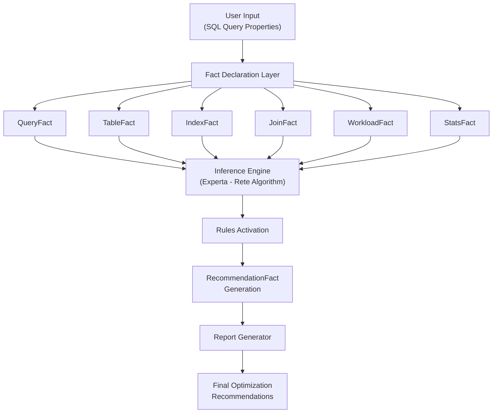

**شرح المخطط:** يوضح هذا المخطط البنية العامة للنظام الخبير. تبدأ العملية بإدخال خصائص الاستعلام (نوع الاستعلام، خصائص الجدول، الفهارس، إلخ)، ثم تحويل هذه الخصائص إلى حقائق (Facts) منظمة. تمر هذه الحقائق إلى محرك الاستدلال Experta الذي يطبق خوارزمية Rete لتفعيل القواعد المناسبة. تنتج القواعد توصيات تحسين يتم تجميعها في تقرير نهائي.

---

## Diagram 2: Query Classification and Fact Extraction

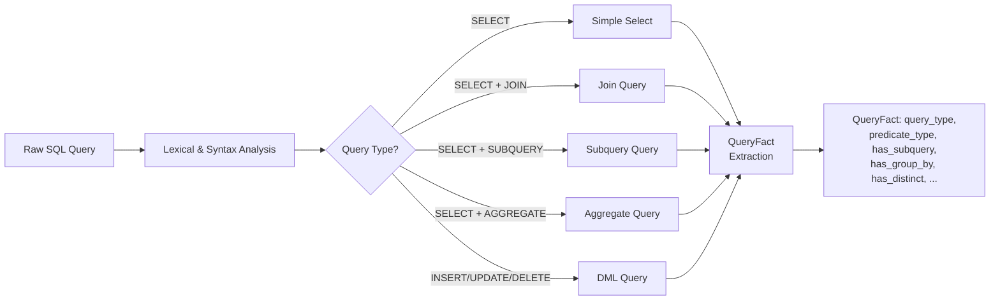

**شرح المخطط:** يقوم النظام أولاً بتصنيف نوع الاستعلام (SELECT بسيط، JOIN، Subquery، تجميعي، DML). بناءً على التصنيف، يتم استخراج خصائص الاستعلام المختلفة وتحويلها إلى QueryFact. هذا التصنيف المبكر يوجه القواعد التي سيتم تطبيقها لاحقاً.

---

## Diagram 3: Full Scan vs Index Scan Decision

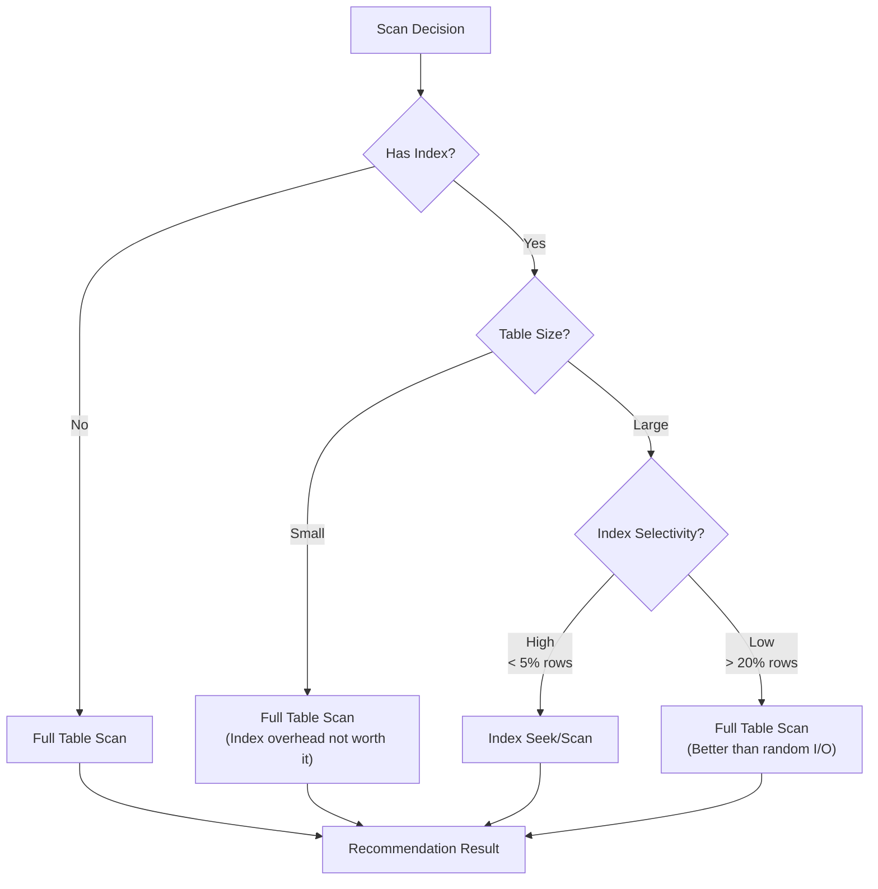

**شرح المخطط:** أحد أهم القرارات في تحسين الاستعلامات هو كيفية الوصول إلى البيانات. يقرر النظام ما إذا كان سيستخدم Full Table Scan أو Index Scan بناءً على:
1. وجود فهرس من عدمه
2. حجم الجدول (صغير أم كبير)
3. درجة انتقائية الفهرس (Selectivity)
يتبع هذا القرار المبادئ المذكورة في Database System Concepts Chapter 16 حول تقدير كلفة الوصول.

---

## Diagram 4: Push Selection Down

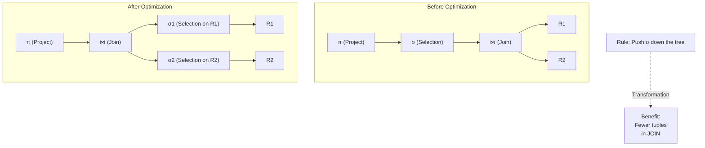

**شرح المخطط:** تعتبر قاعدة Push Selection Down من أهم قواعد التحسين الترابطي (Heuristic Optimization). بدلاً من تطبيق شروط الاختيار (WHERE) بعد JOIN، يتم دفعها لأسفل لتُطبق مباشرة على كل جدول قبل JOIN. هذا يقلل عدد الصفوف المشاركة في JOIN بشكل كبير، مما يحسن الأداء. المصدر: Database System Concepts Ch16.3.

---

## Diagram 5: Push Projection Down

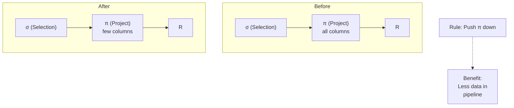

**شرح المخطط:** دفع الإسقاط (Projection) للأسفل يقلل عدد الأعمدة التي يتم نقلها بين مراحل تنفيذ الاستعلام. بتطبيق SELECT بأسماء الأعمدة المحددة بدلاً من SELECT * في أقرب وقت ممكن، نقلل عرض الصفوف المنقولة ونحسن استخدام الذاكرة و I/O.

---

## Diagram 6: Join Algorithm Selection

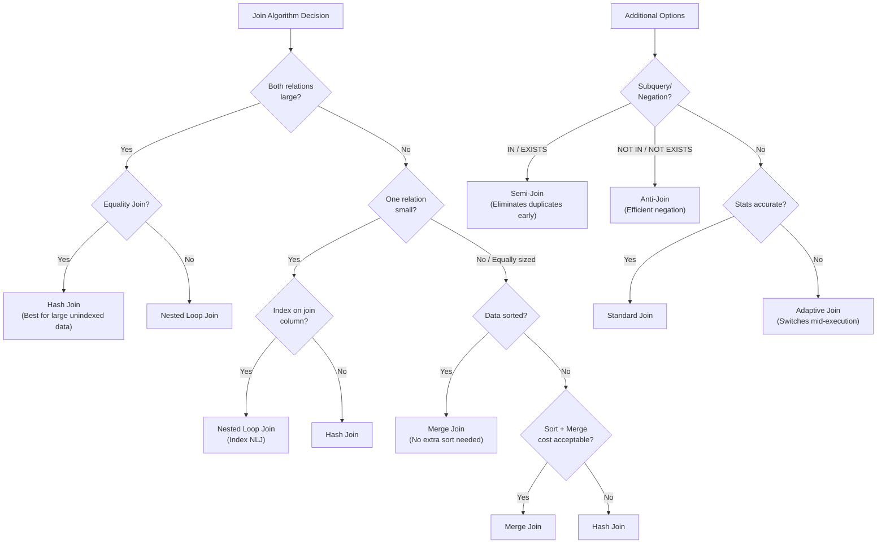

**شرح المخطط:** اختيار خوارزمية JOIN المناسبة يعتمد على:
- **Nested Loop Join:** مثالي عندما تكون إحدى العلاقات صغيرة والأخرى مفهرسة
- **Hash Join:** الأفضل للعلاقات الكبيرة بدون فهارس (شروط المساواة)
- **Merge Join:** مناسب عندما تكون البيانات مرتبة مسبقاً أو مطلوب ترتيب النتائج
- **Semi-Join:** للاستعلامات التي تستخدم IN/EXISTS — يوقف عند أول تطابق
- **Anti-Join:** للاستعلامات التي تستخدم NOT IN/NOT EXISTS — معالجة فعالة للنفي
- **Adaptive Join:** يختار ديناميكياً بين Hash Join و Nested Loop في منتصف التنفيذ
المصدر: Database System Concepts Ch16.5، dbjournal.ro، Modern DBMS.

---

## Diagram 7: Join Order Optimization

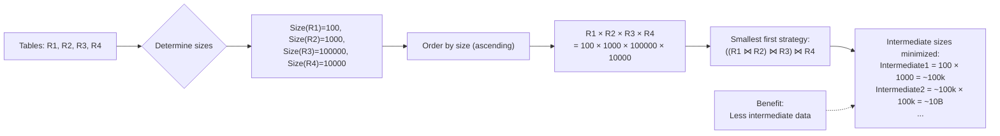

**شرح المخطط:** ترتيب JOINs يؤثر بشكل كبير على كلفة الاستعلام. القاعدة الأساسية هي وضع العلاقات الأصغر أولاً في ترتيب JOIN لتقليل حجم النتائج الوسيطة. Database System Concepts Ch16.5.5 يشرح كيف يمكن استخدام البرمجة الديناميكية لإيجاد أفضل ترتيب JOIN.

---

## Diagram 8: Subquery Rewriting

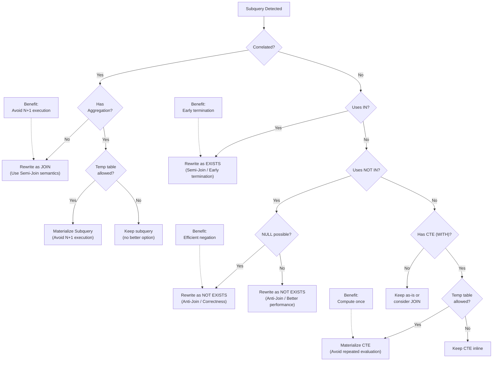

**شرح المخطط:** إعادة كتابة الـ Subquery يمكن أن تحسن الأداء بشكل جذري. القاعدة:
- الـ Subquery الترابطي (Correlated) يتحول إلى JOIN مع دلالات Semi-Join
- الـ IN يتحول إلى EXISTS (توقف عند أول تطابق)
- الـ NOT IN يتحول إلى NOT EXISTS (تجنب مشاكل NULL + أداء أفضل)
- الـ CTE يتم تجسيده (Materialize) في جدول مؤقت إذا سمحت الذاكرة
المصدر: Database System Concepts Ch16.3.2، dbjournal.ro، Medium Guide.

---

## Diagram 9: WHERE vs HAVING Decision

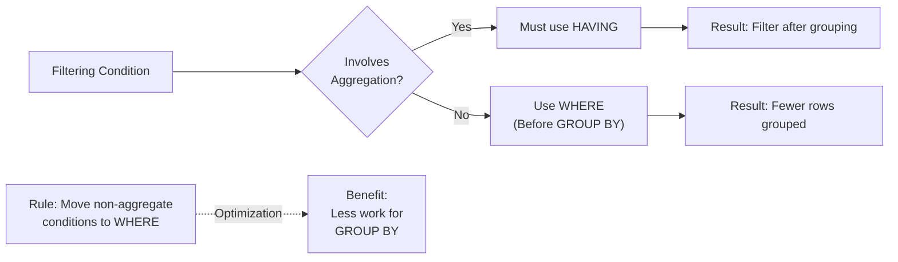

**شرح المخطط:** HAVING يُطبق بعد GROUP BY بينما WHERE يُطبق قبله. لذلك، يجب وضع شروط التصفية غير التجميعية في WHERE لتقليل عدد الصفوف التي تدخل في عملية التجميع. المصدر: Database System Concepts Ch16 و Medium Guide.

---

## Diagram 10: DISTINCT Optimization

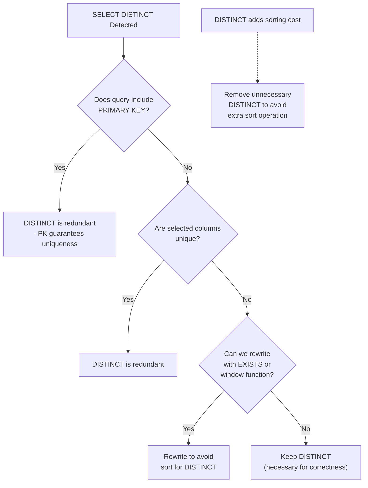

**شرح المخطط:** DISTINCT يضيف كلفة فرز إضافية. إذا كان الاستعلام يحتوي على PRIMARY KEY أو كان الحقل فريداً، فإن DISTINCT يصبح غير ضروري ويمكن حذفه. المصدر: Database System Concepts Ch16 و Medium Guide.

---

## Diagram 11: EXISTS vs IN

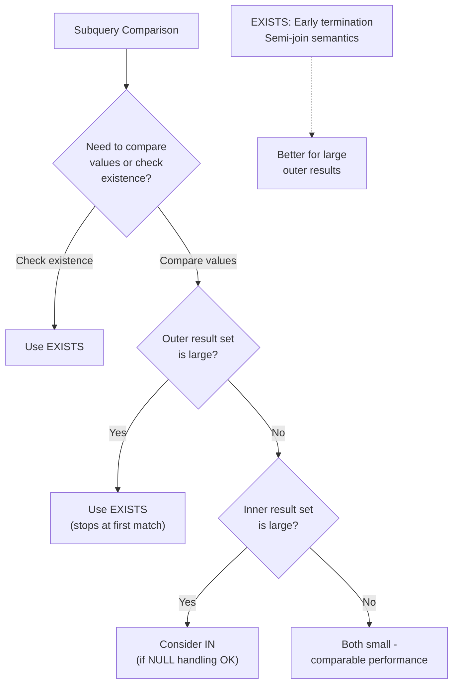

**شرح المخطط:** EXISTS يوقف التنفيذ عند أول تطابق (Early Termination) بينما IN يفحص جميع القيم. لذلك، EXISTS أفضل عندما يكون الهدف هو التحقق من الوجود فقط. مع ذلك، يجب مراعاة معالجة NULL ومقارنة الأداء حسب حجم البيانات. المصدر: dbjournal.ro و Medium Guide.

---

## Diagram 12: Index Suggestion Decision

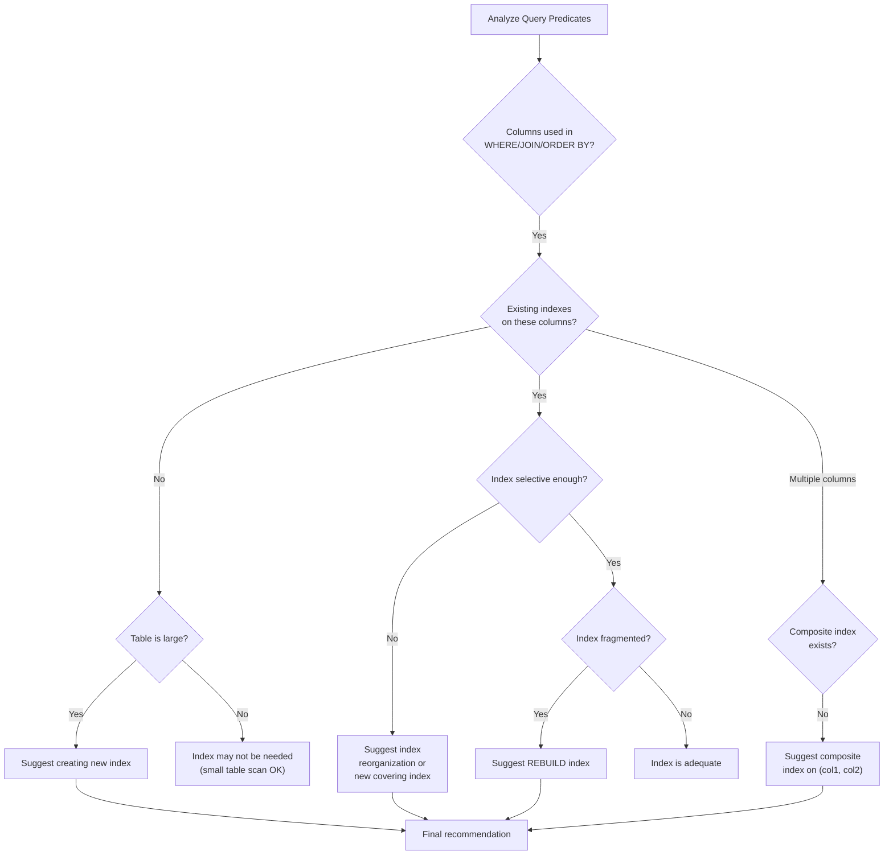

**شرح المخطط:** قرار الفهرسة معقد ويعتمد على تحليل دقيق للأعمدة المستخدمة في WHERE و JOIN و ORDER BY. يشمل القرار:
1. إنشاء فهرس جديد للأعمدة غير المفهرسة
2. إنشاء فهرس مركب للأعمدة المتعددة
3. إعادة بناء الفهرس المجزأ
المصدر: Database System Concepts Ch16.4 و dbjournal.ro.

---

## Diagram 13: Statistics Freshness Check

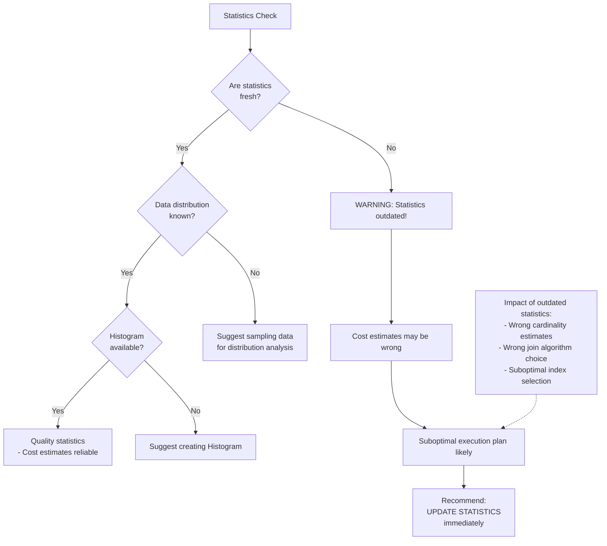

**شرح المخطط:** الإحصاءات القديمة تؤدي إلى خطط تنفيذ غير مثلى. عندما تكون الإحصاءات قديمة، يصبح تقدير الكلفة غير دقيق مما قد يؤدي لاختيار خوارزميات JOIN غير مناسبة أو فهارس غير صحيحة. المصدر: dbjournal.ro - الإحصاءات القديمة تزيد كلفة الاستعلام حتى 10 أضعاف.

---

## Diagram 14: Intermediate Result Reduction

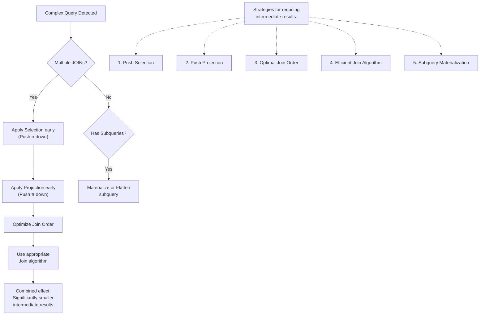

**شرح المخطط:** تقليل النتائج الوسيطة هو الهدف الرئيسي لتحسين الاستعلامات المعقدة. يتم تطبيق مجموعة من القواعد الترابطية:
- دفع Selection للأسفل (تقليل عدد الصفوف)
- دفع Projection للأسفل (تقليل عدد الأعمدة)
- ترتيب JOIN الأمثل (تقليل حجم كل خطوة)
- اختيار خوارزمية JOIN مناسبة
المصدر: Database System Concepts Ch16.

---

## Diagram 15: Final Decision Assembly

```mermaid
flowchart TB
    subgraph "Input Layer"
        A1["Query Properties"]
        A2["Table Statistics"]
        A3["Index Information"]
        A4["Workload Profile"]
    end

    subgraph "Rule Engine (Experta)"
        B1["Rule: Scan Selection"]
        B2["Rule: Push Selection"]
        B3["Rule: Push Projection"]
        B4["Rule: Join Algorithm"]
        B5["Rule: Join Order"]
        B6["Rule: Subquery Rewrite"]
        B7["Rule: WHERE vs HAVING"]
        B8["Rule: DISTINCT Check"]
        B9["Rule: EXISTS vs IN"]
        B10["Rule: Index Suggestion"]
        B11["Rule: Index Maintenance"]
        B12["Rule: Statistics Check"]
        B13["Rule: Cost Analysis"]
        B14["Rule: Intermediate Result"]
        B15["Rule: UNION Optimization"]
        B16["Rule: Semi-Join / Anti-Join"]
        B17["Rule: Partition Pruning"]
        B18["Rule: Parallel Execution"]
        B19["Rule: CTE Materialization"]
        B20["Rule: View Pushdown"]
        B21["Rule: Adaptive Join"]
        B22["Rule: Workload Strategy"]
    end

    subgraph "Output Layer"
        C1["Access Path<br/>Recommendation"]
        C2["Query Rewrite<br/>Recommendations"]
        C3["Index<br/>Recommendations"]
        C4["Statistics<br/>Recommendations"]
        C5["Cost-based<br/>Plan Selection"]
        C6["Execution<br/>Strategy"]
    end

    A1 --> B1
    A1 --> B2
    A1 --> B3
    A1 --> B4
    A1 --> B5
    A1 --> B6
    A1 --> B7
    A1 --> B8
    A1 --> B9
    A1 --> B10
    A1 --> B11
    A1 --> B12
    A1 --> B16
    A1 --> B17
    A1 --> B19
    A1 --> B20
    A1 --> B21
    A2 --> B12
    A2 --> B13
    A3 --> B1
    A3 --> B10
    A3 --> B11
    A4 --> B18
    A4 --> B22

    B1 --> C1
    B2 --> C2
    B3 --> C2
    B4 --> C1
    B5 --> C1
    B6 --> C2
    B7 --> C2
    B8 --> C2
    B9 --> C2
    B10 --> C3
    B11 --> C3
    B12 --> C4
    B13 --> C5
    B14 --> C2
    B15 --> C2
    B16 --> C1
    B17 --> C1
    B18 --> C6
    B19 --> C2
    B20 --> C2
    B21 --> C1
    B22 --> C6
```

**شرح المخطط:** هذا هو المخطط النهائي الذي يوضح كيف تتكامل جميع القرارات. تبدأ العملية من طبقة الإدخال (خصائص الاستعلام، إحصاءات الجدول، معلومات الفهارس، ملف عبء العمل)، تمر عبر 22 قاعدة في محرك Experta، وتنتج توصيات في 6 فئات رئيسية: مسار الوصول، إعادة كتابة الاستعلام، الفهارس، الإحصاءات، اختيار الخطة، وإستراتيجية التنفيذ.

---

## Diagram 16: Rete Network (Experta Inference)

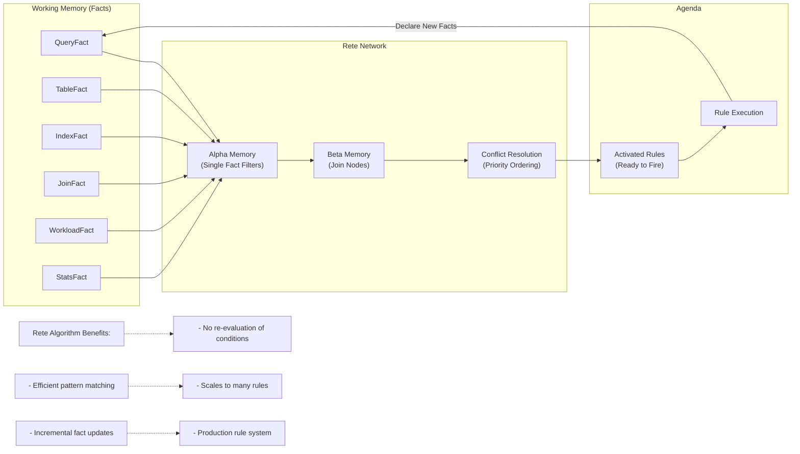

**شرح المخطط:** يوضح هذا المخطط كيف يعمل محرك Experta داخلياً باستخدام خوارزمية Rete. يتم تخزين الحقائق في الذاكرة العاملة (Working Memory)، ثم تمر عبر شبكة Rete التي تحتوي على Alpha Memory (لتصفية الحقائق الفردية) و Beta Memory (لربط الحقائق المتعددة). عندما تتحقق شروط قاعدة معينة، يتم تفعيلها ووضعها في جدول الأعمال (Agenda) لتنفيذها. الميزة الرئيسية هي أن Rete لا يعيد تقييم الشروط عند إضافة حقائق جديدة، بل يحتفظ بنتائج التقييم السابقة.

---

## Diagram 17: Cost-Based Plan Selection

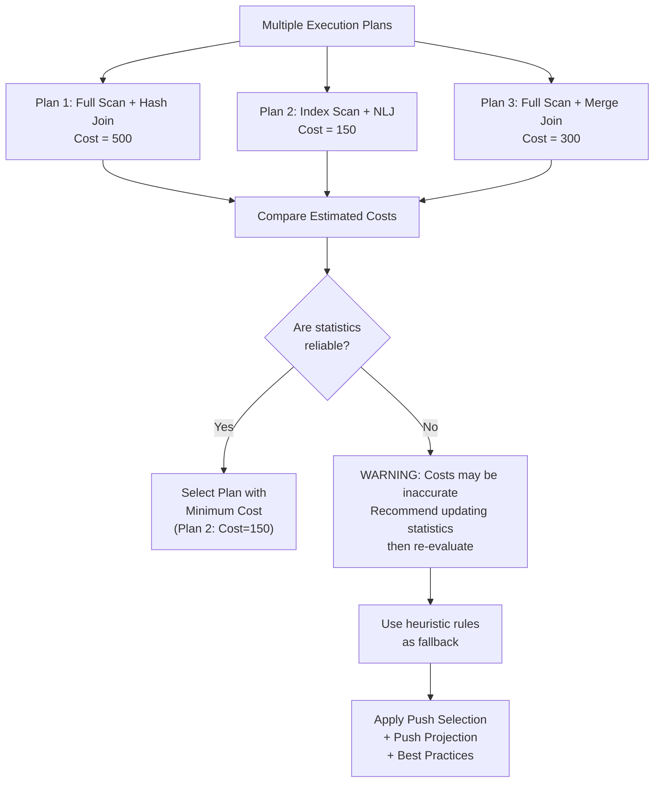

**شرح المخطط:** اختيار خطة التنفيذ يعتمد على تقدير الكلفة. ومع ذلك، إذا كانت الإحصاءات قديمة، فإن تقدير الكلفة قد يكون غير دقيق. في هذه الحالة، يوصي النظام أولاً بتحديث الإحصاءات قبل اختيار الخطة النهائية. المصدر: Database System Concepts Ch16.6.

---

## Diagram 18: Explain Output Flow

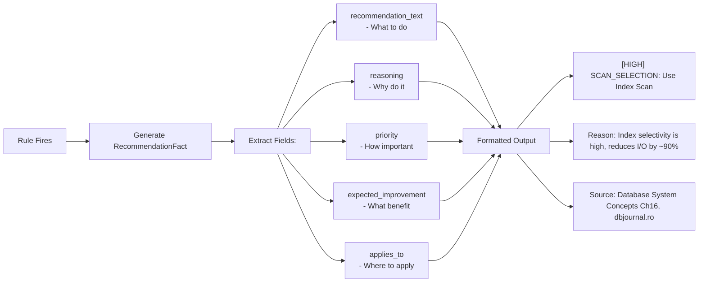

**شرح المخطط:** كل قاعدة تنتج RecommendationFact يحوي 6 حقول أساسية توفر تفسيراً كاملاً للتوصية. هذا يضمن أن النظام ليس مجرد "صندوق أسود" بل يقدم تفسيرات واضحة لكل قرار تحسيني.

---

## Diagram 19: Write-Heavy vs Read-Heavy Workload

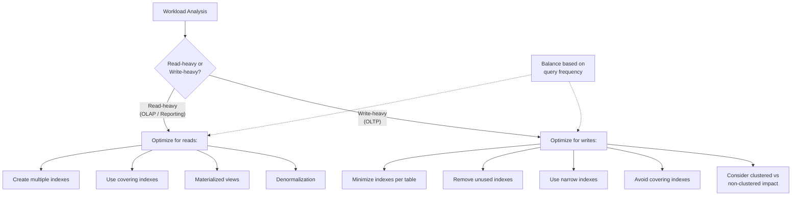

**شرح المخطط:** طبيعة الحمل (Read-heavy vs Write-heavy) تؤثر على قرارات الفهرسة. في أنظمة OLAP يُفضل إنشاء فهارس متعددة لتسريع القراءة. في أنظمة OLTP يُفضل تقليل الفهارس لتجنب كلفة التحديث. المصدر: Medium Guide.

---

## Diagram 20: Complete Decision Tree Summary

```mermaid
flowchart TB
    START["SQL Query"] --> QCLASS["Classify Query"]
    QCLASS --> TABLES["Analyze Tables"]
    QCLASS --> INDEXES["Analyze Indexes"]
    QCLASS --> JOINS["Analyze Joins"]
    QCLASS --> WORKLOAD["Analyze Workload"]

    TABLES --> STATS{"Statistics<br/>Fresh?"}
    STATS -->|"No"| REC1["⚠ UPDATE STATISTICS"]
    STATS -->|"Yes"| SCAN{"Scan Type?"}
    
    INDEXES --> IDX_USE{"Index Used?"}
    IDX_USE -->|"Yes"| IDX_OK{"Index OK?"}
    IDX_OK -->|"Fragmented"| REC2["🔧 REBUILD INDEX"]
    IDX_OK -->|"Unused"| REC3["🗑 DROP UNUSED INDEX"]
    IDX_OK -->|"OK"| SCAN
    
    IDX_USE -->|"No / Missing"| REC4["➕ CREATE INDEX"]
    REC4 --> SCAN

    SCAN -->|"Index"| PUSH_SEL["Push Selection Down"]
    SCAN -->|"Full"| PUSH_SEL

    TABLES --> PART{"Partitioned<br/>Table?"}
    PART -->|"Yes| PART_KEY{"Partition key<br/>in WHERE?"}
    PART_KEY -->|"Yes"| PRUNE["✂ Partition Pruning"]
    PART_KEY -->|"No"| WARN["⚠ Scan all partitions"]
    PRUNE --> PUSH_SEL
    WARN --> PUSH_SEL
    PART -->|"No"| PUSH_SEL
    
    WORKLOAD --> HW{"Parallel<br/>Available?"}
    HW -->|"Yes & Large table"| PAR["⚡ Parallel Execution"]
    HW -->|"No / Small table"| SEQ["Sequential Execution"]
    PAR --> PUSH_SEL
    SEQ --> PUSH_SEL
    
    JOINS --> JOIN_ALG{"Choose Join<br/>Algorithm"}
    JOIN_ALG -->|"Small+Index"| NLJ["Nested Loop Join"]
    JOIN_ALG -->|"Large+Equal"| HJ["Hash Join"]
    JOIN_ALG -->|"Sorted"| MJ["Merge Join"]
    JOIN_ALG -->|"IN/EXISTS"| SEMI["Semi-Join"]
    JOIN_ALG -->|"NOT IN/NOT EXISTS"| ANTI["Anti-Join"]
    JOIN_ALG -->|"Stats uncertain"| ADAPT["Adaptive Join"]
    
    PUSH_SEL --> PUSH_PROJ["Push Projection Down"]
    PUSH_PROJ --> JOIN_ORDER{"Optimize<br/>Join Order?"}
    JOIN_ORDER -->|"Yes (3+ tables)"| REORDER["Reorder: Smallest First"]
    JOIN_ORDER -->|"No"| SUB{"Subquery/CTE?"}
    
    REORDER --> SUB
    SUB -->|"Correlated"| REWRITE1["↻ Rewrite as JOIN (Semi-Join)"]
    SUB -->|"IN"| REWRITE2["→ Use EXISTS / Semi-Join"]
    SUB -->|"NOT IN"| REWRITE3["→ Use NOT EXISTS / Anti-Join"]
    SUB -->|"CTE (WITH)"| CTE{"Referenced<br/>multiple times?"}
    CTE -->|"Yes & Temp allowed"| MATERIALIZE["Materialize CTE"]
    CTE -->|"No"| GROUP
    MATERIALIZE --> GROUP
    SUB -->|"View"| VIEW_PUSH["Push predicates through view"]
    VIEW_PUSH --> GROUP
    SUB -->|"None"| GROUP{"GROUP BY?"}
    
    GROUP -->|"WHERE+HAVING"| WH_REWRITE["Move conditions to WHERE"]
    GROUP -->|"DISTINCT"| DIST_REWRITE{"PK in SELECT?"}
    DIST_REWRITE -->|"Yes"| DROP_DIST["Drop DISTINCT"]
    DIST_REWRITE -->|"No"| KEEP_DIST["Keep DISTINCT"]
    
    WORKLOAD --> WL{"Workload<br/>Type?"}
    WL -->|"Read-heavy"| READ_IDX["Maintain indexes<br/>Consider covering indexes"]
    WL -->|"Write-heavy"| WRITE_IDX["Minimize indexes<br/>Drop unused indexes"]
    READ_IDX --> FINAL
    WRITE_IDX --> FINAL
    
    FINAL["📋 FINAL OPTIMIZATION REPORT<br/>with reasoning for each decision"]
    
    REC1 --> SCAN
    REC2 --> SCAN
    REC3 --> SCAN
    WH_REWRITE --> FINAL
    REWRITE1 --> FINAL
    REWRITE2 --> FINAL
    REWRITE3 --> FINAL
    NLJ --> FINAL
    HJ --> FINAL
    MJ --> FINAL
    SEMI --> FINAL
    ANTI --> FINAL
    ADAPT --> FINAL
    KEEP_DIST --> FINAL
    DROP_DIST --> FINAL
    PUSH_SEL --> FINAL
    PUSH_PROJ --> FINAL
```

**شرح المخطط:** هذا هو المخطط الشامل الذي يلخص جميع قرارات النظام الخبير من البداية إلى النهاية. يبدأ بتصنيف الاستعلام، ثم تحليل الجداول والفهارس و JOINs، ثم تطبيق سلسلة من قواعد التحسين، وينتهي بتقرير تحسيني شامل مع تبرير لكل قرار.

---

## Diagram 21: Semi-Join vs Anti-Join Decision

```mermaid
flowchart TD
    A["Subquery or Join Decision"] --> B{"Purpose?"}
    
    B -->|"Check existence<br/>(IN / EXISTS)"| C["Semi-Join Path"]
    B -->|"Check non-existence<br/>(NOT IN / NOT EXISTS)"| D["Anti-Join Path"]
    
    subgraph "Semi-Join"
        C1["Scan outer relation"]
        C2["For each outer row,<br/>probe inner relation"]
        C3["Stop at first match"]
        C4["Yield outer row once"]
        C1 --> C2 --> C3 --> C4
    end
    
    subgraph "Anti-Join"
        D1["Scan outer relation"]
        D2["For each outer row,<br/>probe inner relation"]
        D3["If NO match found,"]
        D4["Yield outer row"]
        D1 --> D2 --> D3 --> D4
    end
    
    E["Benefit over Subquery:<br/>- Stops at first match<br/>- No duplicate elimination needed<br/>- Set semantics built-in"] -.-> C4
    F["Benefit over NOT IN:<br/>- Handles NULL correctly<br/>- Early termination possible"] -.-> D4
```

**شرح المخطط:** Semi-Join و Anti-John هما خوارزميتان متخصصتان للتعامل مع الاستعلامات الفرعية.
- **Semi-Join:** للاستعلامات التي تستخدم IN/EXISTS — يمسح العلاقة الخارجية ويتوقف عند أول تطابق في العلاقة الداخلية. هذا يمنع إنتاج صفوف مكررة ويحسن الأداء.
- **Anti-Join:** للاستعلامات التي تستخدم NOT IN/NOT EXISTS — يمسح العلاقة الخارجية ويعيد الصفوف التي ليس لها تطابق في العلاقة الداخلية. يتجنب مشاكل NULL التي يعاني منها NOT IN.
المصدر: Database System Concepts Ch16.

---

## Diagram 22: Partition Pruning Decision

```mermaid
flowchart TD
    A["Query on Partitioned Table"] --> B{"Does WHERE clause<br/>use the partition key?"}
    
    B -->|"Yes"| C["Identify relevant partitions"]
    C --> D["Eliminate non-matching partitions"]
    D --> E["Scan only matching partitions"]
    E --> F["Benefit: Skip up to 90%<br/>of irrelevant data"]
    
    B -->|"No"| G["All partitions must be scanned"]
    G --> H["Full table scan across all partitions"]
    H --> I["Warning: Partition key not used<br/>- Consider adding it to WHERE"]
    
    J["Example: Table partitioned by sale_date"] -.-> K["WHERE sale_date BETWEEN '2024-01-01' AND '2024-01-31'<br/>→ Scan only 1 partition (Jan 2024)"]
    J -.-> L["WHERE region = 'East'<br/>→ No partition key → Scan ALL 12 partitions"]
```

**شرح المخطط:** تقسيم الجداول (Partitioning) يحسن الأداء عندما يستخدم الاستعلام مفتاح التقسيم (Partition Key) في WHERE. يقوم النظام بقص (Prune) الأقسام غير الضرورية ومسح الأقسام ذات الصلة فقط. إذا لم يستخدم الاستعلام مفتاح التقسيم، يجب مسح جميع الأقسام مما يلغي فائدة التقسيم.
المصدر: Database System Concepts Ch16.

---

## Diagram 23: Parallel Execution Strategy

```mermaid
flowchart TD
    A["Query Analysis"] --> B{"Hardware supports<br/>parallelism?"}
    
    B -->|"No"| C["Sequential execution<br/>(no parallel option available)"]
    B -->|"Yes"| D{"Query involves<br/>large tables?"}
    
    D -->|"No / Small tables"| E["Sequential execution<br/>(parallel overhead not worth it)"]
    D -->|"Yes"| F["Enable Parallel Execution"]
    
    F --> G["Split operations across CPU cores"]
    G --> H1["Parallel Scan: Split table into N ranges"]
    G --> H2["Parallel Sort: Each core sorts its range"]
    G --> H3["Parallel Join: Hash/merge join across cores"]
    
    H1 --> I["Linear speedup<br/>proportional to<br/>CPU core count"]
    
    J["Considerations:"] -.-> K["- Memory overhead for parallelism"]
    J -.-> L["- CPU cost of thread management"]
    J -.-> M["- I/O contention on shared storage"]
```

**شرح المخطط:** التنفيذ المتوازي (Parallel Execution) يوزع عمليات الاستعلام الثقيلة (Scan، Sort، Join) عبر أنوية المعالجة المتعددة. هذا مفيد بشكل خاص للجداول الكبيرة والاستعلامات المعقدة. التحسن النظري خطي مع عدد الأنوية، لكن يجب مراعاة كلفة إدارة الخيوط والذاكرة.
المصدر: Database System Concepts Ch16.

---

## Diagram 24: CTE Materialization Decision

```mermaid
flowchart TD
    A["CTE (WITH clause) Detected"] --> B{"How many times is<br/>the CTE referenced?"}
    
    B -->|"Once"| C["Inline the CTE<br/>(No materialization needed)"]
    B -->|"Multiple times"| D{"Temp table<br/>allowed?"}
    
    D -->|"Yes"| E["Materialize CTE into temp table"]
    D -->|"No"| F["Keep CTE inline<br/>(may be re-evaluated)"]
    
    E --> G["Compute CTE once"]
    G --> H["Store results in temp table"]
    H --> I["All references use<br/>the materialized result"]
    
    J["Benefits of Materialization:"] -.-> K["- Compute once, use many times"]
    J -.-> L["- Avoids repeated Subquery execution"]
    J -.-> M["- Can index the temp table"]
    
    N["Cost of Materialization:"] -.-> O["- Disk/memory for temp storage"]
    N -.-> P["- Writing overhead"]
```

**شرح المخطط:** CTE (Common Table Expression / WITH clause) يمكن تجسيده (Materialize) في جدول مؤقت إذا تمت الإشارة إليه مرات متعددة في الاستعلام الرئيسي. هذا يمنع إعادة تنفيذ نفس الاستعلام لكل إشارة. إذا تمت الإشارة إلى CTE مرة واحدة فقط، فمن الأفضل تركه Inline لتجنب كلفة الكتابة في الجدول المؤقت.
المصدر: Database System Concepts Ch16.

---

## Diagram 25: Predicate Pushdown Across Views

```mermaid
flowchart TD
    subgraph "Before Optimization"
        A["SELECT * FROM (SELECT * FROM employees WHERE salary > 50000) v WHERE v.dept_id = 10"] --> B["Query View v"]
        B --> C["Scan all rows of v"]
        C --> D["Filter: dept_id = 10"]
        D --> E["Large intermediate result"]
    end

    subgraph "After Optimization"
        F["Push WHERE through view"] --> G["Rewrite: SELECT * FROM (SELECT * FROM employees WHERE salary > 50000 AND dept_id = 10) v"]
        G --> H["Push both predicates down"]
        H --> I["Scan employees with combined filter"]
        I --> J["Much smaller intermediate result"]
    end

    K["Rule: Predicates on views can be pushed into the view definition"] -.-> L["Benefit: Filters applied earlier = less data to process"]
```

**شرح المخطط:** عندما يستخدم الاستعلام VIEW، يمكن دفع شروط WHERE إلى داخل تعريف الـ VIEW. هذا يسمح بتطبيق التصفية مباشرة على الجداول الأساسية، مما يقلل النتائج الوسيطة ويحسن الأداء. تعتبر هذه التقنية امتداداً لقاعدة Push Selection Down.
المصدر: Database System Concepts Ch16.

---

## Diagram 26: Adaptive Join Decision

```mermaid
flowchart TD
    A["Large Join with<br/>Uncertain Cardinality"] --> B{"Are statistics<br/>accurate?"}
    
    B -->|"Yes"| C["Use standard Join selection<br/>(Hash / Merge / NLJ based on cost)"]
    B -->|"No / Uncertain"| D["Use Adaptive Join"]
    
    D --> E["Start with Hash Join<br/>(build phase for inner relation)"]
    E --> F{"Inner relation<br/>size matches estimate?"}
    
    F -->|"Yes"| G["Continue with Hash Join"]
    F -->|"No - smaller than expected"| H["Switch to Nested Loop Join<br/>(Use index on inner)"]
    F -->|"No - larger than expected"| I["Continue with Hash Join<br/>(it scales better for large data)"]
    
    J["Benefit:"] -.-> K["- No 'wrong join algorithm' risk"]
    J -.-> L["- Adaptive to runtime conditions"]
    J -.-> M["- Robust when statistics are outdated"]
```

**شرح المخطط:** Adaptive Join هي تقنية حديثة (متوفرة في SQL Server 2017+ و PostgreSQL) تسمح باختيار خوارزمية JOIN في منتصف التنفيذ بناءً على الإحصاءات الفعلية في وقت التشغيل. تبدأ بـ Hash Join، وإذا تبين أن العلاقة الداخلية أصغر من المتوقع، تتحول إلى Nested Loop Join تلقائياً. هذا يوفر أداءً قوياً حتى عندما تكون إحصاءات النظام قديمة أو غير دقيقة.
المصدر: Modern DBMS (SQL Server 2017+, PostgreSQL).
