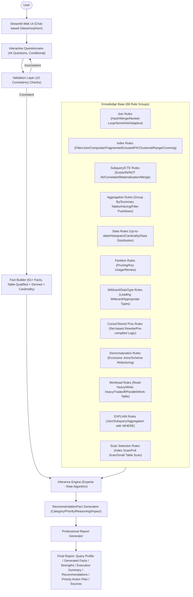
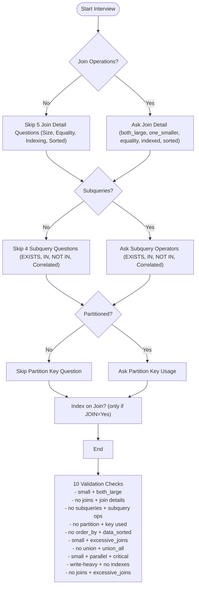
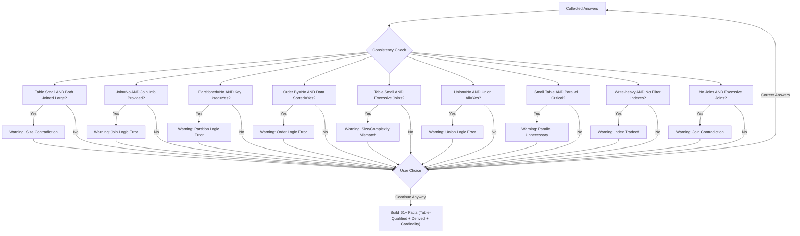
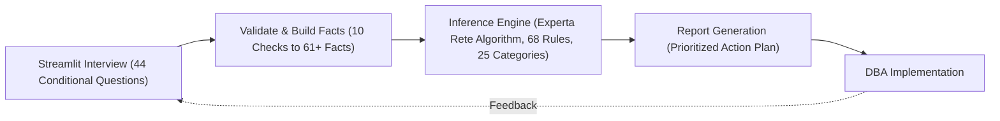

# Architecture Diagrams - Expert System Query Optimizer

---

## Diagram 1: Professional System Architecture
This diagram shows the end-to-end pipeline from the interactive Streamlit interview to the final professional report.

**Description:** The system starts with a Streamlit web UI featuring dark glassmorphism design. A conditional 44-question interview passes through 10 validation checks, maps answers to 61+ facts (including table-qualified `Fact(table=t1, large=True)`, derived join algorithm facts, and cardinality facts), and uses the Rete algorithm to fire 68 rule groups from the knowledge base. The final report includes a query profile, generated facts, optimization strengths, recommendations with priority/impact, and a sorted priority action plan.

---

## Diagram 2: Conditional Questioning Flow
This diagram illustrates how the system avoids irrelevant questions to create an "intelligent" interview experience.

**Description:** To improve user experience, the system uses conditional logic with `depends_on` tuples. If a primary feature is absent, all dependent sub-questions are skipped. The validation layer then runs 10 consistency checks before facts are built.

---

## Diagram 3: The Validation Process
How the system ensures that the provided facts are logically consistent.

**Description:** The validation layer now contains 10 contradiction checks. Each detected inconsistency produces a specific warning. The user can either correct answers or proceed — preventing the inference engine from processing contradictory data.

---

## Diagram 4: Final Decision Assembly (Updated)
Mapping the updated rule categories to the final output.

```mermaid
flowchart LR
    subgraph Inputs["Input Facts (61+)"]
        F1["Query Facts (Join/Subquery/CTE/Union/etc.)"]
        F2["Table Facts (size=large, partitioned, table=t1, large=True)"]
        F3["Index Facts (filter/join/fragmented/composite/unused/FK/range/covering)"]
        F4["Stats/Workload Facts (stats_fresh, read_heavy, parallel, temp_allowed, cardinality)"]
        F5["Derived Facts (hash_join_possible, semi_join_possible, selective, supports_order, where)"]
    end
    
    subgraph Rules["Knowledge Base (68 Rule Groups)"]
        R1["Filter/Join Index Opt (Create indexes, avoid full scan, covering)"]
        R2["Group By / Distinct Opt (Summary tables, index distinct cols)"]
        R3["Join Strategy (Hash/Merge/Nested-Loop/Semi/Adaptive selection)"]
        R4["Subquery/CTE Rewrite (Materialization, semi-join/anti-join rewrite)"]
        R5["Partition/Stats Opt (Pruning, histograms, cardinality, data distribution)"]
        R6["Query Rewrite (OR->UNION ALL, SELECT*, HAVING->WHERE, NOT IN->NOT EXISTS)"]
        R7["Wildcard/DataType/Cursor (Avoid leading %, set-based rewrite)"]
        R8["Denormalization/Excessive Joins (Schema refactoring, reduce JOIN count)"]
        R9["Workload Tuning (Read vs Write tradeoff, Parallel/Work-Table, write-heavy guards)"]
        R10["EXPLAIN Analysis (Join/Subquery/Aggregation with WHERE clause)"]
        R11["Scan Selection (Index Scan/Full Scan/Small Table Scan)"]
        R12["Pagination (LIMIT/OFFSET with index, ORDER BY index)"]
    end
    
    subgraph Output["Report Sections"]
        S1["Query Profile & Generated Facts"]
        S2["Optimization Strengths"]
        S3["Recommendations (with Priority + Impact)"]
        S4["Priority Action Plan (HIGH->MEDIUM->LOW)"]
        S5["Sources Referenced"]
    end
    
    Inputs --> Rules
    Rules --> S1
    Rules --> S2
    Rules --> S3
    Rules --> S4
    Rules --> S5
```

**Description:** The updated assembly shows 61+ input facts including table-qualified, derived join-algorithm facts, derived selectivity/ordering facts, and cardinality facts, feeding into 68 rule groups across 25 categories. The output now includes a full query profile, recommendations with priority/impact, and a sorted priority action plan.

---

## Diagram 5: Complete Expert System Lifecycle
The high-level view of the project's operational cycle.

**Description:** The lifecycle begins with a Streamlit web-based interview. The feedback loop allows the DBA to refine answers based on real-world implementation results, creating a continuous improvement cycle.
